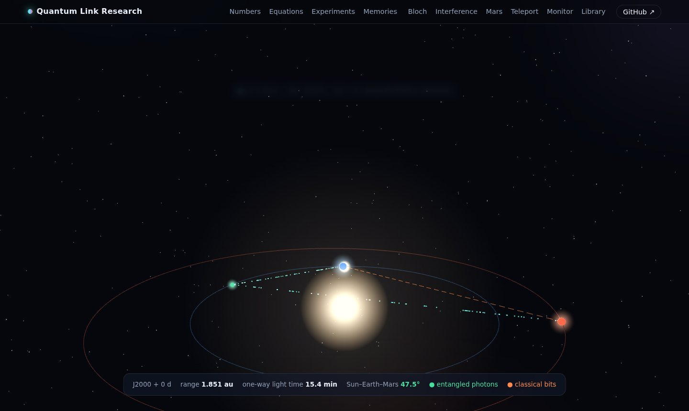
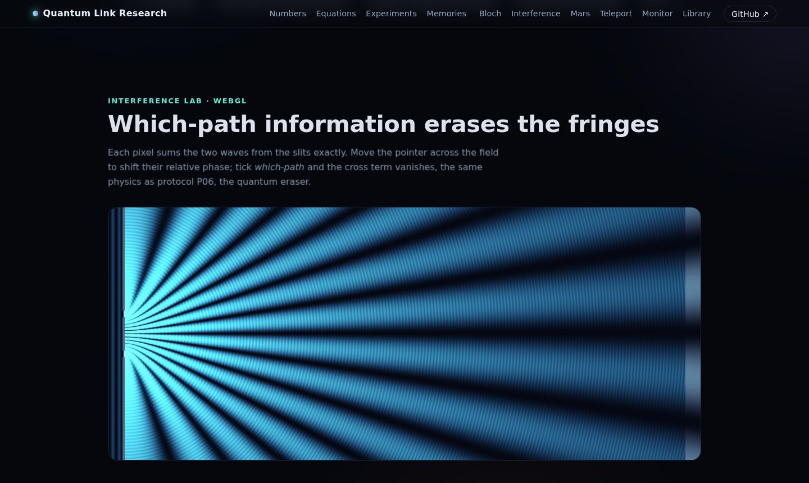
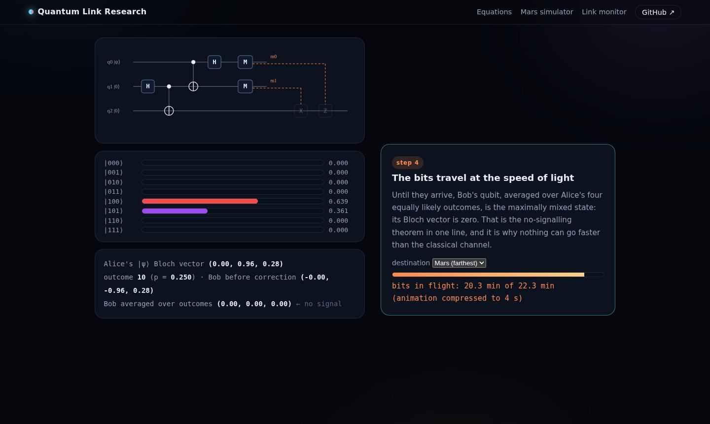
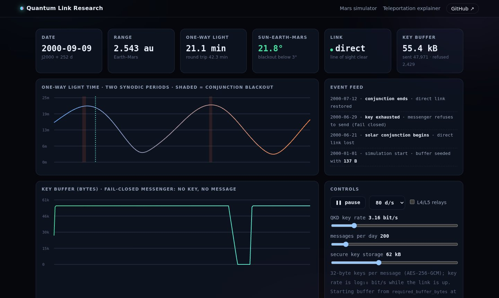
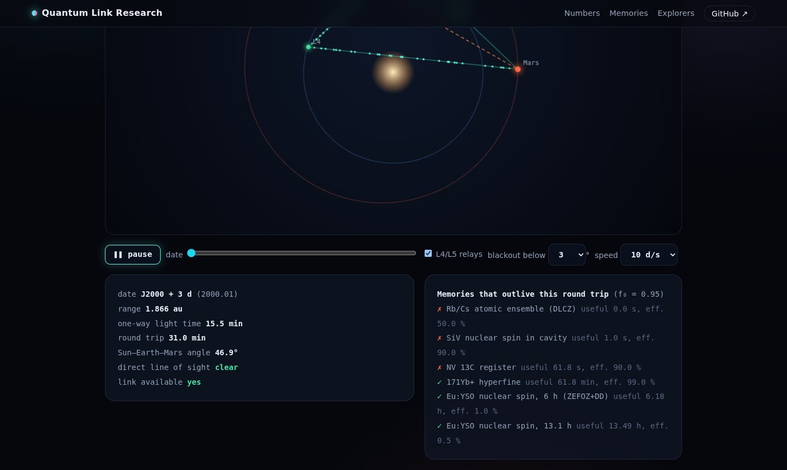
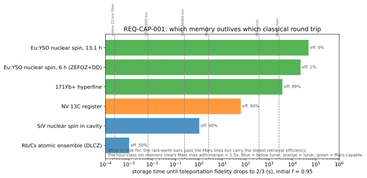
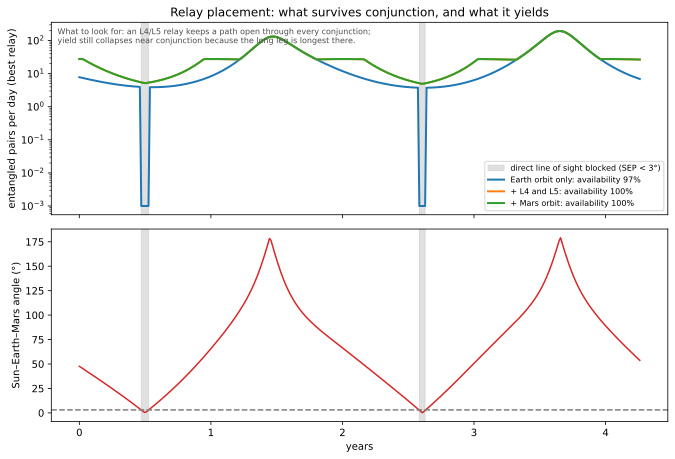
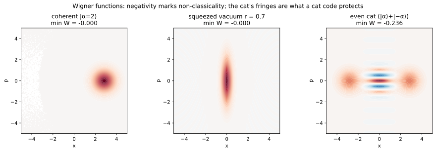

<p align="center">
  <a href="https://Normansrule.github.io/quantum-link-research/"></a>
</p>

<p align="center">
  <a href="https://Normansrule.github.io/quantum-link-research/"><b>Website</b></a> ·
  <a href="https://Normansrule.github.io/quantum-link-research/mars/"><b>Mars link simulator</b></a> ·
  <a href="https://Normansrule.github.io/quantum-link-research/teleport/"><b>Teleportation explainer</b></a> ·
  <a href="https://Normansrule.github.io/quantum-link-research/monitor/"><b>Link monitor</b></a> ·
  <a href="https://Normansrule.github.io/quantum-link-research/apps/">Explorers</a> ·
  <a href="research/thesis/THESIS_DRAFT.md">Thesis draft</a> ·
  <a href="learn/COURSE_SYLLABUS.md">15-week course</a> ·
  <a href="docs/references.md">References</a>
</p>

<p align="center">
  <a href="https://github.com/Normansrule/quantum-link-research/actions/workflows/ci.yml"></a>
  
  <a href="docs/status.md"></a>
  
  <a href="LICENSE"></a>
</p>

> **Can two people, one on Earth and one on Mars, share a secret that no eavesdropper and no future computer can read?**
> Physics says yes, with a catch: entanglement carries no message by itself, and the two classical bits every teleportation needs take minutes at the speed of light. This repository computes what that catch costs, what hardware could pay it, and what a student can build on the way — in code where every formula is cited, every module has an analytic test, and every requirement traces to the test that verifies it.

## The answer, computed

<!-- numbers:start -->
| Question | Answer from the code | Module |
|---|---|---|
| One-way light time, Earth → Mars | **3.1–22.3 min** | `qll/space/ephemeris.py` |
| Round trip a memory must survive (Mars max) | **44.6 min** | `qll/channels/light_time_delay.py` |
| Demonstrated memories that survive it (f₀ = 0.95) | **3 of 6: hour-class ions (99 % retrieval) and rare-earth crystals (< 5 %)** | `qll/network/memory_decoherence.py` |
| Micius two-downlink loss at 30° elevation | **65.7 dB (reported 64–82 dB)** | `qll/channels/link_budget.py` |
| Thermal photons a 5 GHz qubit sees | **1250 at 300 K, 1.1e-07 at 15 mK** | `qll/circuits/noise/thermal.py` |
| BB84 error threshold | **11.00 %** | `qll/qkd/key_rate.py` |
| Where a repeater chain (1 s memories) beats direct fiber | **393 km** | `qll/network/repeater_chain.py` |
| Purification 0.80 → 0.99 | **BBPSSW 10 rounds / 2917 pairs; DEJMPS 4 / 32** | `qll/network/purification.py` |
| Rounds for a device-independent key at S = 0.95·2√2 | **2,535** | `qll/qkd/e91.py` |
| Key buffer to message once a minute through a Mars round trip | **1.43 kB** | `qll/app/messenger.py` |
<!-- numbers:end -->

The same numbers drive the [website](https://Normansrule.github.io/quantum-link-research/): `scripts/build_site_data.py` regenerates them from the tested code on every commit, so the README, the site, and the thesis cannot disagree.

## The website

Five interactive pages, all driven by the same tested numbers. Click an image to open it.

| | |
|---|---|
| [](https://Normansrule.github.io/quantum-link-research/) **Landing page** — three.js orbits from the Kepler ephemeris, live range and light time, tickers, KaTeX equation cards, capability matrix, Bloch sphere | [](https://Normansrule.github.io/quantum-link-research/#interference) **Interference lab** — a WebGL shader sums the two slit waves exactly; which-path information erases the fringes (P06) |
| [](https://Normansrule.github.io/quantum-link-research/teleport/) **Teleportation, step by step** — scroll through the protocol with the exact eight-amplitude state (checked against Qiskit), the no-signalling average, and the bits in flight | [](https://Normansrule.github.io/quantum-link-research/monitor/) **Link monitor** — two synodic periods of light time and blackouts, and a fail-closed messenger that refuses to send when conjunction drains its key, until relays are switched on |
| [](https://Normansrule.github.io/quantum-link-research/mars/) **Mars link simulator** — orbits, conjunction, L4/L5 relays, and which memories outlive today's round trip | **Built on the shoulders of:** [react-bits](https://github.com/DavidHDev/react-bits) · [Magic UI](https://github.com/magicuidesign/magicui) · [Animate UI](https://animate-ui.com/) · [motion-primitives](https://github.com/ibelick/motion-primitives) · [WebGL-Fluid-Simulation](https://github.com/PavelDoGreat/WebGL-Fluid-Simulation) · [folio-2019](https://github.com/brunosimon/folio-2019) · [GSAP](https://github.com/greensock/GSAP) · [Remotion](https://github.com/remotion-dev/remotion) · [llm-viz](https://github.com/bbycroft/llm-viz) · [transformer-explainer](https://github.com/poloclub/transformer-explainer) · [gods-eye-view](https://github.com/bilawalsidhu/gods-eye-view) · [worldmonitor](https://github.com/koala73/worldmonitor). What each contributed is in [CREDITS.md](CREDITS.md); no code was copied. |

## The argument in five equations

$$\bar n(\omega,T)=\frac{1}{e^{\hbar\omega/k_BT}-1}\qquad\text{heat decides where each part of the link can live}$$

$$\eta_{\rm geo}=1-\exp\!\left(-\frac{2r_{\rm rx}^2}{w(L)^2}\right),\qquad w(L)=w_0\sqrt{1+(L/z_R)^2}\qquad\text{photons are lost as }1/L^2\text{ in space}$$

$$\tau=\frac{d(t)}{c}\qquad\text{the two classical bits of every teleportation arrive minutes later}$$

$$f(t)=\tfrac14+\left(f_0-\tfrac14\right)e^{-t/T_{\rm mem}},\qquad \bar F=\frac{2f+1}{3}>\frac23\qquad\text{so the memory must outlive }2d/c$$

$$K\le-\log_2(1-\eta)\qquad\text{and no repeaterless protocol beats this}$$

Each line is a module in [`qll/`](qll) with a test that checks it against its closed form; the full set, with figures, is in [docs/physics_overview.md](docs/physics_overview.md).

## Three experiments, one physics

<p align="center"></p>

| | F1 · two computers, one city | F2 · Earth ↔ satellite | F3 · Earth ↔ Mars |
|---|---|---|---|
| **What** | heralded entanglement and teleportation over 25 km of fiber | single-photon downlink from low orbit | the same protocol with a 6–45 min round trip |
| **State of the art** | done in the field (2024) | Micius 2017, Jinan-1 2025 | done nowhere |
| **Our version** | P03 bench → campus fiber | Micius budget reproduced within 3 dB → rooftop link | delayed-bits bench, relay scheduling, fail-closed messenger |
| **Plan** | [F1](experiments/flagship/F1_earth_to_earth.md) | [F2](experiments/flagship/F2_earth_to_satellite.md) | [F3](experiments/flagship/F3_earth_to_mars.md) |

## What is inside

| | | |
|---|---|---|
| 📚 **[Learn](learn/README.md)** — foundations, computing core, eight qubit platforms, communication; every file with equations, a figure, references, exercises | 🧪 **[Experiments](experiments/README.md)** — flagships, eight bench protocols, fifteen landmark experiments with cheap recreations, fifteen proposals, lessons | 🔭 **[Research](research/README.md)** — timeline, open problems, fifteen frontier theories, design process, thesis chapters |
| 💻 **[`qll/`](qll)** — tested physics from thermal occupation to a fail-closed Mars messenger, with Qiskit Aer, Stim, QuTiP, SeQUeNCe, Perceval adapters | 🎛️ **[Simulations](simulations/README.md)** — eight scripts that predict what each bench must reproduce | 🎓 **[Course](learn/COURSE_SYLLABUS.md)** — 15 weeks, four machine-graded problem sets |
| 📈 **[Data](data/README.md)** — tested analysis pipelines waiting for the first ODMR and T₁(T) measurements | 🎬 **[Youtube](youtube/README.md)** — verified videos per topic | 📖 **[References](docs/references.md)** — a bibliography that code citations are checked against |

## Figures

Every figure is drawn by a function under test; `python scripts/make_figures.py` regenerates all of them.

| | |
|---|---|
|  |  |
|  |  |
|  |  |

## Quick start

```bash
git clone https://github.com/Normansrule/quantum-link-research.git && cd quantum-link-research
conda env create -f environment.yml && conda activate qll
python -m pytest -q -m "not slow"                       # the physics, the figures, the library, the citations
python -m qll.systems.traceability                        # every requirement and the test that verifies it
python simulations/s02_teleportation_with_light_time.py   # teleportation with the bits delayed by a Mars light time
python -m qll.viz.memory_crossover                        # which memory outlives which round trip (interactive)
python scripts/build_thesis.py                            # assemble the thesis draft from chapters + generated tables
```

## Phases

| Phase | Deliverable | Must pass | Status |
|---|---|---|---|
| 1 | constants, channels, thermal model, QKD theory, explorers, library | analytic and integrity tests | **done** |
| 2 | Bell, teleportation, swapping, CHSH, fidelity, tomography, Kraus noise, no-cloning guard | $F_{\rm ideal}=1$; $F=(2f+1)/3$; $S=2\sqrt2$ | **done** |
| 3 | atmosphere, turbulence, pointing, link budget; BB84/E91/decoy/MDI/TF/CV; sources, detectors, NV node | Micius within 3 dB; rates ≤ PLOB | **done** |
| 4 | memories, purification (BBPSSW, DEJMPS), repeaters, scheduling, routing | chain beats direct; $T_{\rm mem}$ vs $2d/c$ | **done** |
| 5 | Kepler ephemeris, conjunction, relays, relativity, flown coolers, DSOC-class link | envelope within 1 %; L4/L5 > 99.9 % availability | **done** |
| 6 | ML-KEM + QKD hybrid, AES-GCM, fail-closed messenger, benchmark | never sends unkeyed | **done** |
| — | bench data (P01 ODMR, P02 T₁ vs temperature) | REQ-THM-003 | **waiting on hardware** |

## Map

```
qll/            tested physics: constants → channels → circuits → qkd → network → space → app, plus hardware, analysis, viz
simulations/    S01–S08: predictions for each bench            data/       measured CSVs + tested fit pipelines
learn/          settled physics, course, problem sets           experiments/ flagships, protocols, landmarks, proposals, lessons
research/       frontier theories, timeline, thesis             docs/       website, explorers, figures, bibliography, status
systems/        needs, requirements, traceability, risks, TRL   tests/      500+ tests, run on every commit
```

## Contributing and credits

Six rules in [CONTRIBUTING.md](CONTRIBUTING.md): physics correct · established libraries · every formula cited · every module tested · one idea per file · commit only green. Cite with [CITATION.cff](CITATION.cff). The website's visual techniques are credited in [CREDITS.md](CREDITS.md). Session history in [docs/SESSION_LOG.md](docs/SESSION_LOG.md); decisions in [research/thesis/DESIGN_PROCESS.md](research/thesis/DESIGN_PROCESS.md).
