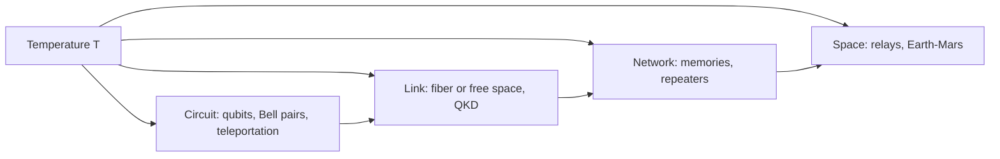
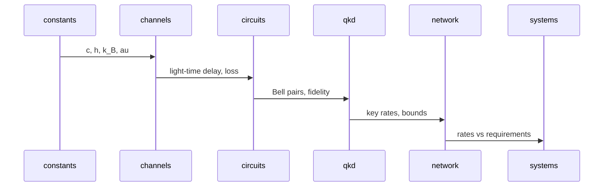

# quantum-link-lab

[](https://github.com/OWNER/quantum-link-lab/actions/workflows/ci.yml)

Physics-first models of quantum communication links, from a diamond qubit on a bench to an Earth-Mars relay chain, built in six phases on established simulators (Qiskit Aer, Stim, QuTiP, SeQUeNCe, Perceval) with every formula cited and every module checked against an analytic result.

## One picture



## Three unbreakable rules

| Rule | Where it is enforced |
|---|---|
| No signaling faster than light (no-communication theorem) | `qll/channels/light_time_delay.py` is the only latency source; `ClassicalMessage.receive` refuses early reads |
| No cloning of unknown states | Phase 2 no-cloning guard test |
| Teleportation costs exactly 2 classical bits per qubit | `TeleportationRecord.classical_bits` (Phase 2), REQ-PHY-002 |

## The temperature hurdle

A mode at angular frequency ω in a bath at temperature T holds n̄ = 1/(exp(ħω/k_BT) − 1) thermal photons.

| Carrier | n̄ at 300 K | n̄ at 15 mK |
|---|---|---|
| 5 GHz microwave qubit | ≈ 1250 | ≈ 1e-7 |
| 193 THz (1550 nm) photon | ≈ 4e-14 | 0 |

Optical carriers cross warm channels; microwave qubits need dilution refrigerators; moving between the two (transduction) is the open problem.

## Phase 1 equations

| Name | Formula | File | Analytic test |
|---|---|---|---|
| Light-time delay | τ = d/c | `channels/light_time_delay.py` | 1 au → 499.005 s |
| Bose-Einstein occupation | n̄ = 1/(e^{ħω/k_BT} − 1) | `circuits/noise/thermal.py` | Rayleigh-Jeans limit |
| Thermal T1 | T1(T) = T1(0)/(2n̄+1) | `circuits/noise/thermal.py` | T1(0) at T = 0 |
| Generalized amplitude damping | Kraus E0..E3 | `circuits/noise/thermal.py` | ΣE†E = I |
| Fiber loss | η = 10^(−αL/10) | `channels/fiber_loss.py` | 100 km → 0.01 |
| Diffraction | θ = λ/(πw₀), η ∝ 1/L² | `channels/free_space_diffraction.py` | ratio 4 when L doubles |
| Thermal background | N = n̄ M B η | `channels/thermal_background.py` | blackbody = Bose-Einstein |
| BB84 rate | r = 1 − 2h₂(Q) | `qkd/key_rate.py` | threshold 11.0% |
| PLOB bound | K = −log₂(1−η) | `qkd/plob_bound.py` | ≈ η/ln2 |

## Code map

`qll/constants` → `qll/channels` → `qll/circuits` → `qll/qkd` → `qll/network` → `qll/app`, with `qll/hardware` feeding circuits and channels and `qll/systems` reading everything. One physical idea per file; see `docs/physics_module_design.md` for every module's card.



## Install (Ubuntu; Windows notes below)

```bash
conda env create -f environment.yml && conda activate qll
python scripts/check_env.py && pytest -q && python -m qll.systems.traceability
```

Windows 11: run the same commands in an Anaconda PowerShell prompt; `scripts/bootstrap.sh` needs Git Bash.

## Achievable today vs. open research

| Achievable today (TRL 7-9) | Open research (TRL 1-3) |
|---|---|
| Fiber QKD, LEO satellite QKD, metropolitan NV/SiV entanglement | Minutes-long network memories, transduction, interplanetary links |

## Citation policy

Every formula and default carries a `[bibkey]` in its docstring and an entry in `docs/references.bib`. DOIs are given only when certain; otherwise `TODO: verify`.

## Documentation

`docs/architecture.md`, `docs/physics_module_design.md`, `docs/hardware_and_experiments_guide.md`, `docs/roadmap.md`, `docs/glossary.md`, `docs/SESSION_LOG.md`.
