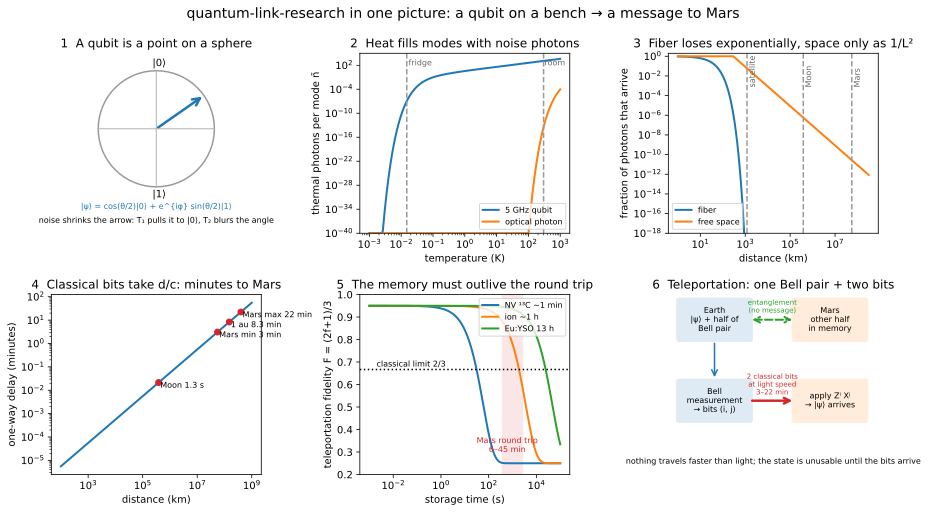
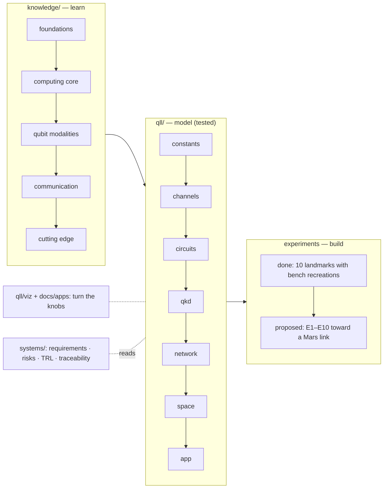
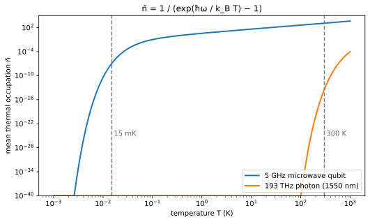
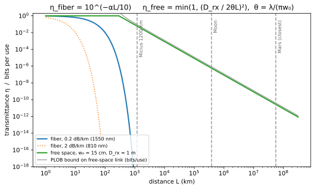
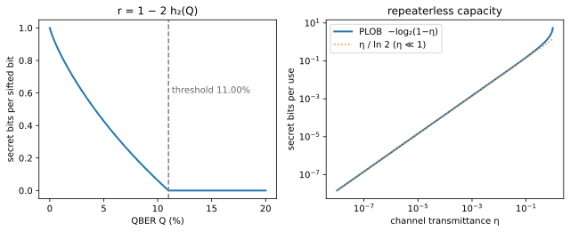
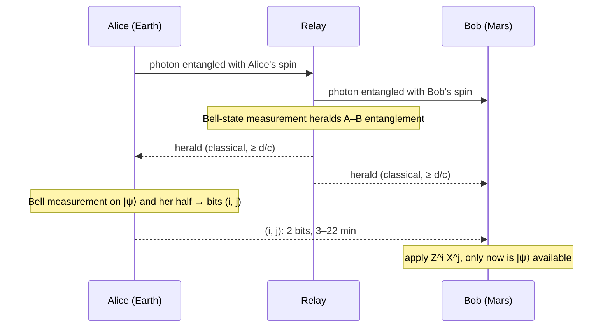
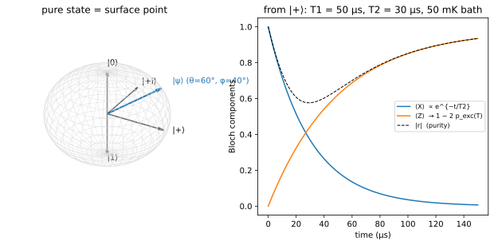
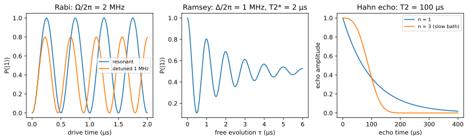
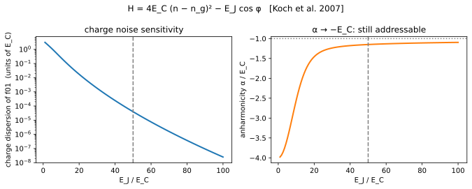
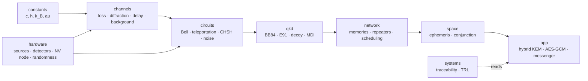

# quantum-link-research

[](https://github.com/Normansrule/quantum-link-research/actions/workflows/ci.yml)
[](LICENSE)
[](environment.yml)
[](https://Normansrule.github.io/quantum-link-research/apps/)
[](knowledge/README.md)

> **Can two people, one on Earth and one on Mars, share a secret that no eavesdropper and no future computer can read?**
> Physics says yes, with a catch: the quantum part is instantaneous-looking but carries no message, and the classical part takes 3 to 22 minutes at the speed of light. This repository works out, in code that is tested against the equations, exactly what that catch costs, what hardware could pay it, and what a student lab can build on the way.



## The whole idea in six sentences

1. **A qubit is an arrow on a sphere.** Any two-level quantum system (a spin in diamond, a superconducting circuit, a photon's polarization) is a point on the Bloch sphere; noise shortens the arrow (energy loss, $T_1$) and blurs its direction (dephasing, $T_2$).
2. **Heat is noise you can compute.** A mode at frequency $\omega$ in a bath at temperature $T$ holds $\bar n = 1/(e^{\hbar\omega/k_BT}-1)$ thermal quanta. Microwave qubits need 15 mK; optical photons at room temperature already sit at $\bar n\approx10^{-14}$. That single formula decides where every part of a quantum link must live.
3. **Photons are the only thing that travels.** In fiber they die exponentially ($10^{-\alpha L/10}$); in free space only as $1/L^2$. Past a few hundred kilometers the sky wins, which is why satellites exist and why Mars is reachable in principle.
4. **Entanglement is a resource, not a radio.** Two qubits can share a Bell pair across any distance, but Bob's measurements look random until Alice's two classical bits arrive at light speed. This is the no-signaling theorem, and the code physically refuses to read a teleported state early.
5. **The memory must outlive the round trip.** Teleportation only completes after the bits arrive, so the receiving half of the pair must stay coherent for 6 to 45 minutes. Diamond memories last a minute; ions an hour; rare-earth crystals 13 hours (at low efficiency). That gap is the thesis question.
6. **Everything is checked against an equation.** Every module cites a paper, every default number traces to a requirement, every result has an analytic `pytest`, and the whole stack runs on established simulators (Qiskit Aer, Stim, QuTiP, SeQUeNCe, Perceval). No home-made quantum simulator anywhere.

## Who this is for, and where to start

| You are… | Start here | Then |
|---|---|---|
| New to quantum mechanics | [`knowledge/00_foundations/00_why_quantum…`](knowledge/00_foundations/00_why_quantum_a_history_in_ten_experiments.md) then the [Bloch sphere](knowledge/00_foundations/03_qubit_and_bloch_sphere.md) | play with the [live explorers](https://Normansrule.github.io/quantum-link-research/apps/) |
| A student who wants to build something | [`docs/hardware_and_experiments_guide.md`](docs/hardware_and_experiments_guide.md) §5, the $100 NV magnetometer | [`knowledge/05_experiments/done/04_odmr_nv.md`](knowledge/05_experiments/done/04_odmr_nv.md) |
| An engineer choosing a qubit platform | [`knowledge/02_qubit_modalities/README.md`](knowledge/02_qubit_modalities/README.md) comparison table | the modality file for your platform |
| A physicist reading the code | [`docs/physics_module_design.md`](docs/physics_module_design.md) module cards | `tests/` |
| A systems engineer or reviewer | [`systems/`](systems/) requirements, risks, TRL | [`knowledge/05_experiments/proposed/`](knowledge/05_experiments/proposed/README.md) E1–E10 |
| Skeptical | [`knowledge/MISCONCEPTIONS.md`](knowledge/MISCONCEPTIONS.md) and [`knowledge/05_experiments/lessons/`](knowledge/05_experiments/lessons/01_contested_claims.md) | the [timeline](knowledge/04_cutting_edge/01_state_of_the_art_timeline.md) |

## How the pieces fit



**Six phases**, each committed only when its tests pass: (1) constants, channels, thermal model, QKD theory, explorers, knowledge base — **done**; (2) circuits: Bell, teleportation, CHSH, noise, no-cloning guard; (3) links and hardware; (4) memories and repeaters; (5) space segment; (6) the application: a messenger that fails closed when it runs out of key.

## A 60-second tour of the numbers

| Question | Answer from the code | Where |
|---|---|---|
| How many thermal photons does a 5 GHz qubit see at room temperature? | ≈ 1250 (needs 15 mK to reach 10⁻⁷) | `noise/thermal.py` |
| …and a 1550 nm photon? | ≈ 4 × 10⁻¹⁴ | same |
| How far does fiber carry a photon before 99% are lost? | 100 km at 0.2 dB/km | `channels/fiber_loss.py` |
| What fraction of a Micius-class beam reaches a 1 m telescope at 1200 km? | ~10⁻⁵ to 10⁻⁶ | `channels/free_space_diffraction.py` |
| …and at Mars at closest approach? | ~10⁻¹¹ | same, with the explorer |
| How long do Alice's two bits take to reach Mars? | 3.1 to 22.3 minutes | `channels/light_time_delay.py` |
| When does BB84 stop producing key? | at 11.0% error rate | `qkd/key_rate.py` |
| What is the best any repeaterless link can do? | −log₂(1−η) secret bits per use | `qkd/plob_bound.py` |
| Which memories already outlast a Mars round trip? | Eu:YSO nuclear spins (6 h, 13.1 h); trapped ions (> 1 h) | `knowledge/03_quantum_communication/03` |

Everything below is the detailed version: equations, figures, landmark experiments, the module map, and how to install.

---

## Contents

1. [Three rules the code cannot break](#1-three-rules-the-code-cannot-break)
2. [The temperature hurdle](#2-the-temperature-hurdle)
3. [Loss: fiber, free space, and the capacity bound](#3-loss-fiber-free-space-and-the-capacity-bound)
4. [Light time versus memory lifetime: the Earth–Mars problem](#4-light-time-versus-memory-lifetime-the-earthmars-problem)
5. [From correlations to secret bits](#5-from-correlations-to-secret-bits)
6. [Teleportation, stated precisely](#6-teleportation-stated-precisely)
7. [What has actually been built](#7-what-has-actually-been-built)
8. [Interactive apps](#8-interactive-apps)
9. [Knowledge base](#9-knowledge-base-from-first-course-to-frontier)
10. [Repository map](#10-repository-map)
11. [Install and verify](#11-install-and-verify)
12. [Roadmap](#12-roadmap)
13. [References](#13-references)

---

## 1. Three rules the code cannot break

| Rule | Statement | Enforced by |
|---|---|---|
| **No signaling** | Entanglement alone carries no message: for any operation on Alice's side, Bob's reduced state $\rho_B=\mathrm{Tr}_A(\rho_{AB})$ is unchanged, so every bit of classical information still travels at $\le c$ [Ghirardi et al. 1980; [Peres & Terno 2004](https://doi.org/10.1103/RevModPhys.76.93)]. | `qll/channels/light_time_delay.py` is the *only* latency source; `ClassicalMessage.receive()` raises `NotYetArrived` before $t = t_{\rm sent} + d/c$. |
| **No cloning** | No unitary $U$ satisfies $U\lvert\psi\rangle\lvert 0\rangle=\lvert\psi\rangle\lvert\psi\rangle$ for all $\lvert\psi\rangle$: linearity forbids it, and the best universal cloner reaches fidelity $5/6$ [[Wootters & Zurek 1982](https://doi.org/10.1038/299802a0); [Bužek & Hillery 1996](https://doi.org/10.1103/PhysRevA.54.1844)]. | Phase 2 guard test reflects over every public function in `qll.circuits`. |
| **Two bits per qubit** | Teleporting one qubit consumes one Bell pair and exactly two classical bits [[Bennett et al. 1993](https://doi.org/10.1103/PhysRevLett.70.1895)]. Over the Earth–Mars channel those two bits take 3 to 22 minutes. | `TeleportationRecord.classical_bits` has length 2 (Phase 2); requirement `REQ-PHY-002`. |

Everything else in this repository is downstream of those three rows.

---

## 2. The temperature hurdle

A mode at angular frequency $\omega$ in equilibrium with a bath at temperature $T$ holds

$$
\bar n(\omega,T)=\frac{1}{e^{\hbar\omega/k_BT}-1},\qquad
T_1(T)=\frac{T_1(0)}{2\bar n+1},\qquad
p_{\rm exc}=\frac{\bar n}{2\bar n+1}
$$

thermal quanta [[Clerk et al. 2010](https://doi.org/10.1103/RevModPhys.82.1155); [Krantz et al. 2019](https://doi.org/10.1063/1.5089550)]. The same formula decides two very different things: whether a *qubit* stays coherent, and whether a *channel* is dark.



| Carrier | $\hbar\omega/k_BT$ at 300 K | $\bar n$ at 300 K | $\bar n$ at 15 mK |
|---|---|---|---|
| 5 GHz microwave qubit | 0.0008 | ≈ 1250 | ≈ 1 × 10⁻⁷ |
| 193 THz photon (1550 nm) | 31 | ≈ 4 × 10⁻¹⁴ | 0 |

So optical carriers cross warm channels essentially noise-free, microwave qubits need dilution refrigerators, and moving quantum information between the two domains, **transduction**, is the open problem [Lauk et al. 2020; [Mirhosseini et al. 2020](https://doi.org/10.1038/s41586-020-3038-6)]. The channel-side version of the same statistics gives the background count rate of a receiver that sees a warm scene,

$$
N=\bar n(\nu,T)\;\frac{A\,\Omega}{\lambda^{2}}\;B\;\eta_{\rm det},
$$

with $A\Omega/\lambda^2$ spatial modes and $B$ temporal modes per second (`qll/channels/thermal_background.py`).

The relaxation of a qubit in that bath is the generalized amplitude-damping channel [Nielsen & Chuang 2010, §8.3.5], $\rho\mapsto\sum_k E_k\rho E_k^\dagger$ with

$$
E_0=\sqrt{p}\begin{pmatrix}1&0\\0&\sqrt{1-\gamma}\end{pmatrix},\;
E_1=\sqrt{p}\begin{pmatrix}0&\sqrt{\gamma}\\0&0\end{pmatrix},\;
E_2=\sqrt{1-p}\begin{pmatrix}\sqrt{1-\gamma}&0\\0&1\end{pmatrix},\;
E_3=\sqrt{1-p}\begin{pmatrix}0&0\\\sqrt{\gamma}&0\end{pmatrix},
$$

$p=(\bar n+1)/(2\bar n+1)$, $\gamma=1-e^{-t/T_1(T)}$, and the test asserts $\sum_k E_k^\dagger E_k=I$ to $10^{-12}$.

---

## 3. Loss: fiber, free space, and the capacity bound

$$
\eta_{\rm fiber}(L)=10^{-\alpha L/10},\qquad L_{\rm att}=\frac{10}{\alpha\ln 10}\approx 21.7\ \text{km at }0.2\ \text{dB/km}
$$

$$
\theta=\frac{\lambda}{\pi w_0},\qquad w(L)\simeq\theta L,\qquad
\eta_{\rm free}=\min\!\left(1,\Big(\frac{D_{\rm rx}}{2w}\Big)^{2}\right)\propto\frac{1}{L^{2}}
$$

Fiber loss is exponential; diffraction loss is only quadratic. That single fact is why satellites beat fiber past a few hundred kilometers [Bourgoin et al. 2013; Yin et al. 2017; [Bedington et al. 2017](https://doi.org/10.1038/s41534-017-0031-5)], and why any Earth–Mars link is optical and free-space.



No repeaterless protocol can extract more than the PLOB capacity

$$
K(\eta)=-\log_2(1-\eta)\;\approx\;1.44\,\eta\quad(\eta\ll1)
$$

secret bits per channel use [[Pirandola et al. 2017](https://doi.org/10.1038/ncomms15043)]; the grey curve is that bound for the free-space link. Beating it requires memories (repeaters) or single-photon interference at a midpoint (twin-field QKD, [[Lucamarini et al. 2018](https://doi.org/10.1038/s41586-018-0066-6)]).

---

## 4. Light time versus memory lifetime: the Earth–Mars problem

$$
\tau_{\rm one\,way}=\frac{d}{c},\qquad \tau_{\rm RT}=\frac{2d}{c},\qquad
d_{\rm Earth\text{-}Mars}\in[0.37,\,2.68]\ \text{au}\;\Rightarrow\;\tau_{\rm one\,way}\in[3.1,\,22.3]\ \text{min}
$$

Teleportation needs the two classical bits to arrive while the receiving half of the Bell pair is still coherent. The stored entanglement of a Werner-type pair decays as

$$
F(t)=\tfrac14+\big(F_0-\tfrac14\big)e^{-t/T_2},\qquad\text{useless once } F<\tfrac12 .
$$


The horizontal lines are demonstrated memory lifetimes. Only the rare-earth nuclear-spin memories, 6 h [[Zhong et al. 2015](https://doi.org/10.1038/nature14025)] and 13.1 h [[Wang et al. 2025](https://doi.org/10.1103/PRXQuantum.6.010302)], already exceed the 45-minute worst-case round trip. That is the whole thesis question in one figure: requirement `REQ-CAP-001`, risk `R-1`.

---

## 5. From correlations to secret bits

$$
h_2(x)=-x\log_2x-(1-x)\log_2(1-x),\qquad r_{\rm BB84}(Q)=\max\big(0,\,1-2h_2(Q)\big)
$$

The secret fraction reaches zero at $Q=11.0\%$ [Shor & Preskill 2000]; the code finds the root by Brent's method and the test demands $0.1100\pm5\times10^{-4}$.



The CHSH combination $S=\lvert E(a,b)-E(a,b')+E(a',b)+E(a',b')\rvert$ obeys $S\le2$ for any local model and $S\le2\sqrt2$ for quantum mechanics [Clauser et al. 1969; [Brunner et al. 2014](https://doi.org/10.1103/RevModPhys.86.419)]; Phase 2 reproduces $2\sqrt2$ in Aer to $10^{-6}$ and samples it in Stim, and device-independent QKD turns $S$ directly into a key rate.

---

## 6. Teleportation, stated precisely

$$
\lvert\psi\rangle_1\otimes\lvert\Phi^+\rangle_{23}
=\tfrac12\sum_{i,j\in\{0,1\}}\lvert\beta_{ij}\rangle_{12}\otimes X^{j}Z^{i}\lvert\psi\rangle_3
$$

Alice measures qubits 1–2 in the Bell basis and obtains $(i,j)$; Bob applies $Z^iX^j$ after the bits arrive. With a resource of singlet fraction $f$ the average fidelity is

$$
F=\frac{2f+1}{3},\qquad F_{\rm classical\ limit}=\frac23
$$

[[Massar & Popescu 1995](https://doi.org/10.1103/PhysRevLett.74.1259); Horodecki et al. 1999]. Phase 2 returns an explicit record `(output_qubit, classical_bits=(i, j), message: ClassicalMessage)`, and the output cannot be read before `message.earliest_arrival_s`.



---

## 7. What has actually been built

| Year | Result | Platform | Reference |
|---|---|---|---|
| 1997 | First photonic teleportation | SPDC photons | Bouwmeester et al., *Nature* 390, 575 |
| 2013 | Heralded entanglement of two NV spins, 3 m | NV diamond, 4 K | Bernien et al., *Nature* 497, 86 |
| 2014 | Unconditional teleportation between solid-state qubits | NV + ¹³C | Pfaff et al., *Science* 345, 532 |
| 2015 | Loophole-free Bell test, 1.3 km | NV diamond | Hensen et al., *Nature* 526, 682 |
| 2017 | Ground-to-satellite teleportation, 1400 km | Micius | Ren et al., *Nature* 549, 70 |
| 2017 | Satellite entanglement distribution, 1200 km | Micius | Yin et al., *Science* 356, 1140 |
| 2020 | Memory-enhanced communication beats direct transmission | SiV nanocavity | [Bhaskar et al., *Nature* 580, 60](https://doi.org/10.1038/s41586-020-2103-5) |
| 2021 | Three-node network with entanglement swapping | NV diamond | Pompili et al., *Science* 372, 259 |
| 2022 | Teleportation between non-neighbouring nodes | NV, 3 nodes | [Hermans et al., *Nature* 605, 663](https://doi.org/10.1038/s41586-022-04697-y) |
| 2024 | Solid-state entanglement over 25 km deployed fiber | NV + frequency conversion | Stolk et al., *Sci. Adv.* 10, eadp6442 |
| 2024 | Memory nodes entangled over 35 km Boston fiber | SiV, telecom conversion | [Knaut et al., *Nature* 629, 573](https://doi.org/10.1038/s41586-024-07252-z) |
| 2025 | Real-time QKD from a 23 kg microsatellite payload | Jinan-1 | [Li et al., *Nature* 640, 47](https://doi.org/10.1038/s41586-025-08739-z) |
| 2025 | Nuclear-spin coherence beyond 10 hours | Eu:YSO | [Wang et al., *PRX Quantum* 6, 010302](https://doi.org/10.1103/PRXQuantum.6.010302) |

Where the interplanetary link stands: the only published mission concept is NASA's Deep Space Quantum Link [[Mohageg et al. 2022](https://doi.org/10.1140/epjqt/s40507-022-00143-0); [2025 update](https://doi.org/10.1140/epjqt/s40507-025-00370-1)], Technology Readiness Level 1–2. The full landmark table with step-by-step accounts of how each experiment was run is in [`docs/hardware_and_experiments_guide.md`](docs/hardware_and_experiments_guide.md), together with three budget tiers for building the bench version (an open-source NV magnetometer for about $100, a two-crystal SPDC Bell test for a semester, turnkey kits).

---

## 8. Interactive apps

Two ways to *turn the knobs* on every equation above. Both call, or mirror, the exact functions the tests validate.

**In the browser** (no install): **https://Normansrule.github.io/quantum-link-research/apps/** — four live panels with sliders (qubit frequency and carrier wavelength; aperture, waist, and wavelength; distance against memory lifetimes; QBER). Source: [`docs/apps/index.html`](docs/apps/index.html), a single file with no build step.

**On your machine** (matplotlib windows with sliders):

```bash
conda activate qll
python -m qll.viz.thermal_explorer      # n̄(ω, T) with a qubit-frequency slider
python -m qll.viz.link_loss_explorer    # fiber vs free space vs PLOB, aperture and waist sliders
python -m qll.viz.light_time_explorer   # d/c and 2d/c against demonstrated memory lifetimes
python -m qll.viz.qkd_rate_explorer     # BB84 secret fraction and PLOB capacity
python -m qll.viz.stack_map             # the level map above
python scripts/make_figures.py          # regenerate every figure in docs/figures/ headlessly
```

Check any number the browser shows against the Python source in one line, for example

```bash
python -c "from qll.circuits.noise.thermal import bose_einstein_occupation as n; import math; print(n(2*math.pi*193.4e12, 300))"
```

---

## 9. Knowledge base: from first course to frontier

[`knowledge/`](knowledge/README.md) is the curriculum behind the code, 66 files in six folders plus a glossary and a misconceptions list: [foundations](knowledge/00_foundations) (postulates, Bloch sphere, Rabi/Ramsey/echo, entanglement, open systems, information measures), [computing core](knowledge/01_quantum_computing_core) (gates, algorithms, error correction, benchmarking), [**qubit modalities**](knowledge/02_qubit_modalities/README.md) (how transmons/SQUIDs, silicon spins, diamond NV/SiV, trapped ions, Rydberg atoms, photons, Majoranas, and bosonic codes are actually built, modeled, and where each stands), [communication](knowledge/03_quantum_communication), [cutting edge](knowledge/04_cutting_edge) (a timeline to judge new claims against, open problems, reading list), and [**experiments**](knowledge/05_experiments/README.md): ten landmark experiments each with a bench-budget recreation, ten proposed experiments (E1–E10) that move the Earth–Mars concept forward, and the contested or retracted results the field learned from.





---

## 10. Repository map

One physical idea per file; the import graph follows the physical stack and nothing imports upward.



| Package | Phase | Status |
|---|---|---|
| `qll/constants` | 1 | done |
| `qll/channels` fiber, diffraction, deep-space geometry, light time, thermal background | 1 | done; atmosphere, pointing, link budget in Phase 3 |
| `qll/circuits/noise/thermal.py` | 1 | done; other noise and all circuits in Phase 2 |
| `qll/qkd` entropy, BB84 rate, PLOB | 1 | done; protocols in Phase 3 |
| `qll/viz` five explorers | 1 | done |
| `qll/network`, `qll/hardware`, `qll/app` | 3–6 | stubs raising `NotImplementedError` |
| `qll/systems` traceability, TRL | 1 | done; 17 requirements, 7 verified |

Every module's card (idea, equations, interface, invariants, references, analytic test, allowed imports) is in [`docs/physics_module_design.md`](docs/physics_module_design.md).

---

## 11. Install and verify

```bash
git clone https://github.com/Normansrule/quantum-link-research.git && cd quantum-link-research
conda env create -f environment.yml && conda activate qll
python scripts/check_env.py            # pins match, heavy libraries import
pytest -q                              # 178 tests: analytic physics, figure rendering, knowledge-base links
python -m qll.systems.traceability     # 0 dangling requirement→test links
```

Pinned: Python 3.12, numpy 2.5.3, scipy 1.18.1, qiskit 2.5.2, qiskit-aer 0.17.2, stim 1.16.0, qutip 5.3.1, sequence 1.2.0, perceval-quandela 1.2.4, kyber-py 1.2.0, cryptography 50.0.1. CI runs the same three commands on Ubuntu and Windows. On Windows use an Anaconda PowerShell prompt; `scripts/bootstrap.sh` needs Git Bash.

---

## 12. Roadmap

| Phase | Deliverable | Must-pass physics target |
|---|---|---|
| 1 ✅ | Scaffold, constants, channels, thermal model, QKD theory, explorers, knowledge base | 178 tests; 11.0% threshold; $\sum E^\dagger E=I$ |
| 2 | Bell, GHZ, teleportation, swapping, CHSH, fidelity, tomography, Kraus noise, no-cloning guard | $F_{\rm ideal}=1$; $F=(2f+1)/3$; $S=2\sqrt2$ |
| 3 | Atmosphere, pointing, link budget; BB84/E91/decoy/MDI/twin-field; sources, detectors, NV node | reproduce Micius and Jinan-1 loss budgets; rates $\le$ PLOB |
| 4 | Memories, purification, repeater chains, scheduling, SeQUeNCe adapter | chain beats direct past crossover; $T_{\rm mem}$ vs $2d/c$ |
| 5 | Ephemeris, solar conjunction, spacecraft cryogenic budget, relay constellations | Earth–Mars availability vs constellation size |
| 6 | ML-KEM + QKD hybrid, AES-GCM, fail-closed messenger over 20-minute latency | never blocks, never sends unkeyed |

Seven experiments that have **not** been done, each with a cheap version, are proposed in [`docs/hardware_and_experiments_guide.md`](docs/hardware_and_experiments_guide.md).

---

## 13. References

Every formula and default carries a `[bibkey]` in its docstring; the full BibTeX is in [`docs/references.bib`](docs/references.bib) plus two addition files. DOIs are linked only where they were verified against the publisher; entries marked *TODO* in the `.bib` files are not yet cited from code. Selected entries:

- Bennett, C. H., Brassard, G., Crépeau, C., Jozsa, R., Peres, A., & Wootters, W. K. (1993). Teleporting an unknown quantum state via dual classical and Einstein–Podolsky–Rosen channels. *Physical Review Letters, 70*, 1895. https://doi.org/10.1103/PhysRevLett.70.1895
- Wootters, W. K., & Zurek, W. H. (1982). A single quantum cannot be cloned. *Nature, 299*, 802. https://doi.org/10.1038/299802a0
- Massar, S., & Popescu, S. (1995). Optimal extraction of information from finite quantum ensembles. *Physical Review Letters, 74*, 1259. https://doi.org/10.1103/PhysRevLett.74.1259
- Clerk, A. A., Devoret, M. H., Girvin, S. M., Marquardt, F., & Schoelkopf, R. J. (2010). Introduction to quantum noise, measurement, and amplification. *Reviews of Modern Physics, 82*, 1155. https://doi.org/10.1103/RevModPhys.82.1155
- Krantz, P., et al. (2019). A quantum engineer's guide to superconducting qubits. *Applied Physics Reviews, 6*, 021318. https://doi.org/10.1063/1.5089550
- Pirandola, S., Laurenza, R., Ottaviani, C., & Banchi, L. (2017). Fundamental limits of repeaterless quantum communications. *Nature Communications, 8*, 15043. https://doi.org/10.1038/ncomms15043
- Pirandola, S., et al. (2020). Advances in quantum cryptography. *Advances in Optics and Photonics, 12*, 1012. https://doi.org/10.1364/AOP.361502
- Bedington, R., Arrazola, J. M., & Ling, A. (2017). Progress in satellite quantum key distribution. *npj Quantum Information, 3*, 30. https://doi.org/10.1038/s41534-017-0031-5
- Sidhu, J. S., et al. (2021). Advances in space quantum communications. *IET Quantum Communication, 2*, 182. https://doi.org/10.1049/qtc2.12015
- Hermans, S. L. N., et al. (2022). Qubit teleportation between non-neighbouring nodes in a quantum network. *Nature, 605*, 663. https://doi.org/10.1038/s41586-022-04697-y
- Knaut, C. M., et al. (2024). Entanglement of nanophotonic quantum memory nodes in a telecom network. *Nature, 629*, 573. https://doi.org/10.1038/s41586-024-07252-z
- Li, Y., et al. (2025). Microsatellite-based real-time quantum key distribution. *Nature, 640*, 47. https://doi.org/10.1038/s41586-025-08739-z
- Zhong, M., et al. (2015). Optically addressable nuclear spins in a solid with a six-hour coherence time. *Nature, 517*, 177. https://doi.org/10.1038/nature14025
- Wang, F., et al. (2025). Nuclear spins in a solid exceeding 10-hour coherence times for ultra-long-term quantum storage. *PRX Quantum, 6*, 010302. https://doi.org/10.1103/PRXQuantum.6.010302
- Mohageg, M., et al. (2022). The deep space quantum link. *EPJ Quantum Technology, 9*, 25. https://doi.org/10.1140/epjqt/s40507-022-00143-0
- Stegemann, J., et al. (2023). Modular low-cost 3D printed setup for experiments with NV centers in diamond. *European Journal of Physics, 44*, 035402. https://doi.org/10.1088/1361-6404/acbe7c
- Carney, M., & Kumaran, V. (2025). Uncut Gem: an open-source hackable quantum sensor. arXiv:2509.18329. https://github.com/QuantumVillage/UncutGem
- Dehlinger, D., & Mitchell, M. W. (2002). Entangled photons, nonlocality, and Bell inequalities in the undergraduate laboratory. *American Journal of Physics, 70*, 903. https://doi.org/10.1119/1.1498860
- Nielsen, M. A., & Chuang, I. L. (2010). *Quantum computation and quantum information*. Cambridge University Press.

Contributing: see [CONTRIBUTING.md](CONTRIBUTING.md) (six rules). Session history: [docs/SESSION_LOG.md](docs/SESSION_LOG.md).
