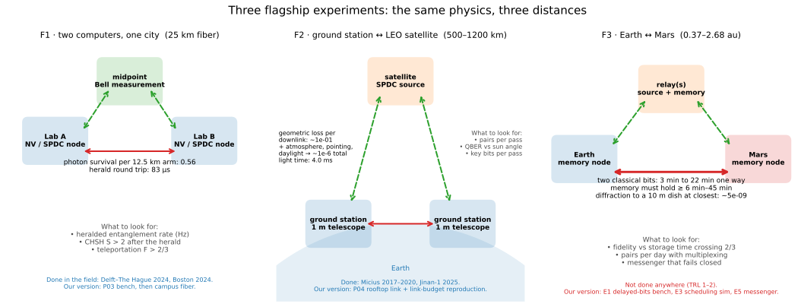
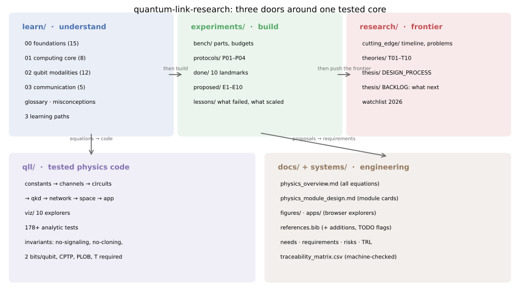
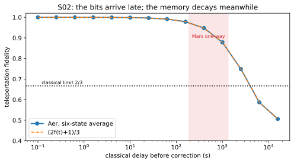
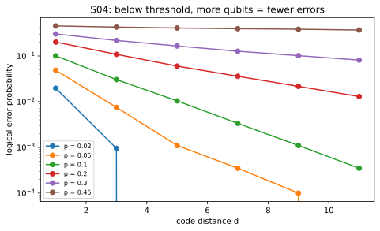
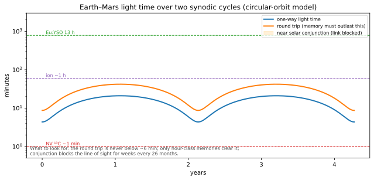
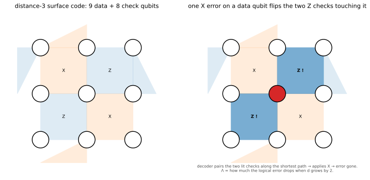
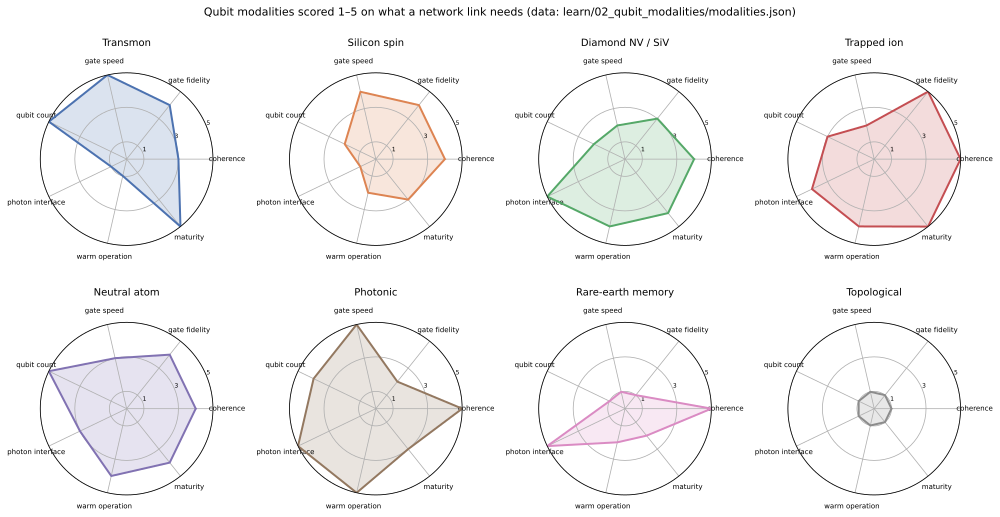

# Quantum Link Research

**Website:** https://Normansrule.github.io/quantum-link-research/ · **Explorers:** https://Normansrule.github.io/quantum-link-research/apps/

[](https://github.com/Normansrule/quantum-link-research/actions/workflows/ci.yml)
[](LICENSE)
[](environment.yml)
[](https://Normansrule.github.io/quantum-link-research/apps/)
[](learn/README.md)
[](experiments/README.md)
[](research/README.md)

> **Can two people, one on Earth and one on Mars, share a secret that no eavesdropper and no future computer can read?**
> Physics says yes, with a catch: entanglement carries no message by itself, and the two classical bits every teleportation needs take 3 to 22 minutes at light speed. This repository is a library, a lab manual, and a tested codebase for working out exactly what that catch costs and what could pay it — starting from a $100 diamond qubit on a bench.


## Three Experiments

| F1 · two computers, one city | F2 · Earth ↔ satellite | F3 · Earth ↔ Mars |
|---|---|---|
| heralded entanglement and teleportation over 25 km of deployed fiber; herald round trip 0.25 ms | single-photon downlink from low Earth orbit; loss $10^{-6}$; one pass = one budget | the same protocol with a 6–45 minute classical round trip; memory must outlive it |
| done in the field (2024); our version: P03 bench → campus fiber | done (Micius 2017, Jinan-1 2025); our version: budget reproduction → rooftop link | done nowhere; our version: delayed-bits bench, scheduling sim, fail-closed messenger |
| [F1](experiments/flagship/F1_earth_to_earth.md) | [F2](experiments/flagship/F2_earth_to_satellite.md) | [F3](experiments/flagship/F3_earth_to_mars.md) |



## Three Doors

| | [**learn/**](learn/README.md) — understand | [**experiments/**](experiments/README.md) — build | [**research/**](research/README.md) — push the frontier |
|---|---|---|---|
| **What** | 46 files from "why quantum" to how every kind of qubit is built | parts and budgets, 4 lab protocols, 10 landmark experiments with cheap recreations, 10 proposals | timeline, open problems, 10 frontier theories, the design process, the backlog |
| **Start** | [three learning paths](learn/README.md#three-learning-paths) | [P01: ODMR on a $100 bench](experiments/protocols/P01_odmr_nv_bench.md) | [BACKLOG](research/thesis/BACKLOG.md) · [NEXT_100](research/thesis/NEXT_100.md) |
| **Rule** | settled physics only, every file cites | every step has a cost and a safety line | every claim has a year and a "verify by" |

Around them sits **`qll/`**, the tested physics code, and **`docs/` + `systems/`**, the engineering record (equations, module cards, requirements, risks, traceability).



## Six Sentences

1. **A qubit is an arrow on a sphere.** Any two-level system is a point on the Bloch sphere; noise shortens the arrow ($T_1$) and blurs its direction ($T_2$). → [learn/00/03](learn/00_foundations/03_qubit_and_bloch_sphere.md)
2. **Heat is noise you can compute.** $\bar n = 1/(e^{\hbar\omega/k_BT}-1)$ thermal quanta per mode: microwave qubits need 15 mK, optical photons are already quiet at room temperature. That one formula decides where every part of a link must live. → [learn/00/06](learn/00_foundations/06_density_matrices_and_open_systems.md)
3. **Photons are the only thing that travels.** Fiber loses them exponentially, free space only as $1/L^2$; past a few hundred km the sky wins. → [learn/03/04](learn/03_quantum_communication/04_satellite_and_deep_space.md)
4. **Entanglement is a resource, not a radio.** Bob's results look random until Alice's two bits arrive at $\le c$; the code physically refuses to read a teleported state early. → [learn/03/02](learn/03_quantum_communication/02_teleportation_and_swapping.md)
5. **The memory must outlive the round trip.** 6–45 minutes to Mars and back; diamond lasts a minute, ions an hour, rare-earth crystals 13 hours at low efficiency. That gap is the thesis question. → [learn/03/03](learn/03_quantum_communication/03_repeaters_and_memories.md)
6. **Everything is checked against an equation.** Every module cites a paper, every default traces to a requirement, every result has an analytic test on established simulators (Qiskit Aer, Stim, QuTiP, SeQUeNCe, Perceval). → [docs/physics_module_design.md](docs/physics_module_design.md)

## Youtube

[**Youtube**](youtube/README.md): verified video links per topic (3Blue1Brown, MinutePhysics, Veritasium, Qiskit, QuTech, Monroe, Lukin, Microsoft, Google), each mapped to the `learn/` file it accompanies.

## Simulations

[`simulations/`](simulations/README.md): five runnable, tested simulations that predict what each flagship bench must reproduce — CHSH vs noise (Aer), teleportation with light-time-delayed bits, the link budget sweep, a repetition code in Stim, key per satellite pass.

|  |  |
|---|---|

## Explorers

**In the browser**, no install: **https://Normansrule.github.io/quantum-link-research/apps/** — five live panels (Bloch sphere with gates, temperature, loss, light time vs memory, QBER).

**On your machine**, matplotlib windows with sliders:
```bash
conda env create -f environment.yml && conda activate qll
python -m qll.viz.thermal_explorer      # also: link_loss_explorer, light_time_explorer, qkd_rate_explorer,
python -m qll.viz.bloch_sphere          #       rabi_ramsey, transmon_levels, stack_map, overview_storyboard, repo_map,
python -m qll.viz.repeater_rate_explorer#       flagship_overview, mars_light_time_cycle, modality_radar, surface_code_lattice
python scripts/make_figures.py          # regenerate every figure in docs/figures/
```

|  |  |
|---|---|
|  |  |
|  |  |

References: [`docs/references.md`](docs/references.md), 270 entries by topic, generated from the BibTeX files.

Every figure carries a "what to look for" note and is drawn by a function under test; `python scripts/make_figures.py` regenerates all 15.

## The Numbers

| Question | Answer from the code | Where |
|---|---|---|
| Thermal photons a 5 GHz qubit sees at 300 K? | ≈ 1250 (10⁻⁷ at 15 mK) | `qll/circuits/noise/thermal.py` |
| …a 1550 nm photon? | ≈ 4 × 10⁻¹⁴ | same |
| Fiber length for 99% loss? | 100 km at 0.2 dB/km | `qll/channels/fiber_loss.py` |
| Micius-class beam fraction reaching 1 m at 1200 km? | ~10⁻⁵–10⁻⁶ | `qll/channels/free_space_diffraction.py` |
| …at Mars, closest approach? | ~10⁻¹¹ | same, with the explorer |
| Time for Alice's two bits to reach Mars? | 3.1–22.3 min | `qll/channels/light_time_delay.py` |
| BB84 stops producing key at… | 11.0% error rate | `qll/qkd/key_rate.py` |
| Best any repeaterless link can do? | −log₂(1−η) bits/use | `qll/qkd/plob_bound.py` |
| Memories that already outlast a Mars round trip? | Eu:YSO (6 h, 13.1 h); trapped ions (> 1 h) | [learn/03/03](learn/03_quantum_communication/03_repeaters_and_memories.md) |

All equations, with their figures and the tests that check them: [**docs/physics_overview.md**](docs/physics_overview.md).

## Map

```
learn/          settled physics, 3 learning paths          research/        frontier + process
  00_foundations  01_computing_core                          cutting_edge/  theories/ T01–T10  thesis/ BACKLOG
  02_qubit_modalities  03_quantum_communication
experiments/    build                                      qll/             tested code (import name qll)
  bench/ protocols/ done/ proposed/ lessons/                docs/            physics_overview, module cards, figures, apps, bib
                                                            systems/         needs, requirements, risks, TRL, traceability
```

## Phases

| Phase | Deliverable | Must pass | Status |
|---|---|---|---|
| 1 | constants, channels, thermal model, QKD theory, explorers, learn/experiments/research library | 180+ analytic and integrity tests | **done** |
| 2 | Bell, teleportation, swapping, CHSH, fidelity, tomography, Kraus noise, no-cloning guard | $F_{\rm ideal}=1$; $F=(2f+1)/3$; $S=2\sqrt2$ | **done** |
| 3 | atmosphere, pointing, link budget; BB84/E91/decoy/MDI/TF; sources, detectors, NV node | Micius reproduced within 3 dB; rates ≤ PLOB | **done** |
| 4 | memories, purification, repeaters (memory-based and all-photonic), scheduling, routing | chain beats direct; $T_{\rm mem}$ vs $2d/c$ | **done** |
| 5 | Kepler ephemeris, conjunction, relay constellations, flown coolers, DSOC-class classical link | envelope within 1 %; L4/L5 > 99.9 % availability | **done** |
| 6 | ML-KEM + QKD hybrid, AES-GCM, fail-closed messenger, benchmark | never sends unkeyed; buffer sizing rule | **done** (SeQUeNCe/Perceval adapters, Jinan-1 fit, bench data remain) |

## Install

```bash
git clone https://github.com/Normansrule/quantum-link-research.git && cd quantum-link-research
conda env create -f environment.yml && conda activate qll
python scripts/check_env.py && pytest -q && python -m qll.systems.traceability
```
CI runs the same on Ubuntu and Windows. Pins: Python 3.12, qiskit 2.5.2, qiskit-aer 0.17.2, stim 1.16.0, qutip 5.3.1, sequence 1.2.0, perceval-quandela 1.2.4, kyber-py 1.2.0, cryptography 50.0.1.

## Contributing
Six rules in [CONTRIBUTING.md](CONTRIBUTING.md) (physics correct · established libraries · every formula cited · every module tested · one idea per file · commit only green). Cite with [CITATION.cff](CITATION.cff). Session history in [docs/SESSION_LOG.md](docs/SESSION_LOG.md); decisions in [research/thesis/DESIGN_PROCESS.md](research/thesis/DESIGN_PROCESS.md).
