<p align="center">
  <a href="https://Normansrule.github.io/quantum-link-research/"></a>
</p>

<p align="center">
  <a href="https://Normansrule.github.io/quantum-link-research/"></a>
  <a href="https://Normansrule.github.io/quantum-link-research/mars/"></a>
  <a href="https://Normansrule.github.io/quantum-link-research/teleport/"></a>
  <a href="https://Normansrule.github.io/quantum-link-research/monitor/"></a>
  <a href="https://Normansrule.github.io/quantum-link-research/repeater/"></a>
  <a href="https://Normansrule.github.io/quantum-link-research/coupler/"></a>
  <a href="research/thesis/THESIS_DRAFT.md"></a>
</p>

<p align="center">
  <a href="https://github.com/Normansrule/quantum-link-research/actions/workflows/ci.yml"></a>
  <a href="CHANGELOG.md"></a>
  <a href="tests"></a>
  <a href="docs/status.md"></a>
  <a href="docs/references.md"></a>
  <a href="learn/README.md"></a>
  
  <a href="LICENSE"></a>
</p>

<p align="center">
  
  
  
  
  
  
  
  
</p>

> **Can two people, one on Earth and one on Mars, share a secret that no eavesdropper and no future computer can read?**
> Physics says yes, with a catch: entanglement carries no message by itself, and the two classical bits every teleportation needs take minutes at the speed of light. This repository computes what that catch costs, what hardware could pay it, and what a student can build on the way, in code where every formula is cited, every module has an analytic test, and every requirement traces to the test that verifies it.

<p align="center">
  <a href="https://Normansrule.github.io/quantum-link-research/">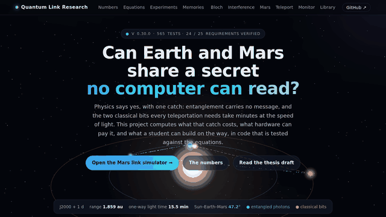</a>
  <br><sub>The live landing page, recorded in headless Chromium: planets placed by the same Kepler ephemeris the Python tests check.</sub>
</p>

## The answer, computed

<p align="center"></p>

Every number above is written by [`scripts/make_readme_art.py`](scripts/make_readme_art.py) from `docs/site_data.json`, which [`scripts/build_site_data.py`](scripts/build_site_data.py) regenerates from the tested code on every commit, so the README, the website, and the thesis cannot disagree.

<details>
<summary><b>The full table, with the module that computes each number</b></summary>

<!-- numbers:start -->
| Question | Answer from the code | Module |
|---|---|---|
| One-way light time, Earth → Mars | **3.1–22.3 min** | `qll/space/ephemeris.py` |
| Round trip a memory must survive (Mars max) | **44.6 min** | `qll/channels/light_time_delay.py` |
| Demonstrated memories that survive it (f₀ = 0.95) | **3 of 6: hour-class ions (99 % retrieval) and rare-earth crystals (< 5 %)** | `qll/network/memory_decoherence.py` |
| Micius two-downlink loss at 30° elevation | **65.7 dB (reported 64–82 dB)** | `qll/channels/link_budget.py` |
| Thermal photons a 5 GHz qubit sees | **1250 at 300 K, 1.1e-07 at 15 mK** | `qll/circuits/noise/thermal.py` |
| BB84 error threshold | **11.00 %** | `qll/qkd/key_rate.py` |
| Where a repeater chain (1 s memories) beats direct fiber | **393 km** | `qll/network/repeater_chain.py` |
| Teleportation fidelity of the pairs it delivers there, without purification | **0.58 (below 2/3: rate is not enough)** | `qll/network/repeater_chain.py` |
| Purification 0.80 → 0.99 | **BBPSSW 10 rounds / 2917 pairs; DEJMPS 4 / 32** | `qll/network/purification.py` |
| Rounds for a device-independent key at S = 0.95·2√2 | **2,535** | `qll/qkd/e91.py` |
| Key buffer to message once a minute through a Mars round trip | **1.43 kB** | `qll/app/messenger.py` |
<!-- numbers:end -->

</details>

## Which memory reaches Mars?

<p align="center"></p>

This is the thesis question in one picture. A stored Bell pair decays toward the useless mixture while the two classical bits cross the Solar System; the bar is how long it stays useful. Hour-class trapped ions and rare-earth crystals clear Mars' farthest round trip, the rare-earth crystals only with a retrieval efficiency below 5 %. [`qll/network/memory_decoherence.py`](qll/network/memory_decoherence.py) computes it and [`learn/03_quantum_communication`](learn/03_quantum_communication) explains it.

## The website

Seven interactive pages, all driven by the same tested numbers and tested themselves in headless Chromium on every push. The animations are recordings of the real pages ([`scripts/record_site.py`](scripts/record_site.py)); click one to open it.

<table>
<tr>
<td width="50%" valign="top"><a href="https://Normansrule.github.io/quantum-link-research/mars/">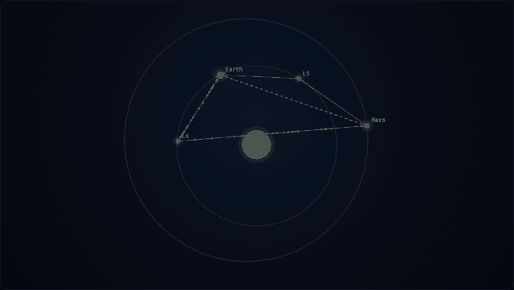</a><br><b>Mars link simulator</b><br><sub>Orbits, conjunction, L4/L5 relays, and which memories outlive today's round trip.</sub></td>
<td width="50%" valign="top"><a href="https://Normansrule.github.io/quantum-link-research/monitor/">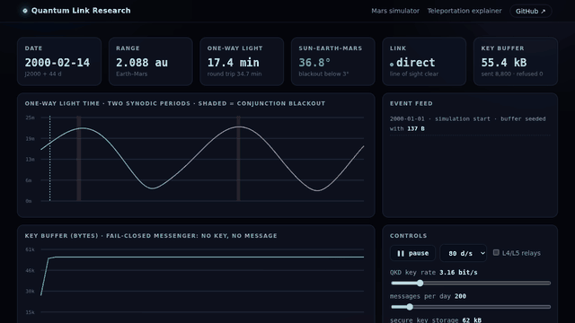</a><br><b>Link monitor</b><br><sub>Two synodic periods of light time and blackouts, and a fail-closed messenger that refuses to send when conjunction drains its key, until relays are switched on.</sub></td>
</tr>
<tr>
<td width="50%" valign="top"><a href="https://Normansrule.github.io/quantum-link-research/teleport/">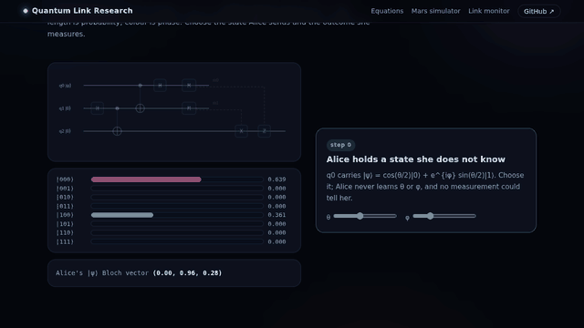</a><br><b>Teleportation, step by step</b><br><sub>Scroll through the protocol with the exact eight-amplitude state (checked against Qiskit to 10⁻¹²), the no-signalling average, and the bits in flight.</sub></td>
<td width="50%" valign="top"><a href="https://Normansrule.github.io/quantum-link-research/#interference">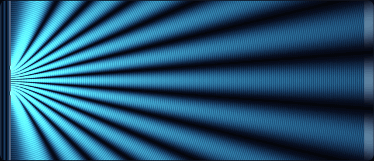</a><br><b>Interference lab</b><br><sub>A WebGL shader sums the two slit waves exactly; which-path information erases the fringes (protocol P06).</sub></td>
</tr>
<tr>
<td width="50%" valign="top"><a href="https://Normansrule.github.io/quantum-link-research/repeater/">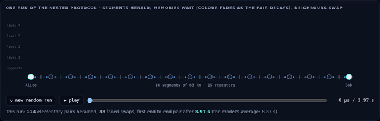</a><br><b>Repeater lab</b> <sup>new</sup><br><sub>One random run of a nested repeater chain: segments herald, stored pairs fade as they decay, swaps join them, failed swaps in red; beside it the average rate against direct fiber and the repeaterless bound, and the fidelity check that rate alone misses.</sub></td>
<td width="50%" valign="top"><a href="https://Normansrule.github.io/quantum-link-research/coupler/">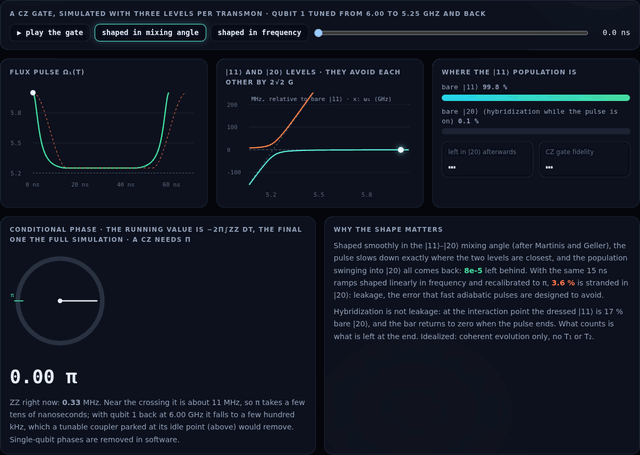</a><br><b>Coupler lab</b><br><sub>Park a tunable coupler where the always-on ZZ vanishes, watch the Ramsey fringes that measure it (E16), and play a simulated CZ gate reaching π with fidelity 0.99998.</sub></td>
</tr>
</table>

## The argument in five equations

<p align="center">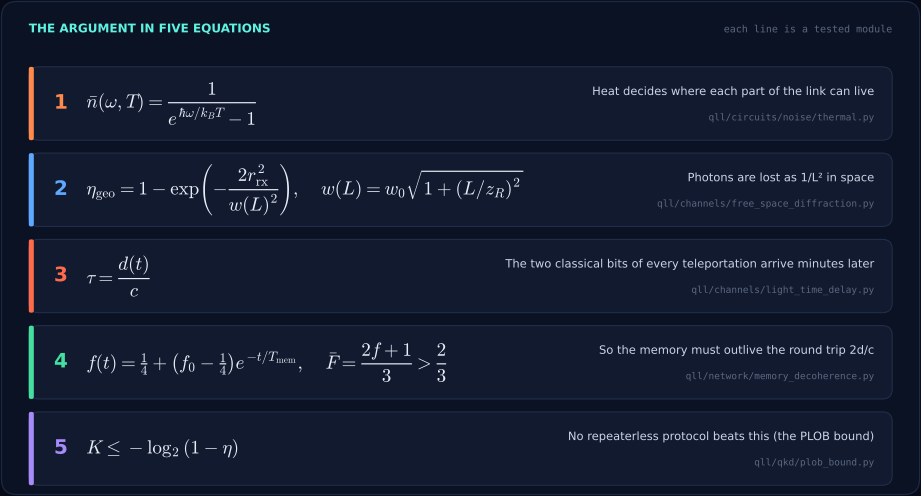</p>

<details>
<summary><b>The same equations as LaTeX</b></summary>

$$\bar n(\omega,T)=\frac{1}{e^{\hbar\omega/k_BT}-1}\qquad\text{heat decides where each part of the link can live}$$

$$\eta_{\rm geo}=1-\exp\left(-\frac{2r_{\rm rx}^2}{w(L)^2}\right),\qquad w(L)=w_0\sqrt{1+(L/z_R)^2}\qquad\text{photons are lost as }1/L^2\text{ in space}$$

$$\tau=\frac{d(t)}{c}\qquad\text{the two classical bits of every teleportation arrive minutes later}$$

$$f(t)=\tfrac14+\left(f_0-\tfrac14\right)e^{-t/T_{\rm mem}},\qquad \bar F=\frac{2f+1}{3}>\frac23\qquad\text{so the memory must outlive }2d/c$$

$$K\le-\log_2(1-\eta)\qquad\text{and no repeaterless protocol beats this}$$

</details>

Each line is a module in [`qll/`](qll) with a test that checks it against its closed form; the full set, with figures, is in [docs/physics_overview.md](docs/physics_overview.md).

## How the code fits together

<p align="center"></p>

## Three experiments, one physics

<p align="center">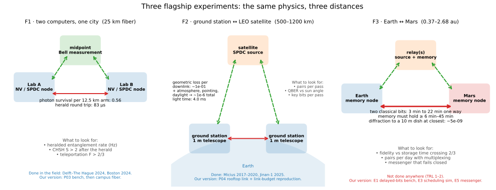</p>

| | F1 · two computers, one city | F2 · Earth ↔ satellite | F3 · Earth ↔ Mars |
|---|---|---|---|
| **What** | heralded entanglement and teleportation over 25 km of fiber | single-photon downlink from low orbit | the same protocol with a 6–45 min round trip |
| **State of the art** | done in the field (2024) | Micius 2017, Jinan-1 2025 | done nowhere |
| **Our version** | P03 bench → campus fiber | Micius budget reproduced within 3 dB → rooftop link | delayed-bits bench, relay scheduling, fail-closed messenger |
| **Plan** | [F1](experiments/flagship/F1_earth_to_earth.md) | [F2](experiments/flagship/F2_earth_to_satellite.md) | [F3](experiments/flagship/F3_earth_to_mars.md) |

<p align="center"><a href="experiments/done/README.md"></a></p>

## What is inside

| | | |
|---|---|---|
| 📚 **[Learn](learn/README.md)**<br>foundations, computing core, eight qubit platforms, communication; every file with equations, a figure, references, and exercises | 🧪 **[Experiments](experiments/README.md)**<br>three flagships, eight bench protocols, fifteen landmark experiments with cheap recreations, sixteen proposals, lessons | 🔭 **[Research](research/README.md)**<br>timeline, open problems, fifteen frontier theories, design process, thesis chapters |
| 💻 **[`qll/`](qll)**<br>tested physics from thermal occupation to a fail-closed Mars messenger, with Qiskit Aer, Stim, QuTiP, SeQUeNCe, and Perceval adapters | 🎛️ **[Simulations](simulations/README.md)**<br>eight scripts that predict what each bench must reproduce | 🎓 **[Course](learn/COURSE_SYLLABUS.md)**<br>15 weeks, four machine-graded problem sets |
| 📈 **[Data](data/README.md)**<br>tested analysis pipelines waiting for the first ODMR (optically detected magnetic resonance) and T₁(T) measurements | 🎬 **[YouTube](youtube/README.md)**<br>verified English videos per topic | 📖 **[References](docs/references.md)**<br>a bibliography that every code citation is checked against |

## Figures

Every figure is drawn by a function under test; `python scripts/make_figures.py` regenerates all of them.

<table>
<tr>
<td width="50%">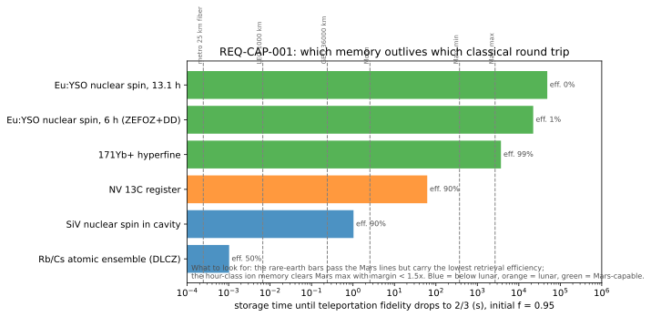</td>
<td width="50%">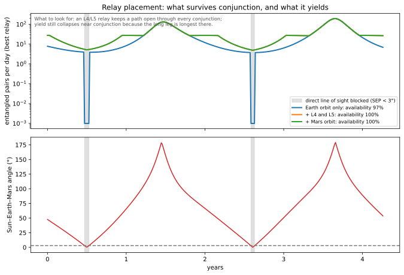</td>
</tr>
<tr>
<td width="50%">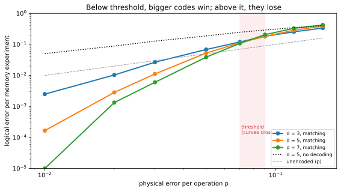</td>
<td width="50%">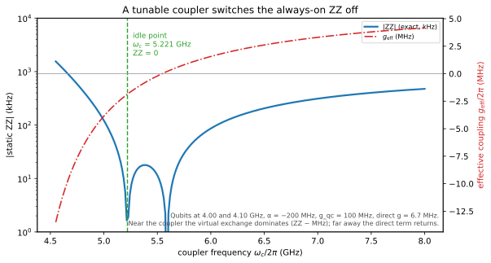</td>
</tr>
<tr>
<td colspan="2">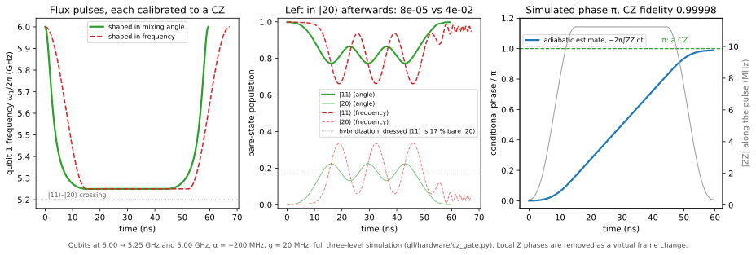</td>
</tr>
</table>

<details>
<summary><b>More figures</b></summary>

<table>
<tr>
<td width="50%">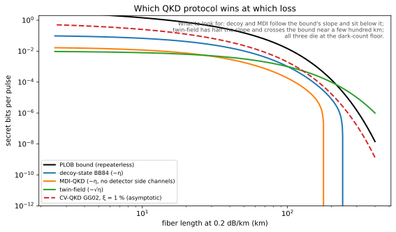</td>
<td width="50%">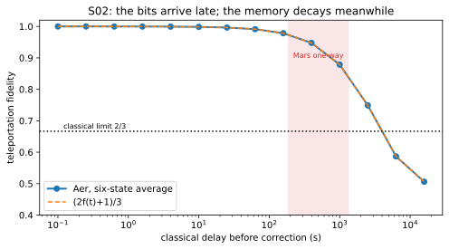</td>
</tr>
<tr>
<td width="50%">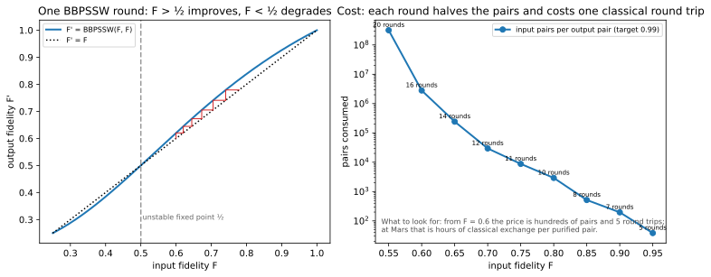</td>
<td width="50%">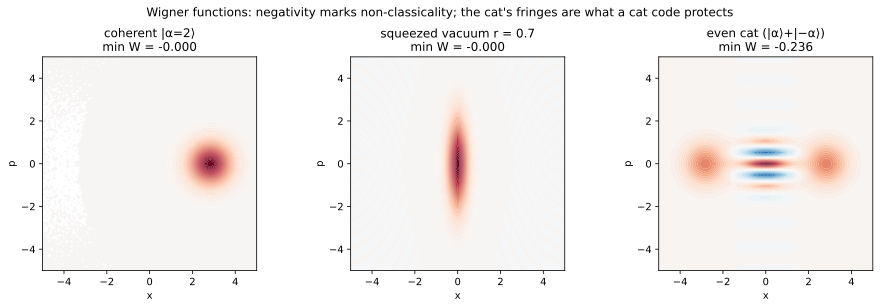</td>
</tr>
<tr>
<td width="50%">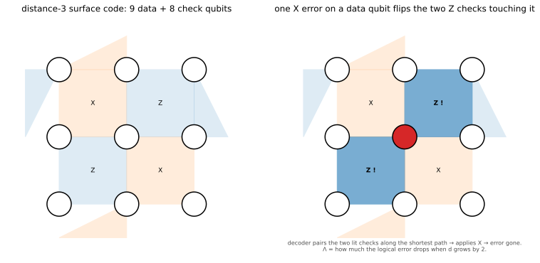</td>
<td width="50%">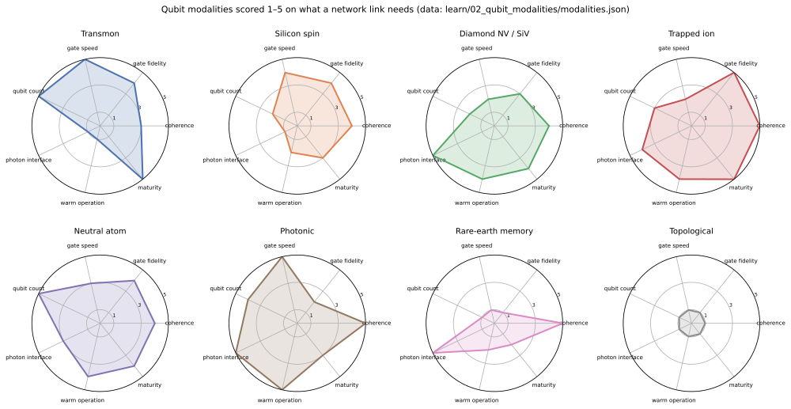</td>
</tr>
<tr>
<td width="50%">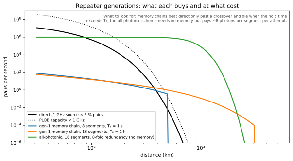</td>
<td width="50%">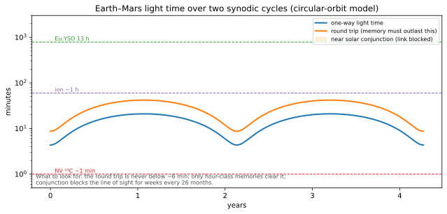</td>
</tr>
<tr>
<td colspan="2">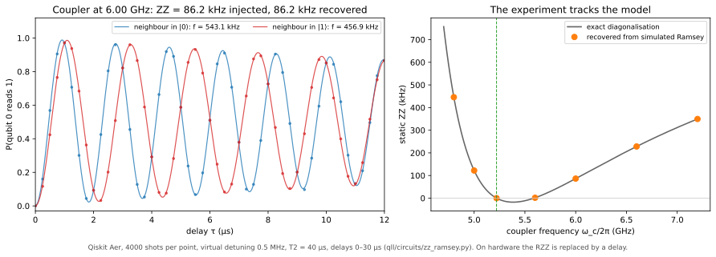</td>
</tr>
<tr>
<td colspan="2">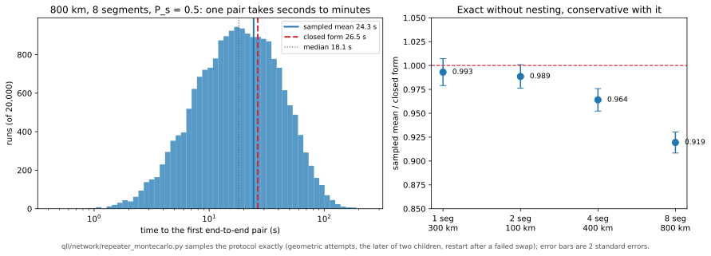</td>
</tr>
</table>

</details>

## Quick start

```bash
git clone https://github.com/Normansrule/quantum-link-research.git && cd quantum-link-research
conda env create -f environment.yml && conda activate qll
python -m pytest -q -m "not slow"                       # the physics, the figures, the library, the citations
python -m qll.systems.traceability                        # every requirement and the test that verifies it
python simulations/s02_teleportation_with_light_time.py   # teleportation with the bits delayed by a Mars light time
python -m qll.viz.memory_crossover                        # which memory outlives which round trip (interactive)
python scripts/build_thesis.py                            # assemble the thesis draft from chapters + generated tables
python -m http.server -d docs 8000                        # the website, offline (libraries are vendored in docs/vendor)
python -m pytest -m browser                               # page tests in headless Chromium (pip install playwright)
python scripts/make_readme_art.py                         # redraw the animated README images from the tested numbers
```

<details>
<summary><b>Phases</b></summary>

| Phase | Deliverable | Must pass | Status |
|---|---|---|---|
| 1 | constants, channels, thermal model, QKD theory, explorers, library | analytic and integrity tests | **done** |
| 2 | Bell, teleportation, swapping, CHSH, fidelity, tomography, Kraus noise, no-cloning guard | $F_{\rm ideal}=1$; $F=(2f+1)/3$; $S=2\sqrt2$ | **done** |
| 3 | atmosphere, turbulence, pointing, link budget; BB84/E91/decoy/MDI/TF/CV; sources, detectors, NV node | Micius within 3 dB; rates ≤ PLOB | **done** |
| 4 | memories, purification (BBPSSW, DEJMPS), repeaters, scheduling, routing | chain beats direct; $T_{\rm mem}$ vs $2d/c$ | **done** |
| 5 | Kepler ephemeris, conjunction, relays, relativity, flown coolers, DSOC-class link | envelope within 1 %; L4/L5 > 99.9 % availability | **done** |
| 6 | ML-KEM + QKD hybrid, AES-GCM, fail-closed messenger, benchmark | never sends unkeyed | **done** |
| — | bench data (P01 ODMR, P02 T₁ vs temperature) | REQ-THM-003 | **waiting on hardware** |

</details>

<details>
<summary><b>Map of the repository</b></summary>

```
qll/            tested physics: constants → channels → circuits → qkd → network → space → app, plus hardware, analysis, viz
simulations/    S01–S08: predictions for each bench            data/       measured CSVs + tested fit pipelines
learn/          settled physics, course, problem sets           experiments/ flagships, protocols, landmarks, proposals, lessons
research/       frontier theories, timeline, thesis             docs/       website, explorers, figures, bibliography, status
systems/        needs, requirements, traceability, risks, TRL   tests/      500+ tests, run on every commit
```

</details>

## Built on the shoulders of

The website and these README images re-implement ideas from twelve open-source projects. No code was copied; [CREDITS.md](CREDITS.md) records exactly what each one contributed.

| Project | What it inspired here |
|---|---|
| [**Magic UI**](https://github.com/magicuidesign/magicui) | number tickers and bento grid (the numbers card above), AnimatedBeam (the stack diagram and the repeater lab's links), Marquee (the landmark strip) |
| [**react-bits**](https://github.com/DavidHDev/react-bits) | gradient text, blur-in reveals, and spotlight cards on the website; the rotating "shine" borders on the README cards |
| [**Animate UI**](https://animate-ui.com/) · [**motion-primitives**](https://github.com/ibelick/motion-primitives) | staggered entrances and easing curves; restrained glass panels |
| [**llm-viz**](https://github.com/bbycroft/llm-viz) · [**transformer-explainer**](https://github.com/poloclub/transformer-explainer) | step-through explainers that show the real internal state: the teleportation page, the coupler lab's CZ player, the repeater lab's sampled run, and the memory-versus-round-trip chart |
| [**WebGL-Fluid-Simulation**](https://github.com/PavelDoGreat/WebGL-Fluid-Simulation) | a full-canvas fragment shader driven by the pointer: the interference lab |
| [**folio-2019**](https://github.com/brunosimon/folio-2019) | the landing page as a 3-D scene to explore: the three.js Solar System |
| [**gods-eye-view**](https://github.com/bilawalsidhu/gods-eye-view) · [**worldmonitor**](https://github.com/koala73/worldmonitor) | a live situation view and a dashboard of tiles, timelines, and an event feed: the hero's live strip and the link monitor |
| [**GSAP**](https://github.com/greensock/GSAP) | used directly for scroll reveals, tickers, and explainer steps |
| [**Remotion**](https://github.com/remotion-dev/remotion) | rendering the product itself into the README's motion; done here with Playwright frame capture |

## Contributing and credits

Six rules in [CONTRIBUTING.md](CONTRIBUTING.md): physics correct · established libraries · every formula cited · every module tested · one idea per file · commit only green. Cite with [CITATION.cff](CITATION.cff). Session history is in [docs/SESSION_LOG.md](docs/SESSION_LOG.md) and decisions in [research/thesis/DESIGN_PROCESS.md](research/thesis/DESIGN_PROCESS.md).
