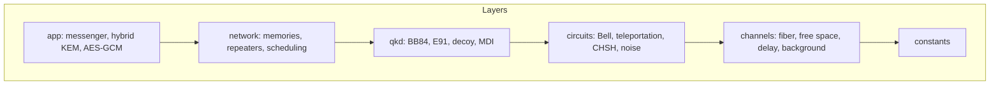
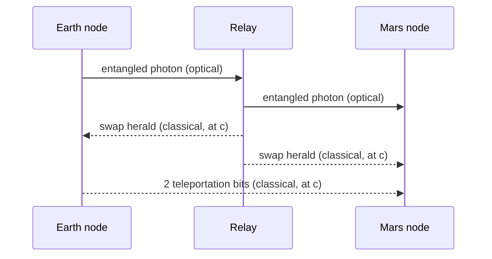

# Architecture

Simulator responsibilities: Qiskit Aer (density-matrix and noisy circuits), Stim (large Clifford circuits and sampling), QuTiP (Lindblad cross-checks for T1/T2 and thermal baths), SeQUeNCe (discrete-event network simulation), Perceval (linear optics), kyber-py + cryptography (post-quantum hybrid application layer).

Three invariants enforced in code: no early classical reads (`light_time_delay.ClassicalMessage`), no cloning (Phase 2 guard), 2 bits per teleported qubit (Phase 2 record).
