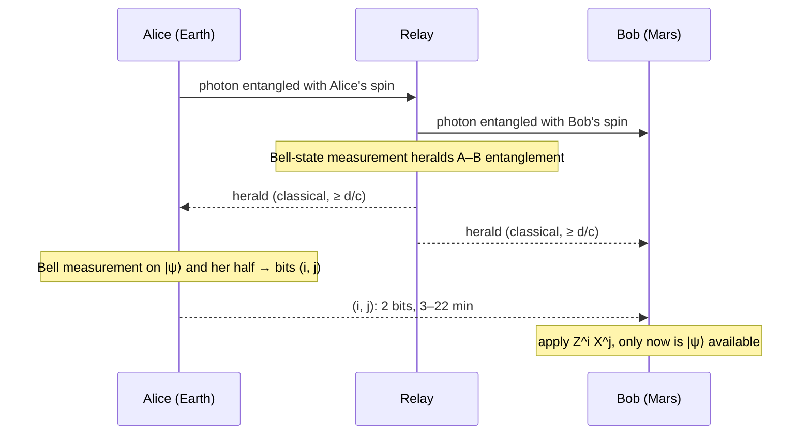

# Physics Overview

This is the long-form companion to the README. Each section states the physics, shows the figure the code draws, and names the module and test that carry it. Paths are relative to the repository root.

## 1. Three rules the code cannot break

| Rule | Statement | Enforced by |
|---|---|---|
| **No signaling** | Entanglement alone carries no message: for any operation on Alice's side, Bob's reduced state $\rho_B=\mathrm{Tr}_A(\rho_{AB})$ is unchanged, so every bit of classical information still travels at $\le c$ [Ghirardi et al. 1980; [Peres & Terno 2004](https://doi.org/10.1103/RevModPhys.76.93)]. | `qll/channels/light_time_delay.py` is the *only* latency source; `ClassicalMessage.receive()` raises `NotYetArrived` before $t = t_{\rm sent} + d/c$. |
| **No cloning** | No unitary $U$ satisfies $U\lvert\psi\rangle\lvert 0\rangle=\lvert\psi\rangle\lvert\psi\rangle$ for all $\lvert\psi\rangle$: linearity forbids it, and the best universal cloner reaches fidelity $5/6$ [[Wootters & Zurek 1982](https://doi.org/10.1038/299802a0); [Bužek & Hillery 1996](https://doi.org/10.1103/PhysRevA.54.1844)]. | Phase 2 guard test reflects over every public function in `qll.circuits`. |
| **Two bits per qubit** | Teleporting one qubit consumes one Bell pair and exactly two classical bits [[Bennett et al. 1993](https://doi.org/10.1103/PhysRevLett.70.1895)]. Over the Earth–Mars channel those two bits take 3 to 22 minutes. | `TeleportationRecord.classical_bits` has length 2 (Phase 2); requirement `REQ-PHY-002`. |

Everything else in this repository is downstream of those three rows.

---

## 2. The temperature hurdle

A mode at angular frequency $\omega$ in equilibrium with a bath at temperature $T$ holds

$$
\bar n(\omega,T)=\frac{1}{e^{\hbar\omega/k_BT}-1},\qquad
T_1(T)=\frac{T_1(0)}{2\bar n+1},\qquad
p_{\rm exc}=\frac{\bar n}{2\bar n+1}
$$

thermal quanta [[Clerk et al. 2010](https://doi.org/10.1103/RevModPhys.82.1155); [Krantz et al. 2019](https://doi.org/10.1063/1.5089550)]. The same formula decides two very different things: whether a *qubit* stays coherent, and whether a *channel* is dark.


| Carrier | $\hbar\omega/k_BT$ at 300 K | $\bar n$ at 300 K | $\bar n$ at 15 mK |
|---|---|---|---|
| 5 GHz microwave qubit | 0.0008 | ≈ 1250 | ≈ 1 × 10⁻⁷ |
| 193 THz photon (1550 nm) | 31 | ≈ 4 × 10⁻¹⁴ | 0 |

So optical carriers cross warm channels essentially noise-free, microwave qubits need dilution refrigerators, and moving quantum information between the two domains, **transduction**, is the open problem [Lauk et al. 2020; [Mirhosseini et al. 2020](https://doi.org/10.1038/s41586-020-3038-6)]. The channel-side version of the same statistics gives the background count rate of a receiver that sees a warm scene,

$$
N=\bar n(\nu,T)\;\frac{A\,\Omega}{\lambda^{2}}\;B\;\eta_{\rm det},
$$

with $A\Omega/\lambda^2$ spatial modes and $B$ temporal modes per second (`qll/channels/thermal_background.py`).

The relaxation of a qubit in that bath is the generalized amplitude-damping channel [Nielsen & Chuang 2010, §8.3.5], $\rho\mapsto\sum_k E_k\rho E_k^\dagger$ with

$$
E_0=\sqrt{p}\begin{pmatrix}1&0\\0&\sqrt{1-\gamma}\end{pmatrix},\;
E_1=\sqrt{p}\begin{pmatrix}0&\sqrt{\gamma}\\0&0\end{pmatrix},\;
E_2=\sqrt{1-p}\begin{pmatrix}\sqrt{1-\gamma}&0\\0&1\end{pmatrix},\;
E_3=\sqrt{1-p}\begin{pmatrix}0&0\\\sqrt{\gamma}&0\end{pmatrix},
$$

$p=(\bar n+1)/(2\bar n+1)$, $\gamma=1-e^{-t/T_1(T)}$, and the test asserts $\sum_k E_k^\dagger E_k=I$ to $10^{-12}$.

---

## 3. Loss: fiber, free space, and the capacity bound

$$
\eta_{\rm fiber}(L)=10^{-\alpha L/10},\qquad L_{\rm att}=\frac{10}{\alpha\ln 10}\approx 21.7\ \text{km at }0.2\ \text{dB/km}
$$

$$
\theta=\frac{\lambda}{\pi w_0},\qquad w(L)\simeq\theta L,\qquad
\eta_{\rm free}=\min\!\left(1,\Big(\frac{D_{\rm rx}}{2w}\Big)^{2}\right)\propto\frac{1}{L^{2}}
$$

Fiber loss is exponential; diffraction loss is only quadratic. That single fact is why satellites beat fiber past a few hundred kilometers [Bourgoin et al. 2013; Yin et al. 2017; [Bedington et al. 2017](https://doi.org/10.1038/s41534-017-0031-5)], and why any Earth–Mars link is optical and free-space.


No repeaterless protocol can extract more than the PLOB capacity

$$
K(\eta)=-\log_2(1-\eta)\;\approx\;1.44\,\eta\quad(\eta\ll1)
$$

secret bits per channel use [[Pirandola et al. 2017](https://doi.org/10.1038/ncomms15043)]; the grey curve is that bound for the free-space link. Beating it requires memories (repeaters) or single-photon interference at a midpoint (twin-field QKD, [[Lucamarini et al. 2018](https://doi.org/10.1038/s41586-018-0066-6)]).

---

## 4. Light time versus memory lifetime: the Earth–Mars problem

$$
\tau_{\rm one\,way}=\frac{d}{c},\qquad \tau_{\rm RT}=\frac{2d}{c},\qquad
d_{\rm Earth\text{-}Mars}\in[0.37,\,2.68]\ \text{au}\;\Rightarrow\;\tau_{\rm one\,way}\in[3.1,\,22.3]\ \text{min}
$$

Teleportation needs the two classical bits to arrive while the receiving half of the Bell pair is still coherent. The stored entanglement of a Werner-type pair decays as

$$
F(t)=\tfrac14+\big(F_0-\tfrac14\big)e^{-t/T_2},\qquad\text{useless once } F<\tfrac12 .
$$


The horizontal lines are demonstrated memory lifetimes. Only the rare-earth nuclear-spin memories, 6 h [[Zhong et al. 2015](https://doi.org/10.1038/nature14025)] and 13.1 h [[Wang et al. 2025](https://doi.org/10.1103/PRXQuantum.6.010302)], already exceed the 45-minute worst-case round trip. That is the whole thesis question in one figure: requirement `REQ-CAP-001`, risk `R-1`.

---

## 5. From correlations to secret bits

$$
h_2(x)=-x\log_2x-(1-x)\log_2(1-x),\qquad r_{\rm BB84}(Q)=\max\big(0,\,1-2h_2(Q)\big)
$$

The secret fraction reaches zero at $Q=11.0\%$ [Shor & Preskill 2000]; the code finds the root by Brent's method and the test demands $0.1100\pm5\times10^{-4}$.


The CHSH combination $S=\lvert E(a,b)-E(a,b')+E(a',b)+E(a',b')\rvert$ obeys $S\le2$ for any local model and $S\le2\sqrt2$ for quantum mechanics [Clauser et al. 1969; [Brunner et al. 2014](https://doi.org/10.1103/RevModPhys.86.419)]; Phase 2 reproduces $2\sqrt2$ in Aer to $10^{-6}$ and samples it in Stim, and device-independent QKD turns $S$ directly into a key rate.

---

## 6. Teleportation, stated precisely

$$
\lvert\psi\rangle_1\otimes\lvert\Phi^+\rangle_{23}
=\tfrac12\sum_{i,j\in\{0,1\}}\lvert\beta_{ij}\rangle_{12}\otimes X^{j}Z^{i}\lvert\psi\rangle_3
$$

Alice measures qubits 1–2 in the Bell basis and obtains $(i,j)$; Bob applies $Z^iX^j$ after the bits arrive. With a resource of singlet fraction $f$ the average fidelity is

$$
F=\frac{2f+1}{3},\qquad F_{\rm classical\ limit}=\frac23
$$

[[Massar & Popescu 1995](https://doi.org/10.1103/PhysRevLett.74.1259); Horodecki et al. 1999]. Phase 2 returns an explicit record `(output_qubit, classical_bits=(i, j), message: ClassicalMessage)`, and the output cannot be read before `message.earliest_arrival_s`.



---

## 7. What has actually been built

| Year | Result | Platform | Reference |
|---|---|---|---|
| 1997 | First photonic teleportation | SPDC photons | Bouwmeester et al., *Nature* 390, 575 |
| 2013 | Heralded entanglement of two NV spins, 3 m | NV diamond, 4 K | Bernien et al., *Nature* 497, 86 |
| 2014 | Unconditional teleportation between solid-state qubits | NV + ¹³C | Pfaff et al., *Science* 345, 532 |
| 2015 | Loophole-free Bell test, 1.3 km | NV diamond | Hensen et al., *Nature* 526, 682 |
| 2017 | Ground-to-satellite teleportation, 1400 km | Micius | Ren et al., *Nature* 549, 70 |
| 2017 | Satellite entanglement distribution, 1200 km | Micius | Yin et al., *Science* 356, 1140 |
| 2020 | Memory-enhanced communication beats direct transmission | SiV nanocavity | [Bhaskar et al., *Nature* 580, 60](https://doi.org/10.1038/s41586-020-2103-5) |
| 2021 | Three-node network with entanglement swapping | NV diamond | Pompili et al., *Science* 372, 259 |
| 2022 | Teleportation between non-neighbouring nodes | NV, 3 nodes | [Hermans et al., *Nature* 605, 663](https://doi.org/10.1038/s41586-022-04697-y) |
| 2024 | Solid-state entanglement over 25 km deployed fiber | NV + frequency conversion | Stolk et al., *Sci. Adv.* 10, eadp6442 |
| 2024 | Memory nodes entangled over 35 km Boston fiber | SiV, telecom conversion | [Knaut et al., *Nature* 629, 573](https://doi.org/10.1038/s41586-024-07252-z) |
| 2025 | Real-time QKD from a 23 kg microsatellite payload | Jinan-1 | [Li et al., *Nature* 640, 47](https://doi.org/10.1038/s41586-025-08739-z) |
| 2025 | Nuclear-spin coherence beyond 10 hours | Eu:YSO | [Wang et al., *PRX Quantum* 6, 010302](https://doi.org/10.1103/PRXQuantum.6.010302) |

Where the interplanetary link stands: the only published mission concept is NASA's Deep Space Quantum Link [[Mohageg et al. 2022](https://doi.org/10.1140/epjqt/s40507-022-00143-0); [2025 update](https://doi.org/10.1140/epjqt/s40507-025-00370-1)], Technology Readiness Level 1–2. The full landmark table with step-by-step accounts of how each experiment was run is in [`experiments/bench/hardware_guide.md`](../experiments/bench/hardware_guide.md), together with three budget tiers for building the bench version (an open-source NV magnetometer for about $100, a two-crystal SPDC Bell test for a semester, turnkey kits).

---

## 8. Interactive apps

Two ways to *turn the knobs* on every equation above. Both call, or mirror, the exact functions the tests validate.

**In the browser** (no install): **https://Normansrule.github.io/quantum-link-research/apps/** — four live panels with sliders (qubit frequency and carrier wavelength; aperture, waist, and wavelength; distance against memory lifetimes; QBER). Source: [`docs/apps/index.html`](apps/index.html), a single file with no build step.

**On your machine** (matplotlib windows with sliders):

```bash
conda activate qll
python -m qll.viz.thermal_explorer      # n̄(ω, T) with a qubit-frequency slider
python -m qll.viz.link_loss_explorer    # fiber vs free space vs PLOB, aperture and waist sliders
python -m qll.viz.light_time_explorer   # d/c and 2d/c against demonstrated memory lifetimes
python -m qll.viz.qkd_rate_explorer     # BB84 secret fraction and PLOB capacity
python -m qll.viz.stack_map             # the level map above
python scripts/make_figures.py          # regenerate every figure in figures/ headlessly
```

Check any number the browser shows against the Python source in one line, for example

```bash
python -c "from qll.circuits.noise.thermal import bose_einstein_occupation as n; import math; print(n(2*math.pi*193.4e12, 300))"
```

---

## 13. References

Every formula and default carries a `[bibkey]` in its docstring; the full BibTeX is in [`references.bib`](references.bib) plus two addition files. DOIs are linked only where they were verified against the publisher; entries marked *TODO* in the `.bib` files are not yet cited from code. Selected entries:

- Bennett, C. H., Brassard, G., Crépeau, C., Jozsa, R., Peres, A., & Wootters, W. K. (1993). Teleporting an unknown quantum state via dual classical and Einstein–Podolsky–Rosen channels. *Physical Review Letters, 70*, 1895. https://doi.org/10.1103/PhysRevLett.70.1895
- Wootters, W. K., & Zurek, W. H. (1982). A single quantum cannot be cloned. *Nature, 299*, 802. https://doi.org/10.1038/299802a0
- Massar, S., & Popescu, S. (1995). Optimal extraction of information from finite quantum ensembles. *Physical Review Letters, 74*, 1259. https://doi.org/10.1103/PhysRevLett.74.1259
- Clerk, A. A., Devoret, M. H., Girvin, S. M., Marquardt, F., & Schoelkopf, R. J. (2010). Introduction to quantum noise, measurement, and amplification. *Reviews of Modern Physics, 82*, 1155. https://doi.org/10.1103/RevModPhys.82.1155
- Krantz, P., et al. (2019). A quantum engineer's guide to superconducting qubits. *Applied Physics Reviews, 6*, 021318. https://doi.org/10.1063/1.5089550
- Pirandola, S., Laurenza, R., Ottaviani, C., & Banchi, L. (2017). Fundamental limits of repeaterless quantum communications. *Nature Communications, 8*, 15043. https://doi.org/10.1038/ncomms15043
- Pirandola, S., et al. (2020). Advances in quantum cryptography. *Advances in Optics and Photonics, 12*, 1012. https://doi.org/10.1364/AOP.361502
- Bedington, R., Arrazola, J. M., & Ling, A. (2017). Progress in satellite quantum key distribution. *npj Quantum Information, 3*, 30. https://doi.org/10.1038/s41534-017-0031-5
- Sidhu, J. S., et al. (2021). Advances in space quantum communications. *IET Quantum Communication, 2*, 182. https://doi.org/10.1049/qtc2.12015
- Hermans, S. L. N., et al. (2022). Qubit teleportation between non-neighbouring nodes in a quantum network. *Nature, 605*, 663. https://doi.org/10.1038/s41586-022-04697-y
- Knaut, C. M., et al. (2024). Entanglement of nanophotonic quantum memory nodes in a telecom network. *Nature, 629*, 573. https://doi.org/10.1038/s41586-024-07252-z
- Li, Y., et al. (2025). Microsatellite-based real-time quantum key distribution. *Nature, 640*, 47. https://doi.org/10.1038/s41586-025-08739-z
- Zhong, M., et al. (2015). Optically addressable nuclear spins in a solid with a six-hour coherence time. *Nature, 517*, 177. https://doi.org/10.1038/nature14025
- Wang, F., et al. (2025). Nuclear spins in a solid exceeding 10-hour coherence times for ultra-long-term quantum storage. *PRX Quantum, 6*, 010302. https://doi.org/10.1103/PRXQuantum.6.010302
- Mohageg, M., et al. (2022). The deep space quantum link. *EPJ Quantum Technology, 9*, 25. https://doi.org/10.1140/epjqt/s40507-022-00143-0
- Stegemann, J., et al. (2023). Modular low-cost 3D printed setup for experiments with NV centers in diamond. *European Journal of Physics, 44*, 035402. https://doi.org/10.1088/1361-6404/acbe7c
- Carney, M., & Kumaran, V. (2025). Uncut Gem: an open-source hackable quantum sensor. arXiv:2509.18329. https://github.com/QuantumVillage/UncutGem
- Dehlinger, D., & Mitchell, M. W. (2002). Entangled photons, nonlocality, and Bell inequalities in the undergraduate laboratory. *American Journal of Physics, 70*, 903. https://doi.org/10.1119/1.1498860
- Nielsen, M. A., & Chuang, I. L. (2010). *Quantum computation and quantum information*. Cambridge University Press.

Contributing: see [CONTRIBUTING.md](../CONTRIBUTING.md) (six rules). Session history: [docs/SESSION_LOG.md](SESSION_LOG.md).

