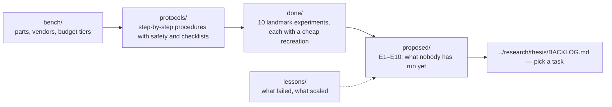

# experiments/ — build, measure, propose

**Start with the three flagships**: [`flagship/README.md`](flagship/README.md) — F1 two computers in one city, F2 Earth to satellite, F3 Earth to Mars. Every protocol, landmark, and proposal below is a stage of one of them.

Everything here involves hardware, a budget, a procedure, or a proposal. Theory lives in `../learn/`; unsettled science in `../research/`.

| Folder | What is in it | Start with |
|---|---|---|
| [`flagship/`](flagship/README.md) | the three experiments the whole repository serves, each staged simulate → bench → field with pass numbers | [`flagship/F1_earth_to_earth.md`](flagship/F1_earth_to_earth.md) |
| [`bench/`](bench/hardware_guide.md) | the hardware guide: every part with a vendor link, three budget tiers ($500 weekend, $5–15k semester, turnkey), step-by-step accounts of how the NV and satellite experiments were run | [`bench/hardware_guide.md`](bench/hardware_guide.md) §5 |
| [`protocols/`](protocols/README.md) | lab procedures you can follow line by line: ODMR on a $100 bench, pulsed NV control, SPDC Bell test, rooftop free-space link | [`protocols/P01_odmr_nv_bench.md`](protocols/P01_odmr_nv_bench.md) |
| [`done/`](done/README.md) | ten experiments that made the field, each with Original · Physics · Simple recreation · What went wrong · Repo hook | [`done/04_odmr_nv.md`](done/04_odmr_nv.md) |
| [`proposed/`](proposed/README.md) | E1–E10, each with gap · cheapest version · research version · requirement verified | [`proposed/E01…`](proposed/E01_delayed_classical_channel_teleportation.md) |
| [`lessons/`](lessons/01_contested_claims.md) | contested and retracted claims; what scaled and why | [`lessons/02_what_scaled_and_why.md`](lessons/02_what_scaled_and_why.md) |

## The recommended order on a student budget
1. **ODMR** ([done/04](done/04_odmr_nv.md), [P01](protocols/P01_odmr_nv_bench.md)) — $100–500, one weekend; you now own a working qubit readout.
2. **Magnet splitting and the spin Hamiltonian** — $0; fit $D\pm\gamma_eB$.
3. **Rabi / Ramsey / echo** ([done/05](done/05_rabi_ramsey_echo_nv.md), [P02](protocols/P02_pulsed_nv_control.md)) — ~$10k; you now have $T_1$, $T_2$ and can run proposal E2.
4. **Hong–Ou–Mandel** and the **SPDC Bell test** ([done/06](done/06_hong_ou_mandel.md), [done/03](done/03_bell_test_spdc.md), [P03](protocols/P03_spdc_bell_test.md)) — $5–15k; flying qubits, CHSH, BB84; add the QRNG board for E6.
5. **Rooftop free-space link** ([P04](protocols/P04_rooftop_free_space_link.md)) — reuse the SPDC source; measure loss and daylight background for E4.
6. Everything else is software first: E1, E3, E5, E7–E10 in `qll/`.

Use [`_TEMPLATE.md`](_TEMPLATE.md) when adding a new experiment file to any folder.
