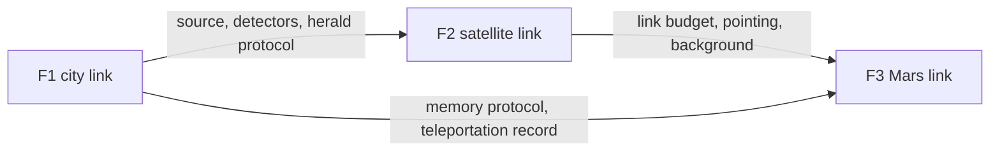

# The three flagship experiments

Everything in this repository serves three experiments, each the same physics at a different distance. Each is staged **simulate → bench → field**, and each stage has a pass/fail number.

| | F1 · Earth ↔ Earth | F2 · Earth ↔ satellite | F3 · Earth ↔ Mars |
|---|---|---|---|
| **Goal** | scalable, heralded entanglement and teleportation between two computers in one city over deployed fiber | entanglement and key from a low-Earth-orbit source to two ground stations | a message channel whose security rests on physics, with the 3–22 minute classical delay handled honestly |
| **Distance** | 1–50 km | 500–1200 km | 0.37–2.68 au |
| **Dominant loss** | fiber, 0.2 dB/km at 1550 nm (needs frequency conversion from 637 nm) | diffraction $1/L^2$, atmosphere, pointing, daylight | diffraction at AU scale ($\sim10^{-9}$ even with a 10 m dish) |
| **Classical round trip** | ~0.1–0.5 ms | ~8 ms | 6–45 min |
| **Memory needed** | ms | ~10 ms | hours (only rare-earth crystals and ions today) |
| **State of the art** | Delft–The Hague 25 km (2024), Boston 35 km (2024) | Micius (2017–2020), Jinan-1 microsatellite (2025) | none; NASA DSQL concept, TRL 1–2 |
| **Our stages** | [F1](F1_earth_to_earth.md): P03 bench → campus fiber → metro fiber | [F2](F2_earth_to_satellite.md): link-budget reproduction → P04 rooftop → ground-station design | [F3](F3_earth_to_mars.md): E1 delayed bits → E3 scheduling → E5 messenger → memory trade E8 |
| **Pass numbers** | herald rate > 1 Hz, S > 2.2, F > 0.7 | reproduce Micius loss ±3 dB; QBER < 5 % at 10° sun angle on the roof | F > 2/3 after a 22-minute stored delay (bench analogue); messenger never sends unkeyed |

The dependency is strict: F2 reuses F1's source and detectors; F3 reuses F2's link budget and F1's memory protocol. Nothing in F3 is new physics; all of it is F1 and F2 with the time axis stretched by $10^6$.

