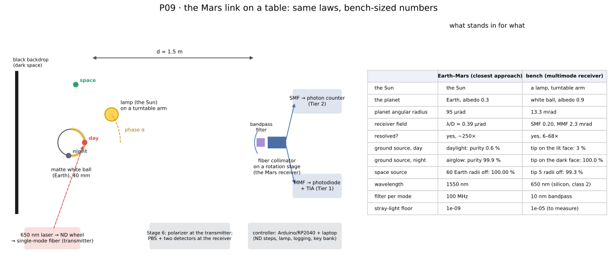

# P09 — The Mars Link on a Table

**What it shows.** The laws that decide the Earth–Mars link, measured on a bench you can build one stage at a time, with a digital twin that predicts every reading before you take it. A lamp stands in for the Sun, a matte white ball for Earth, a bare fiber tip for the Earth-end transmitter, and a fiber collimator for the Mars receiver. The bench cannot reproduce the Mars numbers, since the distances differ by twelve orders of magnitude. It does reproduce the laws behind them:

- sunlit ground swamps a transmitter that sits on the planet, while a transmitter beside the planet stays clean (learn 03/21, trade TS-1);
- a single-mode receiver sees radiance through an étendue of λ² (learn 03/21);
- background turns into errors at exactly the rate the budget assumes (learn 03/21);
- key made unevenly over a synodic period needs a bank sized by the sequent-peak rule (learn 03/22).

**The twin.** `qll/systems/bench_twin.py` holds your bench's parameters (`BenchDesign`) and predicts each stage with the same tested functions that evaluate the Mars link. `python -m qll.analysis.bench_report` has four commands:

- `predict` prints what you should see with your parts;
- `synthetic` writes a complete fake data set, so you can run the analysis before you own a single part;
- `schedule` compresses a synodic period into attenuation steps;
- `report` fits whatever stages you have logged and compares them with the twin, stage by stage, with PASS or CHECK.

**Tiers.** Parts and planning prices are in [`bench/P09_bill_of_materials.md`](../bench/P09_bill_of_materials.md).

| Tier | Detector | Stages | Planning cost |
|---|---|---|---|
| 0 | none: simulation only | all, on synthetic data | $0 |
| 1 | silicon photodiodes with a Transimpedance Amplifier (TIA) | 1, 2, 3 (Multimode Fiber, MMF), 4, 5 (MMF), 6, 7 (in equivalent photons) | $150–400 |
| 2 | adds a Silicon Photomultiplier (SiPM) photon counter | adds 3 (Single-Mode Fiber, SMF, against MMF), 5 (SMF), 7 in real counts | adds $150–400 |
| 3 | adds the P03 entangled-photon source and a time tagger | measure-on-arrival BBM92 key over the bench | $3,000–15,000 |

Work in a room you can darken. Log every stage to `data/bench/` (file names and columns are in the report's help text and in `data/README.md`). Put your measured part values in `data/bench/bench.json`; the template is [`bench/P09_bench.json`](../bench/P09_bench.json).

---

## Stage 0 — Simulate first (one evening, $0)
1. Copy `experiments/bench/P09_bench.json` to `data/bench/bench.json` and edit it to match the parts you plan to buy: wavelength, filter width, collimator focal length and aperture, fiber core and numerical aperture, and ball size.
2. Run `python -m qll.analysis.bench_report predict --config data/bench/bench.json`. Read each line: the photocurrent Stage 1 should give, the phase-curve power, the lit-card power in each fiber, and the purity of each transmitter placement.
3. Run `python -m qll.analysis.bench_report synthetic --out data/_examples/bench`, then `python -m qll.analysis.bench_report report data/_examples/bench --save bench_synthetic.svg`. Every stage should print PASS, and the fits should recover the synthetic bench's hidden values: albedo 0.85, stray floor 3 × 10⁻⁶, polarization error 3 %.

**Pass.** You can explain each predicted number, and you have chosen a tier. If the Stage 3 SMF power is below about 10⁻¹² W, a photodiode cannot see it; that measurement belongs to Tier 2.

## Stage 1 — Frame, lamp, and calibration (one weekend)
**Build.**
- Lay out the bench on a board or two tables, about 0.5 m × 2 m, with every optical axis at one height (100 mm is convenient).
- Hang black felt or foam board behind the ball's position; it is the dark sky.
- Mount the lamp on an arm about 0.25 m long, pivoting on a turntable bearing centred under the ball, so that it can swing from beside the receiver's line of sight (phase 0°) to behind the ball (180°). The ball comes in Stage 2. Keep the lamp's direct light out of the receiver with a 3D-printed baffle.
- Warm the lamp for ten minutes before any reading.

**Measure.** Put the bare, filtered photodiode (BPW34 class, with the bandpass filter taped over it) where the ball will sit, facing the lamp. Log five photocurrent readings to `calibration.csv` (column `photocurrent_a`), then one with the lamp blocked, and subtract it.

**Simulate.** `report` converts the photocurrent to the lamp's spectral irradiance, $E_\lambda = I/(R\,A\,\Delta\lambda)$. It uses the photodiode's responsivity and area from `bench.json`, and uses $E_\lambda$ in every later stage.

**Pass.** Readings stable to 2 % over ten minutes. If they drift, the lamp supply is sagging or the lamp is not yet warm.

## Stage 2 — The planet's phase curve (one evening)
**Build.** Paint a ping-pong ball (40 mm) with two coats of matte white primer and mount it on a thin rod at beam height. Put the bare, filtered photodiode about 0.4 m from the ball (`phase_distance_m`), with a short blackened tube in front of it so that it sees the ball and the felt but not the lamp.

**Measure.** Swing the lamp from 10° to 150° of phase in 10° steps. At each step log the signal, then block the lamp with a card and log the dark reading, to `phase.csv` (`phase_deg, signal, dark`).

**Simulate.** A Lambertian sphere of normal albedo $A$ dims with phase as $\Phi(\alpha) = (\sin\alpha + (\pi-\alpha)\cos\alpha)/\pi$, and its geometric albedo is $p = 2A/3$ [russell1916]. `report` fits the scale and derives the ball's albedo.

**Pass.** Residual under 5 % of the peak up to 120°, and an albedo between about 0.7 and 0.95. A glossy ball shows a bright spike near small phase angles; repaint it matte.

## Stage 3 — Brightness is conserved, and a mode has étendue λ² (one or two weekends)
**Build.**
- Replace the ball with a lit, matte white card that fills the receiver's field.
- The receiver is a fiber collimator with the bandpass filter in front of it.
- For Tier 1, the collimator feeds 50 µm MMF, and the MMF feeds a photodiode through a 3D-printed FC receptacle. The TIA feedback is 100 MΩ to 1 GΩ, because the predicted power is about 10⁻¹⁰ W.
- For Tier 2, repeat with the SMF on the SiPM counter; the prediction is about 5 × 10⁵ photons per second before detector efficiency.

**Measure.** For each fiber, log the power at card distances of 0.3, 0.5, 0.8, and 1.2 m (the card must fill the field at every distance), and at 0.5 m with each filter width you have. Log a dark reading with the lamp blocked each time. Everything goes to `etendue.csv` (`fiber, distance_m, filter_nm, signal, dark`).

**Simulate.**
- A receiver whose field is filled by a surface of radiance $L = A E\cos z/\pi$ collects $L\,\Delta\lambda\,G$ [hapke2012].
- $G = \lambda^2$ for SMF and $(\pi a^2)(\pi\,\mathrm{NA}^2)$ for MMF [siegman1986].
- So the collected power does not depend on distance, is proportional to the filter width, and is $G/\lambda^2$ times larger in MMF. The twin predicts about 700 at 650 nm.

**Pass.**
- Distance slope $0 \pm 0.1$.
- Filter-width slope $1 \pm 0.15$.
- Tier 2: the MMF/SMF ratio is within a factor of 2 of the prediction. Coupling efficiencies differ between the fibers; that is what the factor allows for.

This is the measurement behind the Mars result that a bigger receiver does not improve purity once Earth fills its field.

## Stage 4 — Off-axis rejection (one weekend)
**Build.**
- Put the point source (the transmitter's fiber tip, or a laser behind a 25–50 µm pinhole) where the ball was, lamp off.
- Mount the receiver on a lever-arm rotation stage. A 200 mm arm pushed by an M3 screw (0.5 mm pitch) turns 2.5 mrad per turn, and a twentieth of a turn is 0.125 mrad.
- Use Neutral Density (ND) filters in front of the source for the bright core points and remove them for the far wings. Multiply each reading by 10 to the power of the Optical Density (OD) you used.

**Measure.** Log off-axis angles from 0 to about 50 mrad, fine near the axis and coarse beyond 5 mrad, to `rejection.csv` (`fiber, theta_rad, signal, dark`).

**Simulate.**
- The SMF receiver accepts a Gaussian $\exp(-2\theta^2/\theta_m^2)$ with $\theta_m = (\mathrm{MFD}/2)/f$.
- The MMF receiver accepts everything inside its field stop $a/f$.
- Beyond both, the lens's Airy wing $8/(\pi x^3)$ applies [born1999], and never less than the stray-light floor.
- `report` fits $\theta_m$ and the floor, then uses the floor in Stage 5.

**Pass.** The fitted SMF $\theta_m$ is within 30 % of the prediction. Record the floor: a hobby collimator gives something like 10⁻⁵ to 10⁻⁶. The Mars design needs 10⁻⁹; the gap is risk R-9, and Stage 5 shows what it costs.

## Stage 5 — Ground source or space source (one weekend)
**Build.** Fix the transmitter's fiber tip in three places, aiming the receiver at it each time (peak it up on the stage):

- **day:** on the ball's face toward the receiver, lamp at about 20° of phase;
- **night:** the same point with the lamp swung behind the ball (about 160°);
- **space:** beside the ball at 3, 5, and 10 ball radii from its centre, lamp at about 20°.

Set the transmitter's attenuation so that the day placement is swamped; `predict` suggests OD 5 for the MMF receiver.

**Measure.** For each placement log the signal alone (laser on, lamp off) and the background alone (laser off, lamp on) to `purity.csv` (`fiber, placement, offset_radii, phase_deg, signal_only, background_only`).

**Simulate.** The twin predicts the background for each placement from the fitted lamp, albedo, and floor, and computes the purity $w = S/(S+N)$ with your measured signal. The report prints purity measured and predicted, and the ratio of measured to predicted background.

**Pass.**
- Day purity below 10 %, night above 99 %, space above 95 %.
- Measured background within a factor of 2 of the twin for the day and space placements.

This is TS-1 on a table.

## Stage 6 — Background becomes errors (one evening)
**Build.** Put a linear polarizer (film) at the transmitter, set horizontal. Put a second polarizer in a rotating mount in front of the receiver: its 0° setting is the "right" port and 90° the "wrong" one. In Tier 2 you can use a Polarizing Beamsplitter (PBS) and two counters instead, to measure both at once.

**Measure.** Vary the purity by swinging the lamp or changing the attenuation. At each setting, log:

- the purity (from separate signal-only and background-only readings, as in Stage 5);
- then, with both on, the right and wrong readings.

Log them to `errors.csv` (`purity, right, wrong`).

**Simulate.**
- Unpolarized background splits evenly, so the error fraction is $e = w\,e_{\mathrm{opt}} + (1-w)/2$.
- This is exactly the Werner error rate $2(1-f)/3$ of $f = \tfrac14 + w(f_0 - \tfrac14)$ that the Mars budget uses; the test suite checks the identity.
- `report` fits $e_{\mathrm{opt}}$, your bench's error with no background.

**Pass.** Residual under 1 percentage point, and $e_{\mathrm{opt}}$ under 5 %. Above 11 % no key survives [shor2000]; find the purity at which your bench crosses it.

## Stage 7 — A synodic period on a table, and the key bank (one or two evenings)
**Build.** Leave the transmitter in the space placement at about 6 radii with the lamp on. Give it a way to step its attenuation:

- a servo-turned ND wheel (3D-printed, with filters from OD 0 to 2 in 0.5 steps, plus a shutter blade for conjunction), or
- the laser module's current, pulse-width modulated by the controller (calibrate power against duty first).

**Simulate.** `python -m qll.analysis.bench_report schedule --out data/bench/schedule.csv --steps 78` writes 78 steps, ten Mars days each. Each step's `extra_od` reproduces the link's relative pair rate that day, and `inf` closes the shutter at conjunction.

**Measure.** Step through the schedule: about 5 s per step, so a synodic period takes under seven minutes. For each step, log `step, extra_od, signal, background, right, wrong, seconds` to `run.csv`. Tier 1 logs powers converted to equivalent photons; Tier 2 logs real counts.

**Report.** `report` turns each step into key with $\tfrac12\,n\,(1 - 2h(e))$ bits, sets a demand of half the mean, and sizes the bank with the sequent-peak rule [loucks2017]. It counts the refusals without the bank and checks that the bank carries the demand through two passes of the period. With `--save`, it draws the key per step, the demand, and the bank level, the same curves as the budget page's key-bank panel.

**Pass.** Refusals without the bank, none with it. This is REQ-APP-003 on a table.

---

## What the bench proves and what it does not
- **It proves the laws** with your own hands: the Lambert phase curve, conservation of radiance, single-mode étendue, off-axis rejection, background-limited purity, the error-rate identity, and the key bank.
- **The twin is the bridge:** the same functions evaluate the Mars link, so a law that fails on the bench fails in the budget too.
- **It does not demonstrate Mars-grade stray light.** A floor of 10⁻⁹ at a milliradian is coronagraph territory (R-9).
- **Nor does it demonstrate quantum security.** A classical or weak-coherent bench is not secure against photon-number splitting; Tier 3 with the P03 entangled source is the version that measures true BBM92 key on arrival [bennett1992bbm92].

## Safety
- **Laser:** use a class 2 visible laser (650 nm, 1 mW or less) and never look into the beam or a fiber tip, even when it seems dim.
- **Lamp:** halogen lamps run hot enough to burn skin and scorch felt; keep a gap and never leave one on unattended.
- **SiPM bias:** 25–55 V at low current still deserves an insulated enclosure.
- **Filters:** ND filters absorb, so keep the laser's full power off glued film filters.

## Repo hook
- **Code:** `qll/systems/bench_twin.py`, `qll/analysis/bench_fit.py`, and `qll/analysis/bench_report.py`.
- **Tests:** `tests/test_bench_twin.py` checks the twin's laws against analytic results and recovers a hidden bench from synthetic data.
- **Figure:** `qll/viz/bench_layout.py`.
- **Requirement:** REQ-CHN-003 (background model validated on a bench), verified for the model with the hardware pending.

## References
- Russell, H. N. (1916). On the albedo of the planets and their satellites. *The Astrophysical Journal*, 43, 173–196.
- Hapke, B. (2012). *Theory of reflectance and emittance spectroscopy* (2nd ed.). Cambridge University Press.
- Siegman, A. E. (1986). *Lasers*. University Science Books.
- Born, M., & Wolf, E. (1999). *Principles of optics* (7th ed.). Cambridge University Press.
- Shor, P. W., & Preskill, J. (2000). Simple proof of security of the BB84 quantum key distribution protocol. *Physical Review Letters*, 85, 441–444. https://doi.org/10.1103/PhysRevLett.85.441
- Bennett, C. H., Brassard, G., & Mermin, N. D. (1992). Quantum cryptography without Bell's theorem. *Physical Review Letters*, 68, 557–559. https://doi.org/10.1103/PhysRevLett.68.557
- Loucks, D. P., & van Beek, E. (2017). *Water resource systems planning and management*. Springer. https://doi.org/10.1007/978-3-319-44234-1
