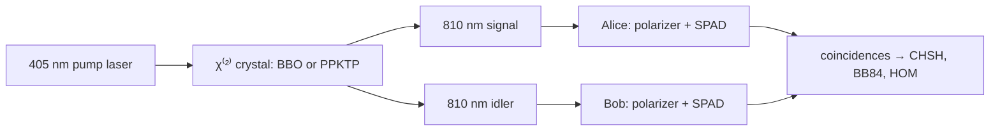

# Quantum optics: states of light and the atom–photon interaction

## Definitions
- **Fock state** $\lvert n\rangle$: exactly $n$ photons in a mode; $\Delta n=0$, phase undefined.
- **Coherent state** $\lvert\alpha\rangle=e^{-\lvert\alpha\rvert^2/2}\sum_n\frac{\alpha^n}{\sqrt{n!}}\lvert n\rangle$: a laser; Poissonian $P(n)$, $\bar n=\lvert\alpha\rvert^2$; the "weak coherent pulse" of decoy-state QKD is this with $\bar n\sim0.5$.
- **Thermal state**: Bose–Einstein $P(n)$; the background of every warm channel.
- **Squeezed state**: uncertainty below vacuum in one quadrature at the cost of the other; the resource of continuous-variable QKD and Gaussian boson sampling; also what makes LIGO more sensitive.
- **Second-order correlation** $g^{(2)}(0)=\frac{\langle a^{\dagger2}a^2\rangle}{\langle a^\dagger a\rangle^2}$: 1 for coherent light, 2 for thermal, 0 for a single photon (antibunching, `05_experiments/done/02`).
- **Jaynes–Cummings model**: one two-level atom, one cavity mode; vacuum Rabi splitting $2g$; strong coupling when $g>\kappa,\gamma$. The physics of circuit QED, of SiV nanocavities, and of atom–cavity network nodes.
- **Spontaneous parametric down-conversion (SPDC)**: a pump photon splits into two (signal, idler) in a $\chi^{(2)}$ crystal with energy and momentum conservation (phase matching); the workhorse entangled-photon source.

## Equations
$$H_{\rm JC}=\hbar\omega_ca^\dagger a+\frac{\hbar\omega_q}{2}Z+\hbar g(a\sigma_++a^\dagger\sigma_-),\qquad \Omega_{\rm vac}=2g\sqrt{n+1}$$
$$\text{SPDC: } \omega_p=\omega_s+\omega_i,\ \vec k_p=\vec k_s+\vec k_i;\quad \lvert\psi\rangle\approx\lvert0,0\rangle+\sqrt p\,\lvert1,1\rangle+p\lvert2,2\rangle+\dots$$
Heralded single-photon purity: $g^{(2)}_{\rm heralded}(0)\approx2p$ for small $p$ (the multi-pair term). Squeezing in dB: $-10\log_{10}(\Delta X^2/\Delta X_{\rm vac}^2)$; 15 dB is the record (2016).

## Visual

## Key papers and texts
- Glauber, R. J. (1963). Coherent and incoherent states of the radiation field. *Physical Review*, 131, 2766. https://doi.org/10.1103/PhysRev.131.2766
- Jaynes, E. T., & Cummings, F. W. (1963). Comparison of quantum and semiclassical radiation theories with application to the beam maser. *Proc. IEEE*, 51, 89. https://doi.org/10.1109/PROC.1963.1664
- Burnham, D. C., & Weinberg, D. L. (1970). Observation of simultaneity in parametric production of optical photon pairs. *Physical Review Letters*, 25, 84. https://doi.org/10.1103/PhysRevLett.25.84
- Kimble, H. J., Dagenais, M., & Mandel, L. (1977). Photon antibunching in resonance fluorescence. *Physical Review Letters*, 39, 691. https://doi.org/10.1103/PhysRevLett.39.691
- Vahlbruch, H., et al. (2016). Detection of 15 dB squeezed states of light. *Physical Review Letters*, 117, 110801.
- Gerry, C., & Knight, P. (2005). *Introductory Quantum Optics*. Cambridge University Press.
- Fox, M. (2006). *Quantum Optics: An Introduction*. Oxford University Press.

## In this repo
`qll/hardware/photon_source.py` (Phase 3): SPDC and weak-coherent statistics, heralded $g^{(2)}$; `qll/qkd/decoy_state.py` uses the coherent-state $P(n)$.

## Exercises
1. Show $g^{(2)}(0)=1$ for a coherent state and $2$ for a thermal state.
2. For SPDC with $p=0.02$ per pulse, compute the heralded $g^{(2)}(0)$ and the fraction of heralds that are multi-pair.
