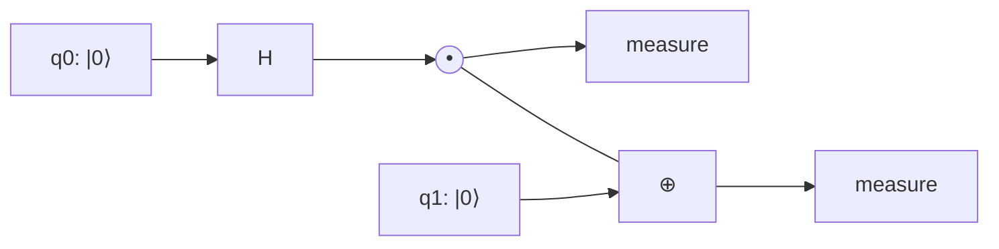

# Gates and circuits

## Definitions
- **Single-qubit gates**: rotations of the Bloch sphere; Clifford set $\{H,S\}$ plus $T=\mathrm{diag}(1,e^{i\pi/4})$ for universality.
- **CNOT**: $\lvert a,b\rangle\to\lvert a,b\oplus a\rangle$; with all single-qubit gates it is universal. Equivalent up to local gates: CZ, iSWAP (superconducting), Mølmer–Sørensen $XX$ (ions), Rydberg CZ (atoms), fusion measurements (photons).
- **Circuit model**: wires are qubits, time runs left to right, measurements at the end (or mid-circuit with feed-forward).
- **Clifford group**: gates that map Paulis to Paulis; Clifford circuits are efficiently classically simulable (Gottesman–Knill), which is what Stim exploits.
- **Depth, width, two-qubit gate count**: the resource measures that matter on hardware.

## Equations
$$\mathrm{CNOT}=\lvert0\rangle\langle0\rvert\otimes I+\lvert1\rangle\langle1\rvert\otimes X,\qquad \mathrm{CZ}=(I\otimes H)\,\mathrm{CNOT}\,(I\otimes H)$$
$$R_{\hat n}(\alpha)=e^{-i\alpha\hat n\cdot\vec\sigma/2},\qquad \text{any }U\in SU(2)=R_z(\gamma)R_y(\beta)R_z(\alpha)$$
Average gate fidelity of a channel with process fidelity $F_p$ on $d$ dimensions: $F_{\rm avg}=(dF_p+1)/(d+1)$ [Nielsen 2002].

## Visual

$H$ then CNOT makes $\lvert\Phi^+\rangle$: this two-gate circuit is `qll/circuits/bell.py`.

## Key papers
- Barenco, A., et al. (1995). Elementary gates for quantum computation. *Physical Review A*, 52, 3457. https://doi.org/10.1103/PhysRevA.52.3457
- Gottesman, D. (1998). The Heisenberg representation of quantum computers. arXiv:quant-ph/9807006
- Aaronson, S., & Gottesman, D. (2004). Improved simulation of stabilizer circuits. *Physical Review A*, 70, 052328.
- Nielsen, M. A. (2002). A simple formula for the average gate fidelity. *Phys. Lett. A*, 303, 249. https://doi.org/10.1016/S0375-9601(02)01272-0
- Gidney, C. (2021). Stim: a fast stabilizer circuit simulator. *Quantum*, 5, 497.

## In this repo
Qiskit builds circuits; Aer simulates them with noise; Stim samples Clifford circuits at scale (Bell, GHZ, CHSH sampling). Phase 2 files: `bell.py`, `ghz.py`, `superdense_coding.py`.

## Exercises
1. Decompose SWAP into three CNOTs and verify with Qiskit.
2. Explain why the $T$ gate is the expensive one in fault-tolerant computing (see `04_error_correction.md`).
