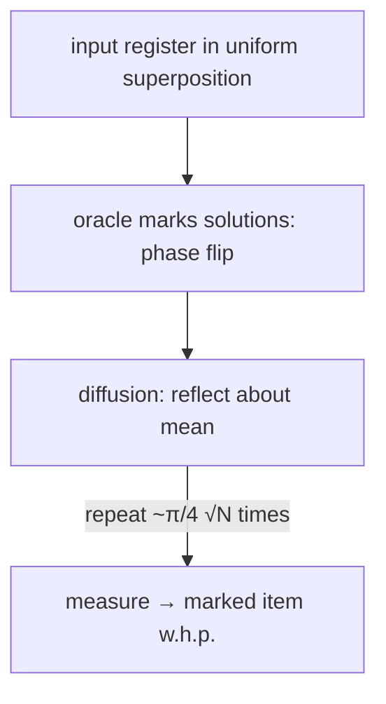

# Algorithms: what a quantum computer is for

## Definitions
- **Query/oracle algorithms**: Deutsch–Jozsa (1 query vs $2^{n-1}+1$), Bernstein–Vazirani, Simon. Pedagogical; they show interference doing the work.
- **Grover search**: $O(\sqrt N)$ queries for unstructured search; provably optimal (BBBV).
- **Quantum Fourier transform (QFT)** and **phase estimation**: the engine of Shor's algorithm and of Hamiltonian-simulation energy estimation.
- **Shor's algorithm**: factoring in polynomial time via period finding; the reason post-quantum cryptography (ML-KEM in `qll/app/hybrid_kem.py`) exists.
- **Hamiltonian simulation**: Trotter–Suzuki, qubitization; the most likely first useful application (chemistry, materials).
- **Variational algorithms** (VQE, QAOA): shallow circuits with classical optimization; the workhorses of the NISQ (Noisy Intermediate-Scale Quantum) era, with contested advantage.

## Equations
Grover iterations: $k\approx\frac\pi4\sqrt{N/M}$ for $M$ marked items among $N$.
Phase estimation: $U\lvert u\rangle=e^{2\pi i\phi}\lvert u\rangle$ read to $t$ bits with $O(1/\epsilon)$ controlled-$U$ applications.
Shor: find $r$ with $a^r\equiv1\pmod N$; then $\gcd(a^{r/2}\pm1,N)$ is a factor with probability $\ge1/2$. Resource estimates for RSA-2048: about 20 million noisy physical qubits and 8 hours [Gidney & Ekerå 2021]; later estimates are lower (**TODO: verify current best**).

## Visual

## Key papers
- Deutsch, D., & Jozsa, R. (1992). Rapid solution of problems by quantum computation. *Proc. R. Soc. A*, 439, 553.
- Grover, L. K. (1996). A fast quantum mechanical algorithm for database search. *Proc. STOC*, 212. arXiv:quant-ph/9605043
- Shor, P. W. (1997). Polynomial-time algorithms for prime factorization and discrete logarithms on a quantum computer. *SIAM J. Comput.*, 26, 1484. https://doi.org/10.1137/S0097539795293172
- Kitaev, A. Y. (1995). Quantum measurements and the Abelian stabilizer problem. arXiv:quant-ph/9511026
- Peruzzo, A., et al. (2014). A variational eigenvalue solver on a photonic quantum processor. *Nat. Commun.*, 5, 4213.
- Farhi, E., Goldstone, J., & Gutmann, S. (2014). A quantum approximate optimization algorithm. arXiv:1411.4028
- Preskill, J. (2018). Quantum computing in the NISQ era and beyond. *Quantum*, 2, 79. https://doi.org/10.22331/q-2018-08-06-79
- Gidney, C., & Ekerå, M. (2021). How to factor 2048 bit RSA integers in 8 hours using 20 million noisy qubits. *Quantum*, 5, 433.

## In this repo
Algorithms are not the thesis focus; they enter only through Shor's threat model (why `qll/app/hybrid_kem.py` combines QKD with ML-KEM) and phase estimation as the reason coherent memories matter.

## Exercises
1. Run Grover for $N=16$, $M=1$ in Qiskit Aer and plot success probability vs iterations; identify the over-rotation.
2. Explain in two sentences why Shor breaks RSA but not AES-256.
