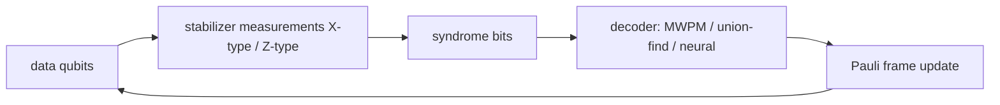

# Quantum error correction

## Definitions
- **Why it is possible**: errors are continuous but measurement of *syndromes* discretizes them into a Pauli basis; correcting $X$, $Z$, and $Y=iXZ$ corrects everything (digitization). Threshold theorem: below a physical error rate $p_{\rm th}$, logical error falls exponentially with code distance.
- **Stabilizer code** $[[n,k,d]]$: $n$ physical qubits, $k$ logical, distance $d$ (corrects $\lfloor(d-1)/2\rfloor$ errors). Shor $[[9,1,3]]$, Steane $[[7,1,3]]$, five-qubit $[[5,1,3]]$.
- **Surface code**: qubits on a 2-D lattice, only nearest-neighbor checks, threshold $\approx1\%$ per gate; distance-$d$ patch uses $2d^2-1$ qubits. The code every superconducting and neutral-atom roadmap targets.
- **qLDPC codes** (quantum Low-Density Parity-Check): higher encoding rate than the surface code at the price of long-range connectivity (IBM "gross code" $[[144,12,12]]$).
- **Bosonic codes**: cat and GKP codes store a qubit in an oscillator; hardware-efficient bias-preserving error correction (Alice & Bob, Yale).
- **Magic states and $T$-gate distillation**: Clifford gates are transversal; $T$ needs distilled resource states, which dominate the cost of fault-tolerant algorithms.

## Equations
Logical error per round for the surface code, empirically
$$p_L\approx A\left(\frac{p}{p_{\rm th}}\right)^{(d+1)/2},\qquad \Lambda=\frac{p_L(d)}{p_L(d+2)}$$
"Below threshold" means $\Lambda>1$; Google's Willow reported $\Lambda\approx2.14$ from $d=3\to5\to7$ (2024). Knill–Laflamme condition for a code with projector $P$: $PE_a^\dagger E_bP=c_{ab}P$.

## Visual

## Key papers
- Shor, P. W. (1995). Scheme for reducing decoherence in quantum computer memory. *Physical Review A*, 52, R2493. https://doi.org/10.1103/PhysRevA.52.R2493
- Steane, A. M. (1996). Error correcting codes in quantum theory. *Physical Review Letters*, 77, 793. https://doi.org/10.1103/PhysRevLett.77.793
- Gottesman, D. (1997). Stabilizer codes and quantum error correction. PhD thesis, Caltech. arXiv:quant-ph/9705052
- Kitaev, A. Y. (2003). Fault-tolerant quantum computation by anyons. *Ann. Phys.*, 303, 2. https://doi.org/10.1016/S0003-4916(02)00018-0
- Fowler, A. G., Mariantoni, M., Martinis, J. M., & Cleland, A. N. (2012). Surface codes: towards practical large-scale quantum computation. *Physical Review A*, 86, 032324. https://doi.org/10.1103/PhysRevA.86.032324
- Google Quantum AI (2023). Suppressing quantum errors by scaling a surface code logical qubit. *Nature*, 614, 676.
- Google Quantum AI (2025). Quantum error correction below the surface code threshold. *Nature*, 638, 920. **TODO: verify DOI 10.1038/s41586-024-08449-y**
- Bravyi, S., et al. (2024). High-threshold and low-overhead fault-tolerant quantum memory. *Nature*, 627, 778. (qLDPC "gross code".)
- Bluvstein, D., et al. (2024). Logical quantum processor based on reconfigurable atom arrays. *Nature*, 626, 58. https://doi.org/10.1038/s41586-023-06927-3
- Sivak, V. V., et al. (2023). Real-time quantum error correction beyond break-even. *Nature*, 616, 50. (GKP bosonic code.)

## In this repo
Error correction is the reason repeater "generations" differ (`03_quantum_communication/03_repeaters_and_memories.md`): third-generation repeaters encode each hop. Stim is already pinned for surface-code sampling in Phase 4 stretch goals.

## Exercises
1. Write the stabilizers of the 3-qubit bit-flip code and show why it cannot correct a $Z$ error.
2. With $p=10^{-3}$, $p_{\rm th}=10^{-2}$, $A=0.1$, how large must $d$ be for $p_L<10^{-12}$? How many physical qubits is that?
