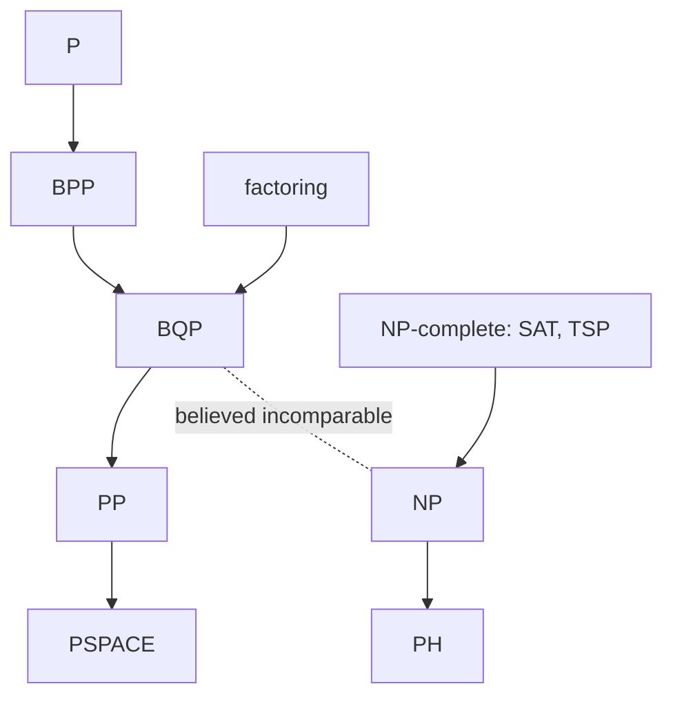

# Complexity: what quantum computers can and cannot do

## Definitions
- **BQP** (Bounded-error Quantum Polynomial time): problems a quantum computer solves efficiently. Contains P and BPP; contains factoring and discrete log (Shor); believed not to contain NP-complete problems.
- **Relationships**: $P\subseteq BPP\subseteq BQP\subseteq PP\subseteq PSPACE$. Whether $BQP\supsetneq BPP$ is unproven (it would imply $P\ne PSPACE$). Relative to oracles, BQP is separated from BPP (Simon, Bernstein–Vazirani) and even from PH (Raz–Tal 2018).
- **QMA**: the quantum analogue of NP; local Hamiltonian ground-energy estimation is QMA-complete, which is *why* generic quantum chemistry is not expected to be easy even for quantum computers, and why heuristics (VQE) are used.
- **Sampling problems** (random circuits, boson sampling): where "advantage" claims live; hardness rests on conjectures (anti-concentration, average-case #P-hardness).
- **What is not sped up**: unstructured search only quadratically (Grover is optimal); most NP-hard optimization gets at best polynomial speedups; "quantum machine learning" advantages mostly evaporate when classical algorithms get the same data-access assumptions (dequantization, Tang 2019).

## Equations
Grover lower bound: $\Omega(\sqrt N)$ queries (BBBV 1997). Quantum query complexity vs classical: polynomial relation for total functions, $Q(f)\ge\Omega(D(f)^{1/6})$ improved over time; exponential gaps need structure (period finding).

## Visual

## Key papers
- Bernstein, E., & Vazirani, U. (1997). Quantum complexity theory. *SIAM J. Comput.*, 26, 1411. https://doi.org/10.1137/S0097539796300921
- Bennett, C. H., Bernstein, E., Brassard, G., & Vazirani, U. (1997). Strengths and weaknesses of quantum computing. *SIAM J. Comput.*, 26, 1510. https://doi.org/10.1137/S0097539796300933
- Kempe, J., Kitaev, A., & Regev, O. (2006). The complexity of the local Hamiltonian problem. *SIAM J. Comput.*, 35, 1070.
- Aaronson, S., & Arkhipov, A. (2011). The computational complexity of linear optics. *Proc. STOC*, 333. arXiv:1011.3245
- Raz, R., & Tal, A. (2019). Oracle separation of BQP and PH. *Proc. STOC*. arXiv:1804.00640
- Tang, E. (2019). A quantum-inspired classical algorithm for recommendation systems. *Proc. STOC*. arXiv:1807.04271
- Aaronson, S. (2013). *Quantum Computing since Democritus*. Cambridge University Press.

## In this repo
Sets expectations: the thesis claims a *communication* capability (security, not speed), which rests on no-cloning and Bell nonlocality rather than on any complexity conjecture.

## Exercises
1. Explain why Shor's algorithm does not put NP inside BQP.
2. Give the classical data-access assumption under which the HHL linear-systems algorithm loses its exponential advantage.
