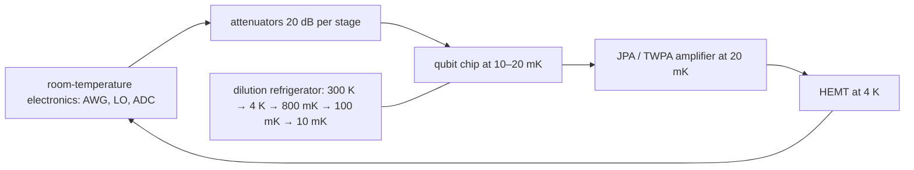

# Superconducting qubits: Josephson junctions, SQUIDs, and the transmon

## The two levels
A superconducting loop is a harmonic LC oscillator, and a harmonic oscillator is useless as a qubit because all level spacings are equal. The **Josephson junction** (two superconductors separated by a ~1 nm oxide barrier) is a nonlinear inductor: current $I=I_c\sin\varphi$, energy $-E_J\cos\varphi$. Adding one to a capacitor makes an anharmonic oscillator whose lowest two levels are the qubit.

- **Cooper-pair box** (charge qubit): $E_J\ll E_C$; fast but killed by charge noise.
- **Transmon** [Koch et al. 2007]: $E_J/E_C\approx50$–100; charge dispersion falls as $e^{-\sqrt{8E_J/E_C}}$ while anharmonicity only falls to $\approx-E_C$. This trade is the whole idea, and the figure below is the proof.
- **SQUID** (Superconducting QUantum Interference Device): two junctions in a loop; the effective $E_J(\Phi)=E_{J,\max}\lvert\cos(\pi\Phi/\Phi_0)\rvert$ is tunable by flux, giving frequency-tunable transmons and tunable couplers, at the cost of flux-noise dephasing.
- **Flux qubit**, **fluxonium** (junction shunted by a superinductor; $T_1\sim$ ms), **0-π qubit** (protected): alternatives with different noise trade-offs.

## Equations
$$H=4E_C(\hat n-n_g)^2-E_J\cos\hat\varphi,\qquad E_C=\frac{e^2}{2C_\Sigma},\qquad E_J=\frac{\Phi_0I_c}{2\pi}$$
$$\hbar\omega_{01}\approx\sqrt{8E_JE_C}-E_C,\qquad \alpha\equiv\omega_{12}-\omega_{01}\approx-E_C/\hbar,\qquad \epsilon_1\propto e^{-\sqrt{8E_J/E_C}}$$
Dispersive readout through a resonator (circuit QED): $H_{\rm disp}=\hbar(\omega_r+\chi Z)a^\dagger a+\frac{\hbar\omega_q}{2}Z$, $\chi=g^2/\Delta\cdot\alpha/(\Delta+\alpha)$; the qubit state shifts the resonator frequency by $2\chi$, read with a microwave tone and a Josephson parametric amplifier.
Thermal population from `qll/circuits/noise/thermal.py`: at 5 GHz, $\bar n(20\,\mathrm{mK})\approx6\times10^{-6}$, so residual excited population is set by stray radiation rather than the base temperature.

## Visual

## How it is built
1. **Substrate**: high-resistivity silicon or sapphire.
2. **Metal**: sputtered or evaporated aluminum (or tantalum, niobium for lower loss), patterned by photolithography; junctions by double-angle (Dolan) or Manhattan shadow evaporation with an in-situ oxidation step that sets $I_c$.
3. **Package**: chip in a copper/aluminum box, wire-bonded or flip-chip bump-bonded; 3-D integration for 100+ qubits.
4. **Cryogenics**: a dilution refrigerator reaching 10 mK, with heavily attenuated coax lines down and isolators + amplifiers up.
5. **Control**: microwave pulses (a few GHz, ns resolution) per qubit for single-qubit gates; two-qubit gates by frequency tuning (CZ), cross-resonance driving (fixed-frequency IBM style), or tunable couplers (Google).
6. **Readout**: dispersive shift on a readout resonator, multiplexed, with parametric amplification near the quantum limit.

## How it is modeled
`scqubits` or exact diagonalization for the spectrum (the figure above is 61-state charge-basis diagonalization); Qiskit Aer with a noise model built from measured $T_1$, $T_2$, and gate errors; QuTiP for the full Lindblad dynamics including the thermal bath.

## Best published results (verify before citing)
- Coherence: $T_1$ up to ~0.3–0.5 ms in tantalum transmons (2021–2023); fluxonium $T_1>1$ ms.
- Two-qubit fidelity 99.7–99.9% (tunable couplers, 2023–2024).
- **Below-threshold surface code**: Google Willow, distance 7, $\Lambda\approx2.14$, logical memory beating the best physical qubit (Nature 2025). This is the milestone that turned "possible in principle" into "an engineering scaling problem."
- Bosonic cat/GKP encodings in 3-D cavities beyond break-even (Yale 2023).

## What has failed or is hard
- Two-level-system (TLS) defects in oxides wander in frequency and eat $T_1$; every chip is different, hourly.
- Cosmic rays and radioactivity cause correlated error bursts across a chip (McEwen et al. 2022), which error correction cannot treat as independent.
- **No photon interface**: microwave photons at 5 GHz have $\bar n\approx1250$ at room temperature, so a superconducting network node needs microwave-to-optical transduction with efficiencies still far below 1 (see `03_quantum_communication/05_transduction.md`).

## What it means for a link
Superconducting processors are the likely *end points* of a future quantum internet, not the memories in the field. For the Earth–Mars concept of operations they matter only after transduction reaches high efficiency and low added noise.

## Key papers
- Josephson, B. D. (1962). Possible new effects in superconductive tunnelling. *Physics Letters*, 1, 251.
- Nakamura, Y., Pashkin, Yu. A., & Tsai, J. S. (1999). Coherent control of macroscopic quantum states in a single-Cooper-pair box. *Nature*, 398, 786. https://doi.org/10.1038/19718
- Koch, J., et al. (2007). Charge-insensitive qubit design derived from the Cooper pair box. *Physical Review A*, 76, 042319. https://doi.org/10.1103/PhysRevA.76.042319
- Wallraff, A., et al. (2004). Strong coupling of a single photon to a superconducting qubit using circuit quantum electrodynamics. *Nature*, 431, 162. https://doi.org/10.1038/nature02851
- Manucharyan, V. E., et al. (2009). Fluxonium: single Cooper-pair circuit free of charge offsets. *Science*, 326, 113. https://doi.org/10.1126/science.1175552
- Devoret, M. H., & Schoelkopf, R. J. (2013). Superconducting circuits for quantum information: an outlook. *Science*, 339, 1169. https://doi.org/10.1126/science.1231930
- Krantz, P., et al. (2019). A quantum engineer's guide to superconducting qubits. *Appl. Phys. Rev.*, 6, 021318. https://doi.org/10.1063/1.5089550
- Blais, A., Grimsmo, A. L., Girvin, S. M., & Wallraff, A. (2021). Circuit quantum electrodynamics. *Rev. Mod. Phys.*, 93, 025005. https://doi.org/10.1103/RevModPhys.93.025005
- Place, A. P. M., et al. (2021). New material platform for superconducting transmon qubits with coherence times exceeding 0.3 milliseconds. *Nat. Commun.*, 12, 1779.
- McEwen, M., et al. (2022). Resolving catastrophic error bursts from cosmic rays in large arrays of superconducting qubits. *Nature Physics*, 18, 107.
- Google Quantum AI (2023). *Nature*, 614, 676; (2025). *Nature*, 638, 920 (**TODO: verify**).

## In this repo
`qll/viz/transmon_levels.py`; the thermal model in `noise/thermal.py` is written for exactly this platform (5 GHz, 15 mK numbers).

## Exercises
1. For $E_J/h=15$ GHz and $E_C/h=300$ MHz compute $f_{01}$ and $\alpha$ from the formulas and from the exact diagonalization in `transmon_levels.py`.
2. Estimate the residual excited-state population at 20 mK and at 60 mK; which one would limit a 99.9% readout?
