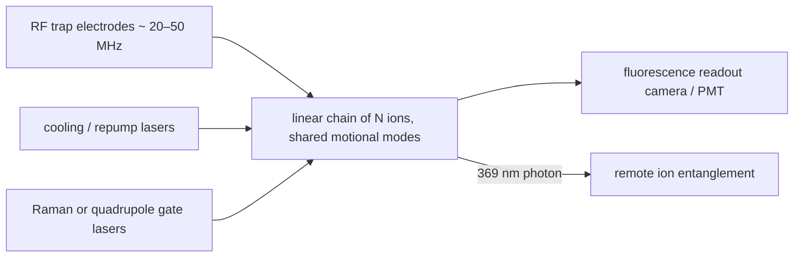

# Trapped ions

## The two levels
Two long-lived internal levels of a single atomic ion held in an oscillating electric quadrupole (Paul) trap: **hyperfine qubits** (e.g., ¹⁷¹Yb⁺ at 12.6 GHz, magnetic-field-insensitive "clock" states, coherence > 1 hour demonstrated) or **optical qubits** (e.g., ⁴⁰Ca⁺ S–D at 729 nm). Laser cooling brings the ion to its motional ground state; the shared motional modes of an ion chain are the bus for two-qubit gates.

## Equations
Ion–laser interaction in the Lamb–Dicke regime, with $\eta=k\sqrt{\hbar/2m\omega_m}$:
$$H=\frac{\hbar\Omega}{2}\left(\sigma_+e^{i\eta(a+a^\dagger)}e^{-i\delta t}+\text{h.c.}\right)\approx\frac{\hbar\Omega}{2}\left(\sigma_+ +i\eta\sigma_+(a e^{-i\omega_mt}+a^\dagger e^{i\omega_mt})\right)e^{-i\delta t}+\text{h.c.}$$
Mølmer–Sørensen gate: bichromatic drive at $\omega_0\pm(\omega_m+\delta)$ produces $U=\exp(-i\theta\,\sigma_x\otimes\sigma_x)$ independent of the motional state to first order; $\theta=\pi/4$ is a maximally entangling gate. Readout by state-dependent fluorescence, > 99.9% in ~100 µs. Ion–photon entanglement from spontaneous emission (369 nm in Yb⁺) is the network interface [Moehring et al. 2007].

## Visual

## How it is built
Ultra-high-vacuum chamber (10⁻¹¹ mbar), microfabricated surface-electrode trap or 3-D blade trap, RF drive, several stabilized lasers (cooling, repumping, Raman), imaging optics. The trap itself is room temperature; cryogenic (4 K) traps improve vacuum and heating rates. Scaling architectures: QCCD (quantum charge-coupled device) shuttling ions between zones (Quantinuum), or photonic interconnects between traps (IonQ, Duke).

## How it is modeled
QuTiP for spin–motion dynamics; Qiskit/Cirq with all-to-all connectivity for algorithms; error models dominated by laser phase noise, motional heating, and spontaneous scattering.

## Best published results (verify)
- Two-qubit gate fidelity 99.9%+ (Ballance et al. 2016; Gaebler et al. 2016); the highest of any platform.
- Coherence > 1 hour for a single Yb⁺ hyperfine qubit (Wang et al. 2021).
- Fault-tolerant control of an error-corrected qubit (Egan et al. 2021); Quantinuum H2 32–56 qubits with logical-qubit demonstrations (2023–2024).
- Ion–ion entanglement between traps separated by hundreds of metres via photons (Stephenson et al. 2020).

## What has failed or is hard
- Gates are slow (10–100 µs) and laser systems are complex; the number of ions in one chain is limited (~30–50) by mode crowding, so scaling is modular.
- Anomalous motional heating from trap surfaces limits gate fidelity as traps shrink.

## What it means for a link
The natural memory for a *ground-station* node: hour-long coherence already exceeds the Earth–Mars round trip, and ion–photon entanglement is routine. Spaceborne ion traps exist as clocks (NASA Deep Space Atomic Clock, 2019), which is a relevant TRL data point.

## Key papers
- Cirac, J. I., & Zoller, P. (1995). Quantum computations with cold trapped ions. *Physical Review Letters*, 74, 4091. https://doi.org/10.1103/PhysRevLett.74.4091
- Mølmer, K., & Sørensen, A. (1999). Multiparticle entanglement of hot trapped ions. *Physical Review Letters*, 82, 1835. https://doi.org/10.1103/PhysRevLett.82.1835
- Monroe, C., et al. (1995). Demonstration of a fundamental quantum logic gate. *Physical Review Letters*, 75, 4714.
- Moehring, D. L., et al. (2007). Entanglement of single-atom quantum bits at a distance. *Nature*, 449, 68. https://doi.org/10.1038/nature06118
- Ballance, C. J., et al. (2016). High-fidelity quantum logic gates using trapped-ion hyperfine qubits. *Physical Review Letters*, 117, 060504.
- Bruzewicz, C. D., et al. (2019). *Appl. Phys. Rev.*, 6, 021314. https://doi.org/10.1063/1.5088164
- Stephenson, L. J., et al. (2020). High-rate, high-fidelity entanglement of qubits across an elementary quantum network. *Physical Review Letters*, 124, 110501.
- Egan, L., et al. (2021). Fault-tolerant control of an error-corrected qubit. *Nature*, 598, 281.
- Wang, P., et al. (2021). Single ion qubit with estimated coherence time exceeding one hour. *Nat. Commun.*, 12, 233. https://doi.org/10.1038/s41467-020-20330-w
- Moses, S. A., et al. (2023). A race-track trapped-ion quantum processor. *Physical Review X*, 13, 041052.

## Exercises
1. Compute $\eta$ for ⁴⁰Ca⁺ at 729 nm with $\omega_m/2\pi=1$ MHz.
2. Why does the Mølmer–Sørensen gate tolerate thermal motion while the original Cirac–Zoller gate does not?
