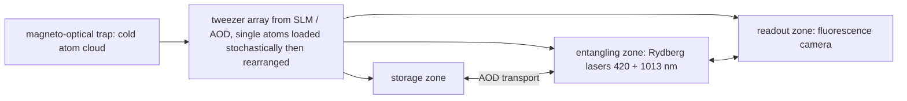

# Neutral atoms in optical tweezers

## The two levels
Hyperfine ground states of a single alkali or alkaline-earth atom (⁸⁷Rb, Cs, Sr, Yb) held in a tightly focused laser beam (optical tweezer), arranged in reconfigurable arrays of hundreds to thousands. Entanglement uses the **Rydberg blockade**: exciting one atom to a high-$n$ Rydberg state shifts its neighbor's Rydberg level by the van der Waals interaction $C_6/r^6$, so two atoms within the blockade radius cannot both be excited, which implements a CZ gate.

## Equations
$$V_{\rm vdW}=\frac{C_6}{r^6},\qquad r_b=\left(\frac{C_6}{\hbar\Omega}\right)^{1/6}\ (\sim5\text{–}10\ \mu\mathrm{m}),\qquad H=\sum_i\frac{\hbar\Omega}{2}\sigma_x^i-\hbar\Delta\sum_in_i+\sum_{i<j}\frac{C_6}{r_{ij}^6}n_in_j$$
Coherent atom transport with acousto-optic deflectors moves qubits between zones in ~100 µs while preserving coherence: connectivity is programmable, which is what made a logical processor with 48 logical qubits possible [Bluvstein et al. 2024].

## Visual

## How it is built
Vacuum cell, magneto-optical trap, spatial light modulator or acousto-optic deflectors for the tweezer array, high-NA objective, Rydberg excitation lasers (UV plus IR), EMCCD/sCMOS camera. Room-temperature apparatus; atoms at microkelvin. Companies: QuEra, Pasqal, Atom Computing, Infleqtion.

## Best published results (verify)
- 99.5% two-qubit gate fidelity (Evered et al. 2023); arrays of 1000–6000 atoms (Atom Computing 2023; Caltech 2024).
- Logical quantum processor: 48 logical qubits, 280 physical, with error-corrected logical operations (Bluvstein et al. 2024).
- Continuous reloading to mitigate atom loss (2024–2025).

## What has failed or is hard
- Atom loss and stochastic loading; Rydberg-state decay and blackbody-induced transitions (the thermal-occupation problem again, at THz frequencies where $\bar n$ at 300 K is not negligible); slow mid-circuit measurement.

## What it means for a link
Atoms have optical transitions (780 nm Rb) and cavity-QED atom–photon interfaces are mature; atomic-ensemble memories (DLCZ) are the same physics in a different regime (`03_quantum_communication/03_repeaters_and_memories.md`).

## Key papers
- Jaksch, D., et al. (2000). Fast quantum gates for neutral atoms. *Physical Review Letters*, 85, 2208. https://doi.org/10.1103/PhysRevLett.85.2208
- Saffman, M., Walker, T. G., & Mølmer, K. (2010). Quantum information with Rydberg atoms. *Rev. Mod. Phys.*, 82, 2313. https://doi.org/10.1103/RevModPhys.82.2313
- Endres, M., et al. (2016). Atom-by-atom assembly of defect-free one-dimensional cold atom arrays. *Science*, 354, 1024.
- Levine, H., et al. (2019). Parallel implementation of high-fidelity multiqubit gates with neutral atoms. *Physical Review Letters*, 123, 170503.
- Henriet, L., et al. (2020). *Quantum*, 4, 327.
- Evered, S. J., et al. (2023). High-fidelity parallel entangling gates on a neutral-atom quantum computer. *Nature*, 622, 268.
- Bluvstein, D., et al. (2024). Logical quantum processor based on reconfigurable atom arrays. *Nature*, 626, 58. https://doi.org/10.1038/s41586-023-06927-3

## Exercises
1. With $C_6/h=1$ THz·µm⁶ (order of magnitude for Rb $n\approx70$) and $\Omega/2\pi=5$ MHz, compute $r_b$.
2. Estimate the blackbody-induced Rydberg decay rate scaling with temperature using $\bar n$ from `qll/circuits/noise/thermal.py` at $\nu\sim$ 10–100 GHz.
