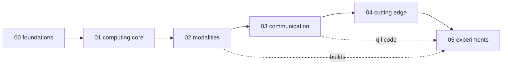

# Knowledge base: quantum mechanics → quantum computing → quantum links

This folder is the curriculum behind the code. It starts where a first course starts (states, measurement, one qubit) and ends at the 2024–2026 frontier (error correction below threshold, logical processors, metropolitan quantum networks), then turns to experiments: what has been done, how to recreate it cheaply, what failed and why, and what we propose to do next. Every file follows one template so the whole tree reads the same way:

```
Definitions   the vocabulary, stated precisely
Equations     the governing formulas with symbols defined
Visual        a figure in docs/figures/ or an inline Mermaid diagram
Key papers    real citations; DOI links only where verified, otherwise venue and year
In this repo  which qll module or test carries this idea
Exercises     something to compute or build
```

## Learning path

| Level | Folder | You can now… |
|---|---|---|
| 0 | `00_foundations/` | write a qubit state, predict a measurement, compute T1/T2 decay |
| 1 | `01_quantum_computing_core/` | build circuits, run Grover, explain why error correction works |
| 2 | `02_qubit_modalities/` | say what a transmon, spin qubit, NV center, ion, atom, or photon *is* physically and how each is built |
| 3 | `03_quantum_communication/` | derive key rates, teleportation fidelity, repeater scaling |
| 4 | `04_cutting_edge/` | place a 2026 paper on the map and judge its claim |
| 5 | `05_experiments/` | recreate a landmark result on a bench budget, and design a new one |



## Two reference files

- [`GLOSSARY.md`](GLOSSARY.md): every term, plain language first.
- [`MISCONCEPTIONS.md`](MISCONCEPTIONS.md): the twelve things people get wrong, and where the code prevents them.

## Folder contents at a glance

| Folder | Files |
|---|---|
| `00_foundations` | history in ten experiments · linear algebra · postulates and measurement · qubit and Bloch sphere · Rabi/Ramsey/echo · entanglement and Bell · density matrices and open systems · information measures · wave mechanics · spin and angular momentum · identical particles · perturbation, adiabatic, annealing · quantum optics · decoherence and interpretations · math toolkit |
| `01_quantum_computing_core` | gates and circuits · algorithms · error correction · benchmarking · complexity · sensing and metrology · quantum simulation and chemistry · software stack |
| `02_qubit_modalities` | comparison table · transmon/SQUID · silicon spin · diamond NV/SiV · trapped ion · Rydberg atom · photonic · topological · other · control electronics · cryogenics and vacuum · materials and fabrication |
| `03_quantum_communication` | QKD protocols · teleportation and swapping · repeaters and memories · satellite and deep space · transduction |
| `04_cutting_edge` | timeline · open problems · reading list |
| `05_experiments` | 10 done · 10 proposed (E1–E10) · 2 lessons |

## Conventions

- Acronyms are written out on first use in each file, e.g. Quantum Key Distribution (QKD).
- Numbers quoted for devices (T1, fidelities, qubit counts) move fast; each carries a year and a source and should be re-checked before being used in the thesis.
- Anything marked **TODO: verify** has not been checked against the publisher and must not be cited from code (CONTRIBUTING rule 3).
- Where a topic already has a full treatment in `docs/` (hardware guide, module design spec), the knowledge file links to it rather than repeating it.
