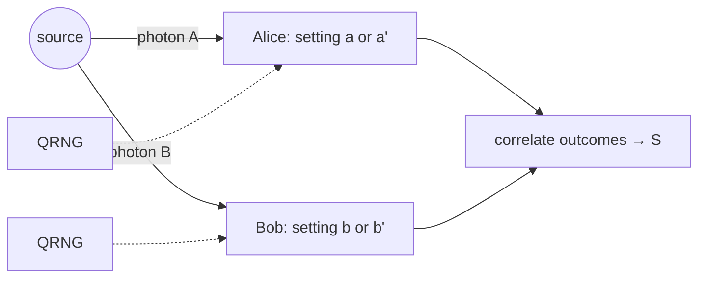

# Entanglement, Bell states, and nonlocality

## Definitions
- **Bell states**: $\lvert\Phi^\pm\rangle=(\lvert00\rangle\pm\lvert11\rangle)/\sqrt2$, $\lvert\Psi^\pm\rangle=(\lvert01\rangle\pm\lvert10\rangle)/\sqrt2$, the maximally entangled two-qubit basis.
- **Entanglement measures**: concurrence $C$, entanglement of formation, and for pure states the entropy of the reduced state $S(\rho_A)$; all vanish on product states.
- **Werner state** $\rho_W=f\lvert\Psi^-\rangle\langle\Psi^-\rvert+\frac{1-f}{3}(I-\lvert\Psi^-\rangle\langle\Psi^-\rvert)$: entangled iff $f>1/2$; the standard model of a noisy Bell pair.
- **CHSH inequality**: $S=\lvert E(a,b)-E(a,b')+E(a',b)+E(a',b')\rvert\le2$ for any local hidden-variable theory; quantum mechanics reaches $2\sqrt2$ (Tsirelson bound).
- **Loopholes**: detection ($\eta>2/(1+\sqrt2)\approx0.83$ for CHSH), locality (space-like separation of setting choice and measurement), freedom of choice (the settings must be random; this is where the owner's QRNG board enters).

## Equations
$$E(a,b)=-\hat a\cdot\hat b\ \text{ for }\lvert\Psi^-\rangle,\qquad S_{\rm max}=2\sqrt2\ \text{ at } a,a',b,b'=0,\tfrac\pi2,\tfrac\pi4,\tfrac{3\pi}4$$
$$S(\rho_W)=2\sqrt2\cdot\frac{4f-1}{3},\qquad C(\rho_W)=\max\!\left(0,\tfrac{3f-1}{2}\right)$$

## Visual

## Key papers
- Einstein, A., Podolsky, B., & Rosen, N. (1935). *Physical Review*, 47, 777. https://doi.org/10.1103/PhysRev.47.777
- Bell, J. S. (1964). On the Einstein Podolsky Rosen paradox. *Physics*, 1, 195. https://doi.org/10.1103/PhysicsPhysiqueFizika.1.195
- Clauser, J. F., Horne, M. A., Shimony, A., & Holt, R. A. (1969). *Physical Review Letters*, 23, 880.
- Aspect, A., Dalibard, J., & Roger, G. (1982). Experimental test of Bell's inequalities using time-varying analyzers. *Physical Review Letters*, 49, 1804. https://doi.org/10.1103/PhysRevLett.49.1804
- Hensen, B., et al. (2015). Loophole-free Bell inequality violation using electron spins separated by 1.3 kilometres. *Nature*, 526, 682.
- Brunner, N., et al. (2014). Bell nonlocality. *Reviews of Modern Physics*, 86, 419. https://doi.org/10.1103/RevModPhys.86.419
- Wootters, W. K. (1998). Entanglement of formation of an arbitrary state of two qubits. *Physical Review Letters*, 80, 2245. https://doi.org/10.1103/PhysRevLett.80.2245

## In this repo
`qll/circuits/bell.py`, `chsh.py` (Phase 2); `hardware/randomness.py` supplies settings (invariant INV-7 in `docs/physics_module_design.md`). Bench version: `../../experiments/done/03_bell_test_spdc.md`.

## Exercises
1. Verify $S(\rho_W)$ above and find the $f$ at which the Werner state stops violating CHSH (answer: $f>(1+1/\sqrt2)/2\cdot\ldots$; work it out, it is about 0.78).
2. Why does a Werner state with $0.5<f<0.78$ still count as entangled although it passes no CHSH test?
