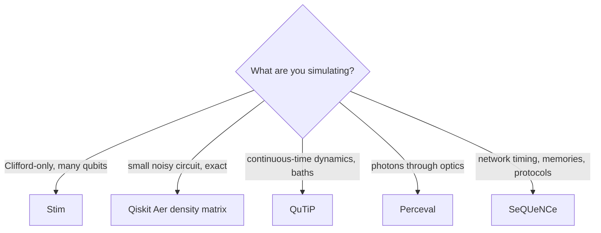

# The software stack: what each pinned library is for

| Library (pinned) | Simulates | Scaling | Used for |
|---|---|---|---|
| **Qiskit 2.5 + Aer 0.17** | state vectors, density matrices, noisy circuits with Kraus/Aer noise models | ~30 qubits statevector, ~15 density matrix | Bell, teleportation, CHSH, tomography (Phase 2) |
| **Stim 1.16** | Clifford circuits, stabilizer sampling, error-correction decoding graphs | $10^4$–$10^6$ qubits | GHZ at scale, CHSH sampling, surface-code memory, repeater-generation comparison |
| **QuTiP 5.3** | open-system dynamics (Lindblad, Monte Carlo, Bloch–Redfield), spin–boson models | ~10–15 qubits or a few oscillators | thermal T1/T2 cross-checks, Jaynes–Cummings, NV spin Hamiltonians |
| **SeQUeNCe 1.2** | discrete-event quantum networks: memories, links, protocols, timing | networks of tens of nodes | repeater chains, relay constellations (Phase 4–5) |
| **Perceval 1.2** | linear optics: Fock-state evolution through interferometers | ~20 photons | HOM, linear-optics BSM, SPDC bench models (Phase 3) |
| **kyber-py 1.2, cryptography 50** | ML-KEM (FIPS 203), AES-GCM | — | the classical security layer (Phase 6) |
| numpy, scipy, matplotlib, networkx | numerics, root finding, plotting, graphs | — | everything analytic, all figures, routing |

Not pinned but worth knowing: **Cirq** (Google), **PennyLane** (differentiable circuits), **NetSquid** and **QuNetSim** (network simulators), **PyMatching** (surface-code decoding), **scqubits** (superconducting-circuit spectra), **OpenFermion** (chemistry Hamiltonians), **QuTiP-QIP**, **Strawberry Fields** (CV photonics).

## Choosing the right simulator

## Adapters in this repo
`qll/network/sequence_adapter.py` builds a two-router meet-in-the-middle link in SeQUeNCe and checks that no memory is entangled before the herald round trip; `qll/hardware/perceval_adapter.py` reproduces the Hong–Ou–Mandel law $(1-V)/2$ and the 1/2 success of the linear-optics Bell analyser from the circuit. Both are compared with the analytic modules in `tests/test_adapters.py`.

## Rule 2 in practice
CONTRIBUTING rule 2 forbids writing a simulator from scratch. The `qll` package is glue and physics: analytic formulas with tests, thin adapters to these libraries, and invariants (no-signaling, no-cloning, CPTP, capacity bounds) that the libraries do not enforce for you.

## Key references
- Javadi-Abhari, A., et al. (2024). Quantum computing with Qiskit. arXiv:2405.08810
- Gidney, C. (2021). Stim. *Quantum*, 5, 497. Johansson, J. R., et al. (2012). QuTiP. *Comput. Phys. Commun.*, 183, 1760.
- Wu, X., et al. (2021). SeQUeNCe. *Quantum Sci. Technol.*, 6, 045027. Heurtel, N., et al. (2023). Perceval. *Quantum*, 7, 931.
- NIST (2024). FIPS 203. https://doi.org/10.6028/NIST.FIPS.203 (**TODO: verify**).
