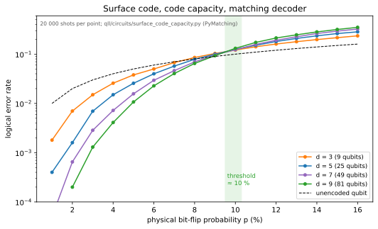

# Decoders and Thresholds

## What a decoder does
Syndrome measurements do not name the error; they report which checks were violated, and the same syndrome is consistent with many error patterns. A decoder picks the most likely one. Because the syndrome measurements are themselves noisy, real decoders work on a space-time graph: a detection event is a change in a check's value between rounds, and an error is an edge (or hyperedge) connecting the events it causes [dennis2002].

## Minimum-weight perfect matching
For codes where each error flips at most two detectors (repetition and surface codes under Pauli noise), the most likely error is a minimum-weight perfect matching of the detection events, with edge weights $\log\frac{1-p}{p}$. `qll/circuits/decoders.py` generates a distance-$d$ repetition-code memory with circuit-level noise in Stim, compiles its detector error model, and decodes with PyMatching [gidney2021stim] [higgott2023pymatching].

The result is the textbook threshold picture: below $p\approx0.08$ (for this noise model) the logical error falls with distance, above it the ordering reverses, and "no decoding" (reading the data qubits alone) is worse than the unencoded qubit because it ignores the syndrome history. Surface-code thresholds under comparable circuit noise are near 1 %; the Google 2024–2025 below-threshold result is the hardware version of the left half of this figure [google2025willow].

## The surface code, one shot at a time
The cleanest version of the picture is the rotated surface code under independent bit flips with perfect parity measurements (the "code capacity" model). `qll/circuits/surface_code_capacity.py` builds the distance-$d$ code's $(d^2-1)/2$ Z checks, samples errors, decodes them with PyMatching, and asks whether the leftover flips cross the lattice [fowler2012] [higgott2023pymatching]. The curves cross near 10 %: the asymptotic matching threshold is about 10.3 % [dennis2002] [wang2003], and codes of distance 9 to 21 cross at about 9.7 %, the usual finite-size shift of a planar code. Below it, going from $d=3$ to $d=9$ cuts the logical error sixfold at 4 % and about thirtyfold at 2 %; the distance-3 code already beats a bare qubit below about 7.5 %. Measurement errors bring the threshold down to the circuit-level value above, near 1 % for the surface code.

The [QEC lab](https://normansrule.github.io/quantum-link-research/qec/) steps through individual decoded shots for $d=3$, 5, and 7 in four stages (errors, lit checks, the decoder's pairing, the correction) and marks the ones that end in a logical error; the page recomputes every syndrome and residual itself and agrees with the Python on all 240 stored shots.

## Other decoders
Union–find (near-linear time, slightly lower threshold), belief propagation with ordered-statistics post-processing (for qLDPC codes, `learn/01/17`), tensor-network decoders (near-optimal, slow), and neural decoders trained on device data [bausch2024]. The trade is always accuracy against latency: a superconducting processor produces syndromes every microsecond, so a decoder that falls behind builds an ever-growing backlog, which is why real-time decoding is itself a hardware research field.

## Key papers
- Dennis, E., Kitaev, A., Landahl, A., & Preskill, J. (2002). Topological quantum memory. *Journal of Mathematical Physics*, 43, 4452. https://doi.org/10.1063/1.1499754
- Higgott, O., & Gidney, C. (2025). Sparse Blossom: correcting a million errors per core second with minimum-weight matching. *Quantum*, 9, 1600. https://doi.org/10.22331/q-2025-01-20-1600
- Gidney, C. (2021). Stim: a fast stabilizer circuit simulator. *Quantum*, 5, 497. https://doi.org/10.22331/q-2021-07-06-497
- Wang, C., Harrington, J., & Preskill, J. (2003). Confinement-Higgs transition in a disordered gauge theory and the accuracy threshold for quantum memory. *Annals of Physics*, 303, 31–58. https://doi.org/10.1016/S0003-4916(02)00019-2
- Delfosse, N., & Nickerson, N. H. (2021). Almost-linear time decoding algorithm for topological codes. *Quantum*, 5, 595. https://doi.org/10.22331/q-2021-12-02-595

## In this repo
`qll/circuits/decoders.py`, `qll/viz/decoder_threshold.py`, `qll/circuits/surface_code_capacity.py`, `qll/viz/surface_code_capacity.py`, `docs/qec/`; S04; T15 (learned decoders at a remote node).
