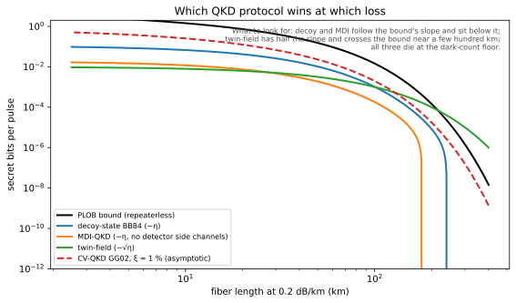

# Quantum key distribution protocols

## Definitions
- **BB84** (prepare-and-measure, four states in two conjugate bases): security from the no-cloning theorem and the disturbance an eavesdropper must cause. Sifted-key secret fraction $r=1-2h_2(Q)$, threshold $Q=11.0\%$.
- **E91 / BBM92** (entanglement-based): a Bell violation certifies the key; the basis for device-independent (DI) QKD.
- **Decoy states**: randomly varied intensities of a weak coherent laser defeat photon-number-splitting attacks and give rates scaling as $\eta$ rather than $\eta^2$.
- **Measurement-device-independent (MDI) QKD**: an untrusted middle node does the Bell measurement; removes all detector side channels.
- **Twin-field (TF) QKD**: single-photon interference at the middle gives rate $\propto\sqrt\eta$, beating the PLOB bound without a memory; 1000 km fiber reached in 2023.
- **Continuous-variable (CV) QKD**: coherent states and homodyne detection with telecom components.
- **Post-processing**: sifting, error correction (Cascade, LDPC), privacy amplification (two-universal hashing), authentication of the classical channel (which needs a pre-shared key: QKD *grows* keys, it does not create them from nothing).

## Equations
$$r_{\rm BB84}=1-2h_2(Q),\qquad r_{\rm decoy}=q\left\{-Q_\mu f(E_\mu)h_2(E_\mu)+Q_1\left[1-h_2(e_1)\right]\right\}$$
$$K_{\rm PLOB}=-\log_2(1-\eta),\qquad r_{\rm TF}\propto\sqrt\eta,\qquad r_{\rm DI}\ge1-h_2\!\left(\frac{1+\sqrt{S^2/4-1}}{2}\right)-h_2(Q)$$
Every classical exchange in these protocols is a `ClassicalMessage` in `qll/channels/light_time_delay.py`: at Earth–Mars distances the *number of rounds* of Cascade becomes a 20-minute-per-round cost, which is why one-way LDPC reconciliation is the design default.

## Visual

## Key papers
- Bennett, C. H., & Brassard, G. (1984). Quantum cryptography: public key distribution and coin tossing. *Proc. IEEE ICCSSP*, 175. (Reprinted *Theor. Comput. Sci.* 560, 7, 2014.)
- Ekert, A. K. (1991). Quantum cryptography based on Bell's theorem. *Physical Review Letters*, 67, 661.
- Shor, P. W., & Preskill, J. (2000). Simple proof of security of the BB84 quantum key distribution protocol. *Physical Review Letters*, 85, 441.
- Hwang, W.-Y. (2003). *Physical Review Letters*, 91, 057901. Lo, H.-K., Ma, X., & Chen, K. (2005). Decoy state quantum key distribution. *Physical Review Letters*, 94, 230504.
- Lo, H.-K., Curty, M., & Qi, B. (2012). Measurement-device-independent quantum key distribution. *Physical Review Letters*, 108, 130503.
- Pirandola, S., et al. (2017). *Nat. Commun.*, 8, 15043. https://doi.org/10.1038/ncomms15043
- Lucamarini, M., et al. (2018). *Nature*, 557, 400. https://doi.org/10.1038/s41586-018-0066-6
- Scarani, V., et al. (2009). The security of practical quantum key distribution. *Rev. Mod. Phys.*, 81, 1301. https://doi.org/10.1103/RevModPhys.81.1301
- Xu, F., et al. (2020). Secure quantum key distribution with realistic devices. *Rev. Mod. Phys.*, 92, 025002. https://doi.org/10.1103/RevModPhys.92.025002
- Pirandola, S., et al. (2020). Advances in quantum cryptography. *Adv. Opt. Photon.*, 12, 1012. https://doi.org/10.1364/AOP.361502

## In this repo

All implemented (0.7.0): `qll/qkd/{binary_entropy,key_rate,plob_bound,sifting,error_correction,privacy_amplification,bb84,e91,decoy_state,mdi,twin_field,rate_bounds}.py`. `run_bb84` is a full session (basis choice from a declared `EntropySource`, sifting, reconciliation, Toeplitz privacy amplification) whose classical time is bounded below by the light time; `rate_bounds.assert_below_plob` enforces INV-5 (REQ-QKD-002).

## Exercises
1. An intercept-resend attacker measures every photon in a random basis: show the induced QBER is 25%.
2. Why can QKD alone not authenticate Alice to Bob, and what does the app layer (`qll/app/hybrid_kem.py`) do about it?
