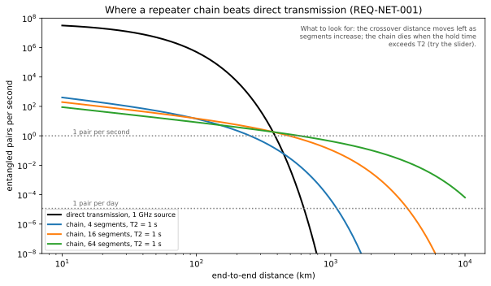
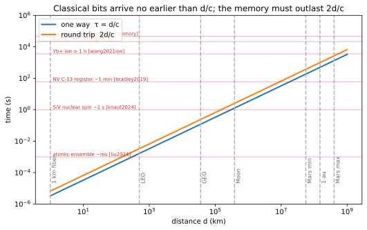

# Quantum repeaters and quantum memories

## Definitions
- **Why repeaters**: direct transmission decays as $\eta=e^{-L/L_{\rm att}}$; a chain of $N$ segments with swapping and purification turns exponential into polynomial scaling [Briegel et al. 1998].
- **Three generations** [Muralidharan et al. 2016]: (1) heralded entanglement + two-way purification (needs memories $\gtrsim$ round-trip time of the whole chain); (2) heralded entanglement + one-way error correction of operation errors; (3) fully one-way, encoded photons, no memories, but needs many photons per hop.
- **Quantum memory**: stores a photonic qubit and re-emits or acts on it later. Platforms: atomic ensembles (DLCZ, EIT, gradient echo), rare-earth-doped crystals (AFC, ZEFOZ), single spins (NV, SiV, ions).
- **Memory figures of merit**: storage time, efficiency, fidelity, bandwidth, multimode capacity, wavelength.
- **Memory-enhanced communication**: a single memory node beat the direct-transmission bound for the first time in 2020 [Bhaskar et al.].

## Equations
Rate of a nested repeater with $n$ nesting levels, segment length $L_0$, generation probability $P_0$, swap probability $P_s$:
$$R\sim\frac{P_0P_s^{\,n}}{t_0}\left(\frac{3}{2}\right)^{-n}\ \text{(with purification overhead)},\qquad t_0=\frac{L_0}{c}$$
Required memory time $\tau_{\rm mem}\gtrsim n\,\frac{L}{c}$ for generation-1 repeaters. Stored-pair fidelity $F(t)=\frac14+(F_0-\frac14)e^{-t/T_2}$ for a depolarizing memory.

| Memory | Storage time | Efficiency | Wavelength | Reference |
|---|---|---|---|---|
| Rb / Cs atomic ensemble (DLCZ) | ms | 10–90% | 780/852 nm | Duan 2001; Liu 2024 (12.5 km network) |
| Eu³⁺:Y₂SiO₅ nuclear spin (ZEFOZ + dynamical decoupling) | 6 h (2015), 13.1 h (2025) | AFC storage < 10% at long times | 580 nm | Zhong 2015; Wang 2025 |
| Eu:YSO one-hour coherent optical storage | 1 h | ~1% | 580 nm | Ma 2021 |
| Er³⁺:YSO | ms | | **1536 nm (telecom)** | Rančić 2018 |
| NV ¹³C register | ~1 min | deterministic | 637 nm (converted to 1588) | Bradley 2019 |
| SiV nuclear spin in cavity | ~1 s | high | 737 nm (converted to 1350) | Knaut 2024 |
| ¹⁷¹Yb⁺ hyperfine | > 1 h | deterministic | 369 nm | Wang 2021 |

## Visual

## Key papers
- Briegel, H.-J., Dür, W., Cirac, J. I., & Zoller, P. (1998). Quantum repeaters: the role of imperfect local operations in quantum communication. *Physical Review Letters*, 81, 5932.
- Duan, L.-M., Lukin, M. D., Cirac, J. I., & Zoller, P. (2001). Long-distance quantum communication with atomic ensembles and linear optics. *Nature*, 414, 413.
- Sangouard, N., Simon, C., de Riedmatten, H., & Gisin, N. (2011). Quantum repeaters based on atomic ensembles and linear optics. *Rev. Mod. Phys.*, 83, 33. https://doi.org/10.1103/RevModPhys.83.33
- Muralidharan, S., et al. (2016). Optimal architectures for long distance quantum communication. *Sci. Rep.*, 6, 20463.
- Lvovsky, A. I., Sanders, B. C., & Tittel, W. (2009). Optical quantum memory. *Nature Photonics*, 3, 706. https://doi.org/10.1038/nphoton.2009.231
- Azuma, K., et al. (2023). Quantum repeaters: from quantum networks to the quantum internet. *Rev. Mod. Phys.*, 95, 045006. arXiv:2212.10820
- Bhaskar, M. K., et al. (2020). *Nature*, 580, 60. https://doi.org/10.1038/s41586-020-2103-5
- Liu, J.-L., et al. (2024). Creation of memory–memory entanglement in a metropolitan quantum network. *Nature*, 629, 579.
- Rančić, M., et al. (2018). Coherence time of over a second in a telecom-compatible quantum memory storage material. *Nature Physics*, 14, 50.

## In this repo
Phase 4: `qll/network/{memory_decoherence,purification,swapping_scheduler,repeater_chain,routing,relay_constellation,sequence_adapter}.py`; requirement `REQ-NET-001` (chain beats direct) and `REQ-CAP-001` (memory time vs light time).

## Exercises
1. For $L=2000$ km fiber, $L_0=125$ km, compute the direct transmittance and the number of nesting levels $n$; estimate the memory time needed.
2. Which memory rows in the table already exceed the Earth–Mars round trip, and what is their efficiency at that storage time? What does that imply for a Mars memory node?
