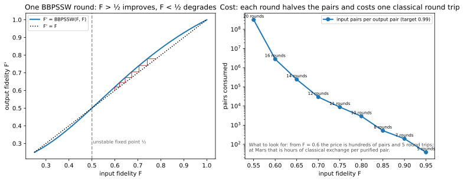
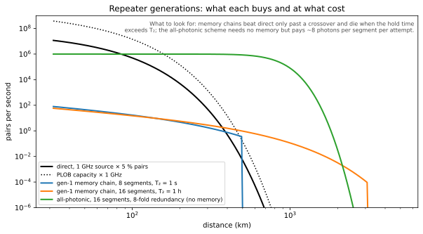

# Purification and Repeater Generations

## Definitions
- **Entanglement purification (distillation)**: local operations and classical communication that turn several noisy pairs into fewer better ones [bennett1996] [deutsch1996].
- **Repeater generations** [muralidharan2016]: gen-1 corrects loss by heralded generation and swapping and corrects errors by purification (two-way classical communication for both); gen-2 corrects loss heralded but errors by quantum error correction (one-way for errors); gen-3 corrects both by encoding (all one-way, no memories), of which the all-photonic repeater is an example [azuma2015].

## The BBPSSW map
$$F'=\frac{F^2+\big(\tfrac{1-F}{3}\big)^2}{F^2+\tfrac{2F(1-F)}{3}+5\big(\tfrac{1-F}{3}\big)^2},\qquad p_{\rm succ}=F^2+\tfrac{2F(1-F)}{3}+5\big(\tfrac{1-F}{3}\big)^2.$$
Fixed points at $F=\tfrac12$ (unstable) and $F=1$ (stable): a pair below one half gets worse. Each round halves the number of pairs, succeeds with $p_{\rm succ}$, and costs one classical round trip to compare outcomes. From $F=0.8$ to $0.99$ BBPSSW takes 10 rounds and about 2 900 input pairs per output pair; from $0.6$, 16 rounds and millions. DEJMPS [deutsch1996], which rotates before the bilateral CNOT and so does not waste the Bell-diagonal structure, reaches 0.99 from 0.8 in 4 rounds and about 32 pairs, and from 0.6 in 7 rounds and about 1 300. Both maps are in `qll/network/purification.py` and both are checked against exact simulations of the circuits. `qll/network/purification.py` implements the map and a full 16-dimensional simulation of the protocol; the two agree to $10^{-12}$.

## Why generations exist
Gen-1 is limited by the two-way classical exchange: every swap herald and every purification round waits $2L/c$. Over a metropolitan link that is microseconds; over an astronomical unit, minutes to hours per round. Gen-2 removes the wait for error correction; gen-3 removes memories altogether at the price of many photons per attempt (redundancy). The figure compares the rates of direct transmission, a gen-1 chain with a 1 s and a 1 h memory, and an all-photonic scheme, all from `qll/network/repeater_chain.py`.

## Consequence for the Mars link
Purification at Mars costs 6–45 minutes per round; the four DEJMPS rounds from 0.8 are 25 minutes to three hours of classical exchange per purified pair, and BBPSSW's ten rounds are an hour to seven and a half. Either the link must deliver pairs of high enough fidelity that no purification is needed (F ≳ 0.9 after storage), or the protocol must be one-way (gen-2 or gen-3), which is proposal T02/T03 territory. This is open problem 3 in `research/cutting_edge/02_open_problems.md`.

## Key papers
- Bennett, C. H., Brassard, G., Popescu, S., Schumacher, B., Smolin, J. A., & Wootters, W. K. (1996). Purification of noisy entanglement and faithful teleportation via noisy channels. *Physical Review Letters*, 76, 722. https://doi.org/10.1103/PhysRevLett.76.722
- Deutsch, D., Ekert, A., Jozsa, R., Macchiavello, C., Popescu, S., & Sanpera, A. (1996). Quantum privacy amplification and the security of quantum cryptography over noisy channels. *Physical Review Letters*, 77, 2818. https://doi.org/10.1103/PhysRevLett.77.2818
- Muralidharan, S., Li, L., Kim, J., Lütkenhaus, N., Lukin, M. D., & Jiang, L. (2016). Optimal architectures for long distance quantum communication. *Scientific Reports*, 6, 20463. https://doi.org/10.1038/srep20463
- Azuma, K., Tamaki, K., & Lo, H.-K. (2015). All-photonic quantum repeaters. *Nature Communications*, 6, 6787. https://doi.org/10.1038/ncomms7787

## In this repo
`qll/network/{purification,repeater_chain}.py`; `notebooks/03_memory_and_repeaters.ipynb`; T02, T03.

## Exercises
1. Show that $F=1/2$ is a fixed point of the BBPSSW map and that the derivative there exceeds 1.
2. For a Mars link delivering pairs at $F=0.85$, how many purification rounds reach 0.95, how many pairs does that cost, and how long is the classical exchange at maximum range?
