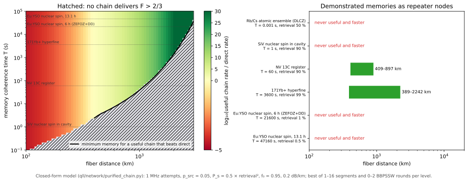

# Where a Fiber Repeater Is Worth Building

## The question
Lesson [03/19](19_repeater_chains_sampled.md) showed that a chain can beat direct transmission on rate and still deliver pairs too noisy to teleport with. The useful question for a systems engineer has two conditions: for a given fiber distance and memory, is there a chain that delivers pairs with teleportation fidelity above 2/3 **and** does so faster than sending photons straight through? This lesson answers it over the whole design space and for every demonstrated memory in the repository's table.

## Purification between levels
One BBPSSW round takes two Werner pairs of fraction $f$ and, with probability $p=f^2+\tfrac{2}{3}f(1-f)+\tfrac{5}{9}(1-f)^2$, returns one pair with
$$f'=\frac{f^2+(1-f)^2/9}{p}$$
[bennett1996]. Interleaving purification with swapping is the original repeater proposal [briegel1998] [dur1999]. `qll/network/purified_chain.py` adds $r_k$ rounds at nesting level $k$ to the closed-form chain of `repeater_chain.py`: each round needs two pairs of that level (the expected maximum of two waits), succeeds with $p(f)$, and costs a classical round trip over the pair's span. With no rounds it reproduces the plain chain to machine precision (tested). It searches up to 16 segments and 0–2 rounds per level for the fastest configuration that stays above 2/3.

## The design space

The left panel colours each (distance, memory time) by how many orders of magnitude the best useful chain beats direct transmission; hatching marks where no configuration reaches $F>2/3$. The black curve is the minimum memory coherence time for a chain that is both useful and faster than direct:

| fiber distance | minimum memory time |
|---|---|
| 500 km | 4.6 s |
| 1000 km | 39 s |
| 2000 km | 23 min |

It rises steeply because a longer link needs more segments, every extra level doubles the waiting and halves the fidelity margin, and the memory must hold pairs through all of it. Below about 385 km no memory helps: direct transmission is fast enough that the repeater's fixed overhead (failed swaps, herald round trips) never pays off.

## Which demonstrated memories qualify
A swap needs both memories read out, so each swap succeeds with $P_s\,\eta_{\rm ret}^2$. Counting retrieval efficiency, the right panel gives the distances over which each memory in `MEMORY_TABLE` makes a useful chain that beats direct transmission:

- **¹⁷¹Yb⁺ hyperfine qubits** (hour-class coherence, 99 % retrieval): 389–2242 km. The best 1000 km chain uses 16 segments with one purification round on the elementary pairs, and delivers 0.065 pairs/s at teleportation fidelity 0.73.
- **NV ¹³C registers** (60 s, 90 %): 409–897 km.
- **SiV nuclear spins** (1 s): never; the coherence is too short.
- **Eu:YSO crystals** (6–13 h): never, despite the longest coherence, because 0.5–1 % retrieval makes every swap fail.
- **Rb/Cs ensembles** (1 ms): never.

The ranking is not the one the Mars table gives (learn [03/03](03_repeaters_and_memories.md)): there, a memory only has to outlive one round trip, and rare-earth crystals qualify despite poor retrieval. Inside a chain, retrieval efficiency is paid at every swap, and it dominates.

## Assumptions, stated once
Attempts at 1 MHz or one per herald round trip, source-and-detection efficiency 0.05, swap success 0.5 times retrieval squared, elementary pairs of fraction 0.95, 0.2 dB/km fiber, Werner noise throughout, depolarizing storage over the expected total time, and a chain declared stalled beyond three memory times. The closed-form waiting time is a few percent conservative (03/19). Better sources (higher $p_{\rm src}$ or $f_0$) move the curve down; multiplexing, which this model does not include, moves it down a lot [sangouard2011].

## Try it
In the [repeater lab](https://normansrule.github.io/quantum-link-research/repeater/), set the purification rounds and watch the fidelity and cost; the lab shows the best useful configuration and the minimum memory time at the current distance from the same model (ported to JavaScript and held to the Python to $10^{-12}$).

## Key papers
- Bennett, C. H., Brassard, G., Popescu, S., Schumacher, B., Smolin, J. A., & Wootters, W. K. (1996). Purification of noisy entanglement and faithful teleportation via noisy channels. *Physical Review Letters*, 76, 722–725. https://doi.org/10.1103/PhysRevLett.76.722
- Briegel, H.-J., Dür, W., Cirac, J. I., & Zoller, P. (1998). Quantum repeaters: The role of imperfect local operations in quantum communication. *Physical Review Letters*, 81, 5932–5935. https://doi.org/10.1103/PhysRevLett.81.5932
- Dür, W., Briegel, H.-J., Cirac, J. I., & Zoller, P. (1999). Quantum repeaters based on entanglement purification. *Physical Review A*, 59, 169–181. https://doi.org/10.1103/PhysRevA.59.169
- Sangouard, N., Simon, C., de Riedmatten, H., & Gisin, N. (2011). Quantum repeaters based on atomic ensembles and linear optics. *Reviews of Modern Physics*, 83, 33–80. https://doi.org/10.1103/RevModPhys.83.33

## In this repo
`qll/network/purified_chain.py` (`purified_chain`, `best_useful_chain`, `minimum_useful_memory_s`, `useful_distance_range_km`, `useful_advantage_map`), `qll/viz/repeater_design_space.py`, `docs/js/repeater_core.js`, `docs/repeater/`; tests `test_purified_chain.py` and `test_site.py::test_js_purified_chain_matches_python`.

## Exercises
1. Raise the retrieval efficiency of the 13.1 h Eu:YSO memory until `useful_distance_range_km` returns a range. What efficiency is needed, and how does it compare with the best demonstrated rare-earth retrieval?
2. Repeat the minimum-memory table with $f_0=0.99$. Which matters more at 1000 km: better sources or longer memories?
3. Why does the best configuration purify only the elementary pairs, and almost never after a swap? (Look at `pairs_per_output`.)
