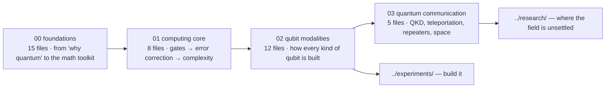

# Learn

Everything here is for **understanding**. Nothing here asks you to buy or build anything; that is `../experiments/`. Nothing here is unsettled; that is `../research/`.



## Three learning paths

Tick as you go. Each item is one file, roughly one sitting.

### Path A — Physics first (no prior quantum mechanics)
- [ ] [Why quantum: a history in ten experiments](00_foundations/00_why_quantum_a_history_in_ten_experiments.md)
- [ ] [Linear algebra and Hilbert space](00_foundations/01_linear_algebra_and_hilbert_space.md)
- [ ] [The postulates and measurement](00_foundations/02_postulates_and_measurement.md)
- [ ] [The qubit and the Bloch sphere](00_foundations/03_qubit_and_bloch_sphere.md) · then open the [live explorers](https://Normansrule.github.io/quantum-link-research/apps/)
- [ ] [Wave mechanics: the four solvable problems](00_foundations/08_wave_mechanics_schrodinger.md)
- [ ] [Spin and angular momentum](00_foundations/09_spin_and_angular_momentum.md)
- [ ] [Rabi, Ramsey, echo](00_foundations/04_two_level_dynamics_rabi_ramsey.md)
- [ ] [Entanglement and Bell states](00_foundations/05_entanglement_bell_states.md)
- [ ] [Identical particles](00_foundations/10_identical_particles_bosons_fermions.md)
- [ ] [Density matrices and open systems](00_foundations/06_density_matrices_and_open_systems.md)
- [ ] [Quantum optics: states of light](00_foundations/12_quantum_optics_states_of_light.md)
- [ ] [Information measures](00_foundations/07_quantum_information_measures.md)
- [ ] [Decoherence and interpretations](00_foundations/13_decoherence_measurement_problem_interpretations.md)

### Path B — Engineer choosing and building a qubit
- [ ] [Modality comparison table](02_qubit_modalities/README.md)
- [ ] [Superconducting transmon and SQUID](02_qubit_modalities/01_superconducting_transmon.md)
- [ ] [Silicon spin qubits](02_qubit_modalities/02_spin_qubits_silicon.md)
- [ ] [Diamond NV and group-IV](02_qubit_modalities/03_diamond_nv_and_group_iv.md)
- [ ] [Trapped ions](02_qubit_modalities/04_trapped_ions.md) · [Neutral atoms](02_qubit_modalities/05_neutral_atoms_rydberg.md) · [Photons](02_qubit_modalities/06_photonic_qubits.md)
- [ ] [Control electronics and readout](02_qubit_modalities/09_control_electronics_and_readout_chain.md)
- [ ] [Cryogenics, vacuum, environment](02_qubit_modalities/10_cryogenics_vacuum_and_environment.md)
- [ ] [Materials and fabrication](02_qubit_modalities/11_materials_and_fabrication.md)
- [ ] [Gates and circuits](01_quantum_computing_core/01_gates_and_circuits.md) · [Error correction](01_quantum_computing_core/03_error_correction.md) · [Benchmarking](01_quantum_computing_core/04_benchmarking_and_metrics.md)
- [ ] then go build: [`../experiments/bench/hardware_guide.md`](../experiments/bench/hardware_guide.md)

### Path C — Communication and the Mars link (the thesis track)
- [ ] Path A items 1–4 and 8, then:
- [ ] [QKD protocols](03_quantum_communication/01_qkd_protocols.md)
- [ ] [Teleportation and swapping](03_quantum_communication/02_teleportation_and_swapping.md)
- [ ] [Repeaters and memories](03_quantum_communication/03_repeaters_and_memories.md)
- [ ] [Satellite and deep space](03_quantum_communication/04_satellite_and_deep_space.md)
- [ ] [Transduction](03_quantum_communication/05_transduction.md)
- [ ] [Complexity: what quantum computers cannot do](01_quantum_computing_core/05_complexity_and_what_quantum_computers_cannot_do.md) (so the security claim is stated correctly)
- [ ] then: [`../research/README.md`](../research/README.md) and [`../experiments/proposed/README.md`](../experiments/proposed/README.md)

## Teaching
[`COURSE_SYLLABUS.md`](COURSE_SYLLABUS.md): a 15-week course built from this repository, with weekly readings, computations, and laboratories.

## Videos
[Youtube](../youtube/README.md): verified links, mapped to each file here.

## Reference files
- [`00_GLOSSARY.md`](00_GLOSSARY.md) — every term, plain language first.
- [`00_MISCONCEPTIONS.md`](00_MISCONCEPTIONS.md) — twelve errors and where the code prevents them.
- [Math toolkit](00_foundations/14_math_toolkit_cheatsheet.md) — one page.
- [Reading list by level](../research/cutting_edge/03_reading_list_by_level.md).

## How every file is written
```
Definitions · Equations · Visual · Key papers · In this repo · Exercises
```
Acronyms are written out on first use. DOIs are linked only where verified; **TODO: verify** marks the rest. Device numbers carry a year and must be re-checked before citing.
