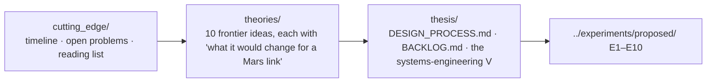

# research/ — where the field is unsettled, and how this project moves it

Settled physics is in `../learn/`; hardware and procedures in `../experiments/`. This folder holds the **frontier** and the **design process** of the thesis.

| Folder | Read when… |
|---|---|
| [`cutting_edge/`](cutting_edge/01_state_of_the_art_timeline.md) | a new paper appears and you need to place it; you need a reading list |
| [`theories/`](theories/README.md) | you want the ideas that could change the architecture: all-photonic repeaters, GKP repeaters, DI-QKD, quantum clock networks, relativistic effects, quantum-limited receivers, blind computing, entanglement routing, CV-QKD, semi-device-independent randomness |
| [`thesis/`](thesis/DESIGN_PROCESS.md) | you want to know what to do next ([BACKLOG](thesis/BACKLOG.md)) and what to add ([NEXT_100](thesis/NEXT_100.md)), and how it fits the requirements |

The engineering specification of the code itself stays in [`../docs/physics_module_design.md`](../docs/physics_module_design.md) (module cards) and [`../docs/architecture.md`](../docs/architecture.md).
