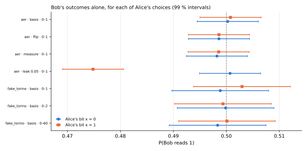
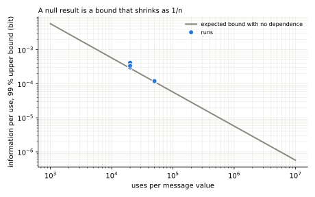
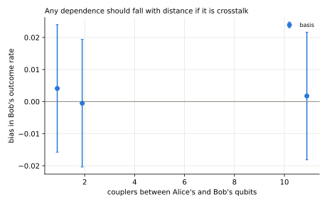

# Can the way a shared state collapses carry a message? A measured bound on a cloud quantum processor

*Draft. Aleksander Norman, California State University, Dominguez Hills. The results below are a rehearsal on simulators and a noisy local copy of an IBM device; the hardware run (protocol P11) replaces them through the same code. The analysis plan was fixed before any hardware data, in `systems/program/08_first_paper.md`.*

## Abstract

A popular idea in quantum communication is an "entanglement Morse code": encode a message in how one half of an entangled pair is measured, and read it from how the other half collapses. Quantum mechanics says such a code carries no information. We turn that statement into a measurement. A sender encodes random bits in one of three actions on her qubit (the measurement basis, whether to measure, or whether to flip); a receiver who hears nothing else records his own outcomes. For each run we test for any dependence and report a 99 % upper bound on the information per use. Two controls show that the analysis would detect a real channel: an injected dissipative disturbance of the receiver's qubit, and teleportation with and without its two classical bits. In the rehearsal every test run is consistent with zero dependence, every control is detected, and the tightest bound is 1.1 × 10⁻⁴ bit per use at 50,000 uses per message value. On a shared chip the same test is a crosstalk detector. The code, the data format, and every number are open.

## 1. Introduction

People meeting entanglement for the first time often propose to use it as a telegraph: Alice measures her half "one way" for a dot and "another way" for a dash, and Bob reads the code from how his half collapses. The no-signalling theorem rules this out [ghirardi1980], and Bell experiments with fast-switched analyzers are consistent with it [aspect1982]. Yet the idea keeps returning, partly because textbooks state the theorem but rarely show what a careful experiment says about it.

This paper asks the question as an experiment. A null result is not "nothing happened": with a stated number of uses, it bounds how much information each use could carry. We report that bound, show that it shrinks as one over the number of uses, and run controls so that a reader can see the analysis is able to find a channel when there is one. The experiment needs only free time on a cloud quantum processor, and every step is reproducible from the repository.

## 2. Theory

Whatever Alice does to her qubit is a quantum instrument $\{K_k\}$ with $\sum_k K_k^\dagger K_k = I$. Bob's state afterwards is

$$\rho_B' = \mathrm{Tr}_A\Big[\sum_k (K_k\otimes I)\,\rho_{AB}\,(K_k\otimes I)^\dagger\Big] = \mathrm{Tr}_A\,\rho_{AB} = \rho_B ,$$

so no statistic Bob collects depends on her choice [ghirardi1980] [nielsen2010]. For a maximally entangled pair, Bob's state is $I/2$ whatever she does. The outcomes are correlated: for polarization pairs with analyzers at $\alpha$ and $\beta$, $P(a,b) = [1 + (-1)^{a\oplus b}V\cos 2(\alpha-\beta)]/4$. Each marginal, though, is exactly one half, and the correlation appears only when the two records are compared over an ordinary channel.

One consequence matters for the controls. Because Bob's state is $I/2$, a *unitary* disturbance of his qubit (coherent crosstalk) leaves his statistics unchanged. Only a dissipative disturbance (relaxation or a reset) or a readout disturbance can bias them. The leak control is therefore an amplitude-damping channel on Bob's qubit, applied when Alice's bit is 1.

What entanglement does give is set out in the controls: teleportation moves a qubit with two classical bits [bennett1993], and superdense coding sends two classical bits per transmitted qubit [bennett1992].

## 3. Method

**Encodings.** Bell pair $|\Phi^+\rangle$ on qubits A and B. For bit $x$:
- *basis*: Alice measures in Z ($x=0$) or at 45° ($x=1$);
- *measure*: Alice measures ($x=1$) or does nothing ($x=0$);
- *flip*: Alice applies X ($x=1$) or nothing.

Bob always measures Z.

**Runs.**
- Each run interleaves the circuits for $x=0$ and $x=1$ in one job, so slow drift affects both alike.
- On devices, three qubit pairs at increasing separation (1, 2, and 11 couplers apart on the rehearsal device) separate crosstalk, which falls with distance, from anything that would not.

**Controls.**
1. An amplitude-damping leak of 0.05 on Bob's qubit when $x=1$, which must be detected.
2. Teleportation of the six cardinal states with feed-forward, with the corrections deferred, and with no bits at all (mission milestone M4.1). The no-bits fidelity must be one half, and the feed-forward fidelity must exceed the classical 2/3 [massar1995].

**Shot budget.** Detecting a bias of $\delta$ at significance $\alpha$ with power $1-\beta$ needs $n = (z_{1-\alpha/2}+z_{1-\beta})^2/(2\delta^2)$ uses per message value [casella2002]: 74,390 for $\delta = 0.01$ at $\alpha = 0.01$ and 90 % power.

## 4. Statistics

For each run:
- **Independence test:** a likelihood-ratio (G) test of independence between Bob's outcome and Alice's bit [casella2002]. The family-wise level is 1 %, with a Bonferroni correction over the test runs.
- **Rates:** Clopper–Pearson intervals on Bob's conditional rates $P(b=1\mid x)$ [clopper1934].
- **Information bound:** mutual information is convex in the channel for a fixed input distribution [cover2006], so its largest value over the box of plausible channels lies at a corner. That corner value is the 99 % upper bound on the information per use.

## 5. Results (rehearsal)

The table in [`results.md`](results.md) lists every run, generated from the data in [`data/rehearsal/`](data/rehearsal/).
- **Test runs:** none shows a dependence. The tightest bound is 1.1 × 10⁻⁴ bit per use (50,000 uses per value, ideal simulator), and the three device-copy runs give a few times 10⁻⁴ at 20,000 uses per value.
- **Leak control:** detected with $p < 10^{-15}$. Its measured bias, −0.026, matches the $-\gamma/2 = -0.025$ an amplitude-damping leak $\gamma$ predicts.
- **Teleportation control** (noisy device copy, [`../../../experiments/bench/frontier/rehearsal/`](../../../experiments/bench/frontier/rehearsal/)):
  - with the bits fed forward, average fidelity 0.835, above the classical 2/3;
  - with the corrections deferred, 0.951;
  - with no bits, 0.505, consistent with one half.

  The gap between feed-forward and deferred correction is the cost, on this device copy, of carrying the classical bits through a mid-circuit measurement.







## 6. Discussion

**What the result says.** Within the precision of the run, Bob's outcomes carry no information about Alice's actions, as the theory requires. The bound is the useful product: to claim a channel of even $10^{-4}$ bit per use, someone would have to beat a measurement like this one.

**What a positive result would mean.** On one chip, Alice and Bob are not separated in space, and neighboring qubits do disturb each other: readout crosstalk, leakage, and heating. A dependence that falls with qubit separation and tracks the measured crosstalk (proposal E16) is a property of the device, a classical channel through the chip, not signalling.

**The cleaner version.** Entangled photons in two rooms (mission milestone M2.4) remove the shared chip. Spacelike separation of Alice's switch and Bob's detection, as in Aspect's experiment [aspect1982], removes any light-speed channel as well.

## 7. Reproducibility

```bash
python -m pytest tests/test_collapse_signalling.py tests/test_cloud_frontier.py
python experiments/bench/E17_collapse_code/run_collapse_code.py run --backend aer --scheme basis --shots 50000
python -m qll.analysis.collapse_report research/papers/P1_collapse_code/data/rehearsal --out research/papers/P1_collapse_code
```

For hardware, run the same commands with `--backend <device> --layout <a> <b>` into `data/hardware/`, and point the report at that folder. Each JSON file holds the configuration, the counts, and the verdict.

## References

Aspect, A., Dalibard, J., & Roger, G. (1982). Experimental test of Bell's inequalities using time-varying analyzers. *Physical Review Letters, 49*, 1804–1807. https://doi.org/10.1103/PhysRevLett.49.1804

Bennett, C. H., Brassard, G., Crépeau, C., Jozsa, R., Peres, A., & Wootters, W. K. (1993). Teleporting an unknown quantum state via dual classical and Einstein–Podolsky–Rosen channels. *Physical Review Letters, 70*, 1895–1899. https://doi.org/10.1103/PhysRevLett.70.1895

Bennett, C. H., & Wiesner, S. J. (1992). Communication via one- and two-particle operators on Einstein–Podolsky–Rosen states. *Physical Review Letters, 69*, 2881–2884. https://doi.org/10.1103/PhysRevLett.69.2881

Casella, G., & Berger, R. L. (2002). *Statistical inference* (2nd ed.). Duxbury.

Clopper, C. J., & Pearson, E. S. (1934). The use of confidence or fiducial limits illustrated in the case of the binomial. *Biometrika, 26*(4), 404–413. https://doi.org/10.1093/biomet/26.4.404

Cover, T. M., & Thomas, J. A. (2006). *Elements of information theory* (2nd ed.). Wiley.

Ghirardi, G. C., Rimini, A., & Weber, T. (1980). A general argument against superluminal transmission through the quantum mechanical measurement process. *Lettere al Nuovo Cimento, 27*, 293–298.

Massar, S., & Popescu, S. (1995). Optimal extraction of information from finite quantum ensembles. *Physical Review Letters, 74*, 1259–1263. https://doi.org/10.1103/PhysRevLett.74.1259

Nielsen, M. A., & Chuang, I. L. (2010). *Quantum computation and quantum information* (10th anniversary ed.). Cambridge University Press.
