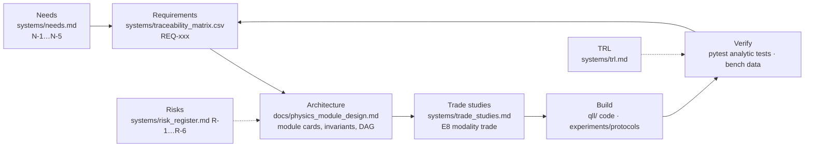

# Design Process

This project is run as a systems-engineering "V": needs on the left, verified capabilities on the right, and every artifact traceable across. The same loop applies whether the artifact is a Python module, a bench experiment, or a mission concept.

## The loop, one iteration at a time
1. **Ask the physics question** in one sentence (e.g., "can a memory outlive the Mars round trip?").
2. **Find the equation** in `learn/` and the landmark experiment in `experiments/done/`; if neither exists, write the `learn/` file first (rule: one idea per file).
3. **Write the requirement** as a testable statement with a number (REQ-CAP-001: memory time compared against $2d/c$ for each baseline).
4. **Write the module card** (idea, equations, interface, invariants, references, test, imports) before code.
5. **Write the analytic test first**, then the code, on established libraries only.
6. **Run the cheapest experiment** that could falsify the model (`experiments/proposed/` cheap version).
7. **Update the matrix, the risk register, and the TRL**; commit with all tests passing; log the session.

## What "done" means at each level
| Artifact | Done when |
|---|---|
| `learn/` file | six sections present, references real, link test passes |
| `qll/` module | card in the design spec, analytic test green on Ubuntu and Windows CI, `[bibkey]` on every default |
| Requirement | `test_path` exists and passes → status `verified` |
| Experiment | data logged, fit to a `qll` function, discrepancy explained, protocol updated |
| Proposal | cheapest version run *or* a written reason it cannot be, and its requirement row added |

## Decision records
Decisions that should not be relitigated without a written reason: import name `qll`; `light_time_delay.py` as the only latency source; temperature first-class from Phase 1; design around transduction rather than through it (T05/E7); memory-based CONOPS as baseline with all-photonic (T02) as the alternative in trade E8. Add new decisions here with a date.

- 2026-09-16 — the five above.
- 2026-09-17 — noisy-teleportation sweep default: $T_1/T_2$ with a temperature sweep.
- 2026-09-18 — repository split into `learn/` (settled), `experiments/` (build), `research/` (frontier and process); `docs/` keeps the engineering specification.
