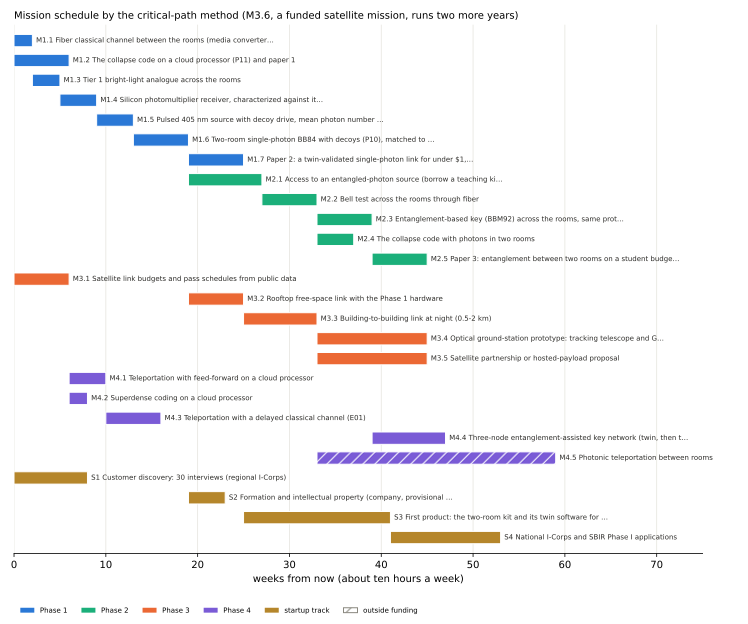
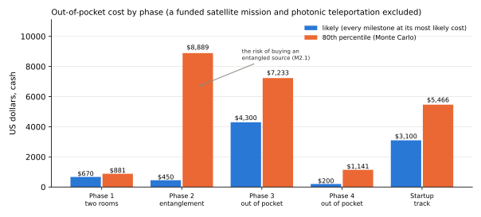

# 01 Phases, milestones, gates, schedule, and cost

*Generated from `qll/systems/program_plan.py` by `scripts/build_program_docs.py`; edit the plan, not this file.*

Each milestone is small enough to finish on its own and ends in a verification with a pass criterion. Weeks assume about ten hours a week; costs are cash out of pocket in US dollars, as three-point estimates (low, likely, high) with the PERT mean (a + 4m + b)/6 [malcolm1959]. Start and finish weeks come from the critical-path method [kelley1959]: a milestone starts when its last prerequisite finishes. Technology readiness levels (TRL) follow NASA's scale [nasa2016seh]. Milestones marked *outside funding* go ahead only with a grant, partner, or award, never out of pocket.

## Phase 0: Foundations: the simulation library and its evidence

| ID | Milestone | Weeks (start–finish) | Cost low / likely / high | PERT mean | After | TRL | Verification | Builds on |
|---|---|---|---|---|---|---|---|---|
| M0.1 | Simulation library, flagships, and evidence (qll, F1-F3) | done | — | — | — | 3 | Test: 700+ analytic tests pass in CI | [F1](../../experiments/flagship/F1_earth_to_earth.md), [F2](../../experiments/flagship/F2_earth_to_satellite.md), [F3](../../experiments/flagship/F3_earth_to_mars.md), [D09](../../experiments/done/09_satellite_qkd_micius_jinan.md) |
| M0.2 | Two-site link simulation, operations day, and experiment catalog | done | — | — | M0.1 | 3 | Test: SN-01 to SN-15 traced; scenarios 1-9 reproduce | [T1](../../systems/see510/10_real_world_experiments.md), [T2](../../systems/see510/10_real_world_experiments.md), [T3](../../systems/see510/10_real_world_experiments.md), [T4](../../systems/see510/10_real_world_experiments.md), [P09](../../experiments/protocols/P09_mars_link_on_a_table.md) |

## Phase 1: Two rooms: a fiber classical channel and a single-photon quantum link

| ID | Milestone | Weeks (start–finish) | Cost low / likely / high | PERT mean | After | TRL | Verification | Builds on |
|---|---|---|---|---|---|---|---|---|
| M1.1 | Fiber classical channel between the rooms (media converters, patch cord, authenticated frames) | 0–2 | $40 / $70 / $150 | $78 | M0.2 | 4 | Test: 10,000 frames with zero authentication failures; 99th-percentile round trip under 5 ms | [T2](../../systems/see510/10_real_world_experiments.md) |
| M1.2 | The collapse code on a cloud processor (P11) and paper 1 | 0–6 | — | — | M0.1 | 3 | Analysis: information per use bounded below 1e-3 bit at 99 % on hardware; the leak control detected | [P11](../../experiments/protocols/P11_collapse_code_on_a_cloud_processor.md), [E17](../../experiments/proposed/E17_can_collapse_carry_a_message.md), [E16](../../experiments/proposed/E16_zz_crosstalk_on_a_cloud_processor.md), [D11](../../experiments/done/11_aspect_1982_time_varying_analyzers.md) |
| M1.3 | Tier 1 bright-light analogue across the rooms | 2–5 | $40 / $80 / $120 | $80 | M1.1 | 4 | Demonstration: the log runs through the protocol; honest error rate near 0, intercept-resend near 25 % | [T1](../../systems/see510/10_real_world_experiments.md) |
| M1.4 | Silicon photomultiplier receiver, characterized against its datasheet | 5–9 | $150 / $250 / $400 | $258 | M1.3 | 4 | Test: dark-count rate, relative efficiency, and afterpulsing measured and written into the twin | [P10](../../experiments/protocols/P10_two_room_single_photon_link.md), [T3](../../systems/see510/10_real_world_experiments.md) |
| M1.5 | Pulsed 405 nm source with decoy drive, mean photon number calibrated | 9–13 | $80 / $150 / $300 | $163 | M1.4 | 4 | Test: mean photon number within 10 % of target from power and repetition rate | [P10](../../experiments/protocols/P10_two_room_single_photon_link.md), [D02](../../experiments/done/02_single_photon_interference.md) |
| M1.6 | Two-room single-photon BB84 with decoys (P10), matched to its twin | 13–19 | $60 / $120 / $250 | $132 | M1.5, M1.1 | 4 | Test: measured click rate and error rate inside the twin's prediction intervals; a session accepted | [P10](../../experiments/protocols/P10_two_room_single_photon_link.md), [T3](../../systems/see510/10_real_world_experiments.md), [E06](../../experiments/proposed/E06_qrng_basis_choice_on_a_cheap_bench.md) |
| M1.7 | Paper 2: a twin-validated single-photon link for under $1,000 | 19–25 | $0 / $0 / $150 | $25 | M1.6 | 4 | Inspection: data, code, and twin published; an outside reader repeats the analysis from the files | — |

Out of pocket: likely $670, PERT mean $737 ± $72; Monte Carlo 50th percentile $799, 80th $881.

## Phase 2: Entanglement between two rooms

| ID | Milestone | Weeks (start–finish) | Cost low / likely / high | PERT mean | After | TRL | Verification | Builds on |
|---|---|---|---|---|---|---|---|---|
| M2.1 | Access to an entangled-photon source (borrow a teaching kit, or partner) | 19–27 | $0 / $0 / $15k | $2,500 | M1.6 | 4 | Inspection: a written loan or collaboration agreement | [P03](../../experiments/protocols/P03_spdc_bell_test.md), [T4](../../systems/see510/10_real_world_experiments.md) |
| M2.2 | Bell test across the rooms through fiber | 27–33 | $100 / $300 / $800 | $350 | M2.1, M1.1 | 4 | Test: CHSH above 2 by at least five standard deviations | [D03](../../experiments/done/03_bell_test_spdc.md), [D11](../../experiments/done/11_aspect_1982_time_varying_analyzers.md), [P03](../../experiments/protocols/P03_spdc_bell_test.md) |
| M2.3 | Entanglement-based key (BBM92) across the rooms, same protocol code | 33–39 | $0 / $100 / $300 | $117 | M2.2 | 5 | Test: key accepted; measured error rate inside the twin's interval | [T4](../../systems/see510/10_real_world_experiments.md) |
| M2.4 | The collapse code with photons in two rooms | 33–37 | $0 / $50 / $200 | $67 | M2.2 | 4 | Analysis: information per use bounded; correlations appear only after the records are compared | [P11](../../experiments/protocols/P11_collapse_code_on_a_cloud_processor.md), [P06](../../experiments/protocols/P06_quantum_eraser.md), [D11](../../experiments/done/11_aspect_1982_time_varying_analyzers.md) |
| M2.5 | Paper 3: entanglement between two rooms on a student budget | 39–45 | $0 / $0 / $150 | $25 | M2.3, M2.4 | 5 | Inspection: data and analysis published | — |

Out of pocket: likely $450, PERT mean $3,058 ± $2,504; Monte Carlo 50th percentile $5,009, 80th $8,889.

## Phase 3: Outdoors and toward orbit

| ID | Milestone | Weeks (start–finish) | Cost low / likely / high | PERT mean | After | TRL | Verification | Builds on |
|---|---|---|---|---|---|---|---|---|
| M3.1 | Satellite link budgets and pass schedules from public data | 0–6 | — | — | M0.1 | 3 | Analysis: Micius and Jinan-1 losses reproduced within 3 dB | [D09](../../experiments/done/09_satellite_qkd_micius_jinan.md), [D14](../../experiments/done/14_jinan1_2025_microsatellite_qkd.md), [E03](../../experiments/proposed/E03_constellation_scheduling_on_real_pass_data.md) |
| M3.2 | Rooftop free-space link with the Phase 1 hardware | 19–25 | $100 / $300 / $800 | $350 | M1.6 | 5 | Test: loss and daylight background against the twin | [P04](../../experiments/protocols/P04_rooftop_free_space_link.md), [E04](../../experiments/proposed/E04_sun_angle_background.md) |
| M3.3 | Building-to-building link at night (0.5-2 km) | 25–33 | $300 / $800 / $2,000 | $917 | M3.2 | 5 | Test: key accepted over the measured free-space loss | [P04](../../experiments/protocols/P04_rooftop_free_space_link.md) |
| M3.4 | Optical ground-station prototype: tracking telescope and GPS-disciplined timing | 33–45 | $1,000 / $3,000 / $8,000 | $3,500 | M3.3 | 5 | Demonstration: tracks a satellite pass; timestamps agree with a second clock within 10 ns | [E14](../../experiments/proposed/E14_relativistic_timing_sanity_test.md), [D14](../../experiments/done/14_jinan1_2025_microsatellite_qkd.md) |
| M3.5 | Satellite partnership or hosted-payload proposal | 33–45 | $0 / $200 / $1,000 | $300 | M3.1, M2.2 | 5 | Inspection: proposal submitted (CubeSat Launch Initiative with a university team, or ground-station time on an operating mission) | [D09](../../experiments/done/09_satellite_qkd_micius_jinan.md), [D14](../../experiments/done/14_jinan1_2025_microsatellite_qkd.md) |
| M3.6 | CubeSat entangled-source mission (only with outside funding) *(outside funding)* | 45–149 | $250k / $600k / $1.5M | $692k | M3.5, M3.4 | 7 | Test: in-orbit entanglement and a downlink to the ground station | [D09](../../experiments/done/09_satellite_qkd_micius_jinan.md), [D14](../../experiments/done/14_jinan1_2025_microsatellite_qkd.md) |

Out of pocket: likely $4,300, PERT mean $5,067 ± $1,218; Monte Carlo 50th percentile $5,663, 80th $7,233.

With outside funding: likely $600k (range $250k–$1.5M).

## Phase 4: Entanglement-assisted communication: the frontier

| ID | Milestone | Weeks (start–finish) | Cost low / likely / high | PERT mean | After | TRL | Verification | Builds on |
|---|---|---|---|---|---|---|---|---|
| M4.1 | Teleportation with feed-forward on a cloud processor | 6–10 | — | — | M1.2 | 3 | Test: average fidelity above 2/3 with the two bits, 1/2 without | [D07](../../experiments/done/07_teleportation_photonic.md), [E01](../../experiments/proposed/E01_delayed_classical_channel_teleportation.md) |
| M4.2 | Superdense coding on a cloud processor | 6–8 | — | — | M1.2 | 3 | Test: two bits per transmitted qubit decoded above chance; none without sending the qubit | [D07](../../experiments/done/07_teleportation_photonic.md) |
| M4.3 | Teleportation with a delayed classical channel (E01) | 10–16 | — | — | M4.1 | 3 | Analysis: fidelity versus delay against the memory model | [E01](../../experiments/proposed/E01_delayed_classical_channel_teleportation.md), [E02](../../experiments/proposed/E02_memory_vs_temperature_vs_light_time.md) |
| M4.4 | Three-node entanglement-assisted key network (twin, then two rooms plus one) | 39–47 | $0 / $200 / $2,000 | $467 | M2.3 | 4 | Test: keys between every pair through a trusted node and through swapping in the twin | [D08](../../experiments/done/08_nv_remote_entanglement_and_network.md), [D13](../../experiments/done/13_bhaskar_2020_memory_enhanced_communication.md) |
| M4.5 | Photonic teleportation between rooms *(outside funding)* | 33–59 | $2,000 / $8,000 / $30k | $11k | M2.2, M4.1 | 5 | Test: fidelity above 2/3 with Bell-state measurement and the classical bits | [D06](../../experiments/done/06_hong_ou_mandel.md), [D07](../../experiments/done/07_teleportation_photonic.md) |

Out of pocket: likely $200, PERT mean $467 ± $333; Monte Carlo 50th percentile $656, 80th $1,141.

With outside funding: likely $8,000 (range $2,000–$30k).

## Startup track: from a validated bench to a company

| ID | Milestone | Weeks (start–finish) | Cost low / likely / high | PERT mean | After | TRL | Verification | Builds on |
|---|---|---|---|---|---|---|---|---|
| S1 | Customer discovery: 30 interviews (regional I-Corps) | 0–8 | $0 / $200 / $1,000 | $300 | — | — | Inspection: interview log; a stated problem worth paying for, or a decision to stop | — |
| S2 | Formation and intellectual property (company, provisional filing) | 19–23 | $100 / $900 / $3,000 | $1,117 | S1, M1.6 | — | Inspection: entity formed; disclosure or provisional filed | — |
| S3 | First product: the two-room kit and its twin software for teaching labs | 25–41 | $500 / $1,500 / $4,000 | $1,750 | S1, M1.7 | 6 | Demonstration: a pilot course or lab runs the kit and matches the twin | [P10](../../experiments/protocols/P10_two_room_single_photon_link.md), [T1](../../systems/see510/10_real_world_experiments.md), [P09](../../experiments/protocols/P09_mars_link_on_a_table.md) |
| S4 | National I-Corps and SBIR Phase I applications | 41–53 | $0 / $500 / $2,000 | $667 | S2, S3 | 6 | Inspection: project pitch and proposals submitted | — |

Out of pocket: likely $3,100, PERT mean $3,833 ± $844; Monte Carlo 50th percentile $4,507, 80th $5,466.

## Gates

Money for a phase is committed only when the gate before it passes.

| Gate | After phase | Pass criteria | Unlocks |
|---|---|---|---|
| G0 | 0 | the simulation reproduces every analytic case and the evidence regenerates | Phase 1 purchases (about $500 likely) |
| G1 | 1 | M1.6 passes (measured inside the twin's intervals) and M1.2's paper is drafted | Phase 2: ask to borrow an entangled source; buy only fibers and couplers |
| G2 | 2 | CHSH above 2 between the rooms and an accepted BBM92 key | Phase 3 outdoor work and the satellite proposal; Phase 4 photonic teleportation |
| G3 | 3 | a ground station that tracks and timestamps, and a partner or award in hand | a satellite mission, paid for by that partner or award, never out of pocket |

## Budget at a glance

| Through | Likely cash | PERT mean | If everything goes wrong | Calendar, in parallel | Calendar, one milestone at a time |
|---|---|---|---|---|---|
| Phase 1 (two rooms, quantum states shared) | $670 | $737 | $1,370 | week 25 | week 31 |
| Phase 2 (entanglement between the rooms) | $1,120 | $3,795 | $18k | week 45 | week 61 |
| Phases 3–4, out of pocket only | $5,620 | $9,328 | $32k | week 47 | week 125 |

The critical-path calendar assumes independent milestones run side by side (with classmates, an advisor's student, or a collaborator). Alone at ten hours a week, take them one at a time: the last column.

The PERT mean of Phase 2 sits far above its likely value because milestone M2.1 ranges from a free loan to buying a source ($15k). Securing the loan before Gate G1 removes that risk; it is the most valuable phone call in the plan.

Critical path to the end of Phase 2: M0.1 → M0.2 → M1.1 → M1.3 → M1.4 → M1.5 → M1.6 → M2.1 → M2.2 → M2.3 → M2.5. M1.2 (the first paper), M3.1 (satellite budgets from public data), M4.1–M4.3 (cloud processor), and S1 (customer discovery) are off the critical path and can run in parallel at no cost.
