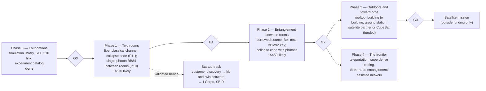

# The Quantum Link Mission: from two rooms to orbit, on a student budget

**Mission.** Share quantum states between two places, first two rooms, then two buildings, then a ground station and a satellite. Turn what each step teaches into entanglement-assisted secure communication that can reach anywhere on the planet. Publish at every step. Found a company once a validated bench has a paying customer.

This folder is the systems-engineering plan for that mission. It is phase-based: each phase starts from the evidence of the one before, ends at a gate with pass criteria, and commits money only when that gate passes. Everything already in the repository is the research foundation: the 15 landmark experiments, the lab protocols, 17 proposals, the three flagships, the simulation library, and the SEE 510 two-site link. Each item is catalogued in [02](02_research_foundation.md), with the phase it feeds and what it takes to replicate it.

## The physics boundary, stated once

The far horizon you described is a language in which the way shared entangled states collapse carries information to a distant user. Part of that is exactly decided by quantum mechanics.

- **What collapse cannot do.** Whatever one side does to its half of an entangled pair, the other side's statistics do not change. Each side alone sees a fair coin, so a code written in the collapses carries zero bits. This is the no-signalling theorem [ghirardi1980], and it holds for every measurement, every basis, and every distance. [05](05_feasibility.md) gives the one-line proof.
- **What collapse does give: correlations.** They are perfect in a shared basis and stronger than any classical system can produce (a Bell test). They appear only when the two records are compared over an ordinary channel at or below light speed.
- **What correlations make possible.** They are what a secret key is made of (entanglement-based QKD). With two classical bits per qubit they teleport a quantum state, and they double the classical capacity of each qubit that is sent (superdense coding).

So the mission's frontier is entanglement-assisted communication: keys and quantum states shared between any two points, every message riding on a classical channel. The first experiment (P11) puts the collapse-language idea itself to a measurement, because a careful null result with a stated bound is publishable, and building it teaches every tool the later phases need.

## Phases

| Phase | Question it answers | Key milestones | Out of pocket (likely) | Technology readiness |
|---|---|---|---|---|
| 0 Foundations | What does the physics allow, and what does each choice cost? | M0.1–M0.2 (done) | $0 | 3 |
| 1 Two rooms | Can a student bench send quantum states between rooms and match its twin? Can collapse carry a message? | M1.1 fiber classical channel · M1.2 collapse code (paper 1) · M1.6 single-photon link (paper 2) | about $670 | 4 |
| 2 Entanglement | Can two rooms share entangled photons and make a key from them? | M2.2 Bell test · M2.3 BBM92 key · M2.4 collapse code with photons (paper 3) | about $450 with a borrowed source | 4–5 |
| 3 Outdoors to orbit | What do sky, distance, and pointing do, and who flies the source? | M3.1 satellite budgets from public data · M3.2–M3.3 free space · M3.4 ground station · M3.5 partner proposal · M3.6 CubeSat (funded) | about $4,300 before any satellite | 5–7 |
| 4 Frontier | What can shared entanglement deliver beyond keys? | M4.1 teleportation · M4.2 superdense coding · M4.4 three-node network · M4.5 photonic teleportation (funded) | about $200 | 3–5 |
| Startup | Who pays, for what? | S1 discovery · S2 formation · S3 kit and twin software · S4 I-Corps and SBIR | about $3,100 | — |

The exact numbers, schedule, critical path, and Monte Carlo cost risk are generated in [01](01_phases_and_milestones.md) from [`qll/systems/program_plan.py`](../../qll/systems/program_plan.py).

## How the work is run

The lifecycle follows NASA's systems-engineering practice, scaled to one person [nasa2016seh]. Each gate is a review with a written record in [`reviews/`](reviews/README.md).

| Gate | Like NASA's | Asks |
|---|---|---|
| G0 | mission concept review | is the concept feasible on paper, and are the needs and requirements written? |
| G1 | system requirements review, plus a preliminary design review for Phase 2 | did the bench match its twin, and is the Phase 2 design and source access settled? |
| G2 | critical design review for the outdoor and satellite segments | is entanglement between rooms demonstrated, and are the designs for outdoors ready? |
| G3 | a flight-readiness decision | is there a ground station that works, and a partner or award to pay for flight? |

Five rules hold in every phase:

1. **Simulate first.** Every physical milestone has a digital twin that predicts its result before a part is bought. The twin reads the same data format the bench writes (P09 and P10 are the pattern).
2. **Replicable or it does not count.** Each experiment has a procedure, a twin, a test, and a data format, so anyone can repeat it.
3. **Small, independent milestones.** Each one finishes on its own with a pass criterion; several run off the critical path for free (cloud processor, public satellite data, customer interviews).
4. **Spend at the gate.** Money for a phase is committed only when the gate before it passes. Nothing over $5,000 is ever out of pocket; it waits for a grant, a partner, or a loan of equipment.
5. **Claim only what the evidence shows.** No unproven security, no faster-than-light anything, and every simulated number labelled as simulated.

## Documents

| # | Document | What it holds |
|---|---|---|
| 01 | [Phases, milestones, gates, schedule, and cost](01_phases_and_milestones.md) | generated: every milestone with weeks, three-point cost, prerequisites, readiness level, verification, and the experiments it builds on; the gates; the budget |
| 02 | [Research foundation](02_research_foundation.md) | generated: every experiment in the repository, by phase, with its twin, test, cost, and role |
| 03 | [Needs, requirements, and verification](03_requirements_and_verification.md) | mission needs, requirements per phase, and how each is verified |
| 04 | [Cost model and funding](04_cost_and_funding.md) | how costs are estimated and controlled, how to keep them low, and where money can come from |
| 05 | [Feasibility](05_feasibility.md) | generated: the physics boundary, the collapse-code statistics, the two-room link, free space, and orbit, with numbers |
| 06 | [Risks and trade studies](06_risks_and_trades.md) | the risk register and the design choices, scored |
| 07 | [The startup path](07_startup_path.md) | who might pay, what to sell first, and the steps from a bench to a company |
| 08 | [Papers](08_first_paper.md) | the first paper's plan in detail, and the two after it |
| — | [Gate reviews](reviews/README.md) | the record of each gate |
| — | [Paper drafts](../../research/papers/README.md) | each paper's draft, generated results, figures, and data (paper 1 rehearsed on simulators) |

**Run it.** `python scripts/build_program_docs.py` regenerates 01, 02, 05, and the figures. `python -m pytest tests/test_program_plan.py tests/test_two_room.py tests/test_collapse_signalling.py` checks the plan, the two-room twin, and the collapse code.
