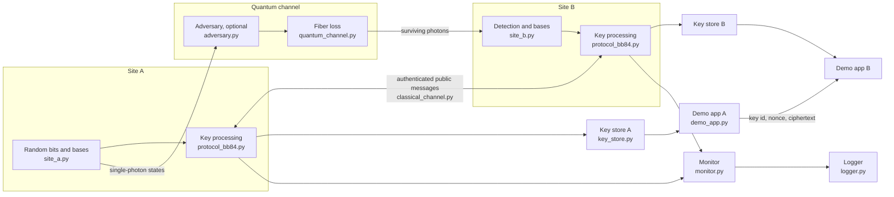

# 01 Simulation architecture

**What is modelled.** The two sites, the two channels between them, an optional adversary, and the functions around them (monitoring, logging, key delivery, and an external application), each a separate module with one responsibility. **Why.** The handoff asks for an architecture that a later protocol or a hardware measurement can replace one block at a time (SN-13, SN-15), and for evidence a reviewer can trace (SN-07). **Supports** SN-01, SN-04, SN-07, SN-12, SN-13, SN-15.

## Blocks and interfaces

| Block | Inputs | Outputs | Replaced by hardware with |
|---|---|---|---|
| Site A (`site_a.py`) | n, random stream | bits, bases | a source driver and a quantum random number generator |
| Quantum channel (`quantum_channel.py`) | states, transmittance | arrived mask | a fiber spool or a variable optical attenuator |
| Adversary (`adversary.py`) | fraction | resent states and a record | an intercept-resend station (P07 step 6) |
| Site B (`site_b.py`) | arrived states | clicks, bits, bases | detectors and a time tagger |
| Classical channel (`classical_channel.py`) | messages | verified messages, transcript | a network socket with HMAC or Wegman–Carter tags |
| Reconciliation (`reconciliation.py`) | two sifted keys | corrected key, leak, verdict | the same code, on measured keys |
| Protocol (`protocol_bb84.py`) | configuration | decision, keys, metrics | the same code, fed by hardware logs |
| Monitor and logger | metrics, events | summaries, folders, CSV | the same code |
| Key store (`key_store.py`) | accepted key | 256-bit keys by identifier | a key-management service with the same three calls |
| Demo application (`demo_app.py`) | key, message | ciphertext and decryption | the same code on two computers |
| Operations day (`operations.py`) | a configuration and a plan of events | a status per session, an operator log, the console's replay data | a scheduler running sessions on the bench, logging the same fields |

The protocol module is the only one that knows the order of the steps; everything else is a component it calls. A different protocol (for example BBM92 with an entangled source, repository module `qll/qkd/e91.py`) would replace `protocol_bb84.py`, `site_a.py`, and `site_b.py` and leave the channels, monitor, logger, key store, and application untouched.

## Session sequence (CONOPS steps)
| CONOPS step | Session step | Module | Messages on the classical channel |
|---|---|---|---|
| 1 Configure | load `LinkConfig`; spawn random streams from the seed | `config.py` | — |
| 2 Verify readiness | validate inputs; session start and ready | `protocol_bb84.py` | 2 |
| 3 Establish session | run identifier agreed | `protocol_bb84.py` | (in step 2) |
| 4 Quantum process | prepare, transmit, detect | `site_a.py`, `quantum_channel.py`, `site_b.py` | — |
| 5 Supporting classical information | sifting: clicks and bases | `protocol_bb84.py` | 2 |
| 6 Monitor | error-rate estimate; alert above 3 %; events | `protocol_bb84.py`, `monitor.py` | 3 |
| 7 Key validity | threshold, Cascade, verification, amplification | `reconciliation.py`, `protocol_bb84.py` | hundreds (parities) |
| 8 Reject affected key | any abort: no key is deposited | `protocol_bb84.py` | — |
| 9 Deliver | accepted key to both stores; applications use it | `key_store.py`, `demo_app.py` | 1 |
| 10 Record | metrics, events, summary, CSV | `logger.py` | — |

**What this proves.** The design separates every responsibility the CONOPS names, and each block is tested on its own (06). **What it does not prove.** That hardware will divide along the same lines without change; the interfaces in the table are the plan for that.
