# Simulation evidence: Scalable Two-Node Fiber-Optic Quantum Communication Link

Generated by `python -m qll.link.run scenarios`. Every number below comes from a configuration and a seed recorded in `sessions/*.csv`; rerunning the command reproduces them exactly (scenario 6), except execution times and timestamps. **These are simulation results under the assumptions of `../03_assumptions.md`; they are not measurements of hardware and not a proof of real-world security.**

Baseline configuration: 1,000,000 pulses per session at 1 MHz, 0.2 dB/km fiber, 1 dB receiver loss, detector efficiency 0.2, dark-count probability 1e-06 per gate, misalignment 1 %, abort threshold 11 %, alert level 3 %. Python 3.12.3, NumPy 2.5.3; all scenarios ran in about 40 s on one core.

## Validation against the closed-form models

| check | expected | observed | result |
|---|---|---|---|
| V1 ideal channel: no errors, matching keys | QBER 0, keys equal, accepted | QBER 0.0000, equal True, ACCEPTED | PASS |
| V2 detection probability at 0 km | 1.5887e-01 | 1.5987e-01 | PASS |
| V3 sifting fraction at 0 km | 0.5 | 0.4995 | PASS |
| V4 error rate at 0 km | 0.0100 | 0.0095 | PASS |
| V2 detection probability at 25 km | 5.0239e-02 | 5.0557e-02 | PASS |
| V3 sifting fraction at 25 km | 0.5 | 0.4989 | PASS |
| V4 error rate at 25 km | 0.0100 | 0.0089 | PASS |
| V2 detection probability at 75 km | 5.0248e-03 | 4.9600e-03 | PASS |
| V3 sifting fraction at 75 km | 0.5 | 0.4889 | PASS |
| V4 error rate at 75 km | 0.0101 | 0.0144 | PASS |
| V5 full intercept-resend: error rate near 25 %, session rejected | 0.2550, rejected | 0.2604, REJECTED (qber) | PASS |
| V6 same configuration and seed reproduce the session | identical metrics, keys, run id | metrics True, keys True, id True; other seed differs True | PASS |
| V7 an altered classical message aborts the session | rejected (auth) | REJECTED (auth) | PASS |
| V8 only accepted key reaches the application, and it works | keys from accepted session only; decrypts; refuses when empty | 58 keys delivered, 0 from the rejected session; round trips True; refused True | PASS |

## Scenario 1: baseline (0 km, no adversary)

| distance (km) | loss (dB) | adversary | detected | sifted | QBER | alert | decision | final key bits | seed |
|---|---|---|---|---|---|---|---|---|---|
| 0 | 0.0 | none | 158,319 | 79,373 | 1.13 % |  | accepted | 44,396 | 11 |
| 0 | 0.0 | none | 158,881 | 79,457 | 1.02 % |  | accepted | 45,020 | 12 |
| 0 | 0.0 | none | 159,380 | 79,923 | 0.81 % |  | accepted | 46,203 | 13 |

Per-run summary of the first session (also in `example_run/1_baseline/62297767f4f9/summary.txt`):

```
Simulation Run ID:       62297767f4f9
Scenario:                1_baseline
Protocol:                BB84 (ideal single-photon source, prepare and measure)
Distance:                0 km
Loss:                    0.00 dB (transmittance 1)
States Sent:             1,000,000
States Detected:         158,319 (p = 1.583e-01)
Sifted Key Bits:         79,373
Errors:                  90 of 7938 sampled bits
QBER:                    1.13 % estimated (upper bound 4.94 %)
Adversary:               none
Key Accepted:            yes
Final Usable Key Length: 44,396 bits (44,396.0 bit/s at the pulse rate)
Authentication:          wegman_carter: 381 key bits spent; net key 44,015 bits (forgery probability below 4.8e-34)
Random Seed:             11
Execution Time:          0.315 s
```

## Scenario 2: increasing distance

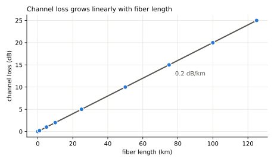 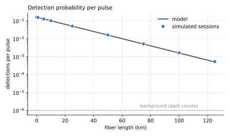

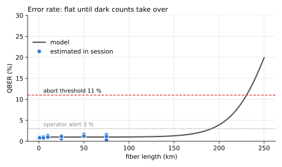 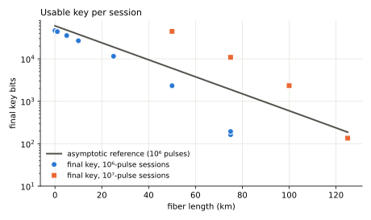

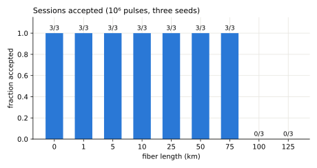

| distance (km) | loss (dB) | adversary | detected | sifted | QBER | alert | decision | final key bits | seed |
|---|---|---|---|---|---|---|---|---|---|
| 0 | 0.0 | none | 158,319 | 79,373 | 1.13 % |  | accepted | 44,396 | 11 |
| 1 | 0.2 | none | 151,137 | 75,820 | 1.00 % |  | accepted | 42,461 | 11 |
| 5 | 1.0 | none | 126,028 | 63,283 | 1.09 % |  | accepted | 34,352 | 11 |
| 10 | 2.0 | none | 99,803 | 50,097 | 1.36 % |  | accepted | 25,686 | 11 |
| 25 | 5.0 | none | 50,061 | 25,211 | 0.91 % |  | accepted | 11,554 | 11 |
| 50 | 10.0 | none | 15,987 | 8,017 | 1.25 % |  | accepted | 2,357 | 11 |
| 75 | 15.0 | none | 5,024 | 2,556 | 0.39 % |  | accepted | 172 | 11 |
| 100 | 20.0 | none | 1,629 | 839 | 50.00 % |  | rejected (insufficient) | 0 | 11 |
| 125 | 25.0 | none | 524 | 267 | 50.00 % |  | rejected (insufficient) | 0 | 11 |
| 50 | 10.0 | none | 158,979 | 79,549 | 1.12 % |  | accepted | 44,493 | 11 |
| 75 | 15.0 | none | 50,273 | 25,113 | 1.39 % |  | accepted | 10,862 | 11 |
| 100 | 20.0 | none | 15,938 | 7,885 | 1.14 % |  | accepted | 2,334 | 11 |
| 125 | 25.0 | none | 4,995 | 2,471 | 0.40 % |  | accepted | 135 | 11 |

The expected error rate stays near the misalignment floor until dark counts compete with the signal; the model puts the 11 % crossing at about 230 km. Long before that, a session of 1,000,000 pulses runs out of detections: the finite block, not the error rate, ends the key. Sessions ten times longer (orange in the key plot) reach further.

## Scenario 3: interception (intercept-and-resend) and classical tampering

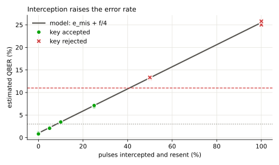 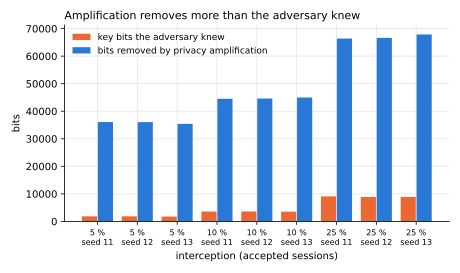

| distance (km) | loss (dB) | adversary | detected | sifted | QBER | alert | decision | final key bits | seed |
|---|---|---|---|---|---|---|---|---|---|
| 0 | 0.0 | none | 158,319 | 79,373 | 1.13 % |  | accepted | 44,396 | 11 |
| 0 | 0.0 | none | 158,881 | 79,457 | 1.02 % |  | accepted | 45,020 | 12 |
| 0 | 0.0 | none | 159,380 | 79,923 | 0.81 % |  | accepted | 46,203 | 13 |
| 0 | 0.0 | IR 5 % of pulses | 158,319 | 79,373 | 2.20 % |  | accepted | 35,381 | 11 |
| 0 | 0.0 | IR 5 % of pulses | 158,881 | 79,457 | 2.24 % |  | accepted | 35,463 | 12 |
| 0 | 0.0 | IR 5 % of pulses | 159,380 | 79,923 | 2.06 % |  | accepted | 36,507 | 13 |
| 0 | 0.0 | IR 10 % of pulses | 158,319 | 79,373 | 3.44 % | yes | accepted | 26,929 | 11 |
| 0 | 0.0 | IR 10 % of pulses | 158,881 | 79,457 | 3.46 % | yes | accepted | 26,909 | 12 |
| 0 | 0.0 | IR 10 % of pulses | 159,380 | 79,923 | 3.45 % | yes | accepted | 26,948 | 13 |
| 0 | 0.0 | IR 25 % of pulses | 158,319 | 79,373 | 6.89 % | yes | accepted | 5,029 | 11 |
| 0 | 0.0 | IR 25 % of pulses | 158,881 | 79,457 | 6.87 % | yes | accepted | 4,869 | 12 |
| 0 | 0.0 | IR 25 % of pulses | 159,380 | 79,923 | 7.12 % | yes | accepted | 4,048 | 13 |
| 0 | 0.0 | IR 50 % of pulses | 158,319 | 79,373 | 13.05 % | yes | rejected (qber) | 0 | 11 |
| 0 | 0.0 | IR 50 % of pulses | 158,881 | 79,457 | 13.19 % | yes | rejected (qber) | 0 | 12 |
| 0 | 0.0 | IR 50 % of pulses | 159,380 | 79,923 | 13.34 % | yes | rejected (qber) | 0 | 13 |
| 0 | 0.0 | IR 100 % of pulses | 158,319 | 79,373 | 25.89 % | yes | rejected (qber) | 0 | 11 |
| 0 | 0.0 | IR 100 % of pulses | 158,881 | 79,457 | 25.02 % | yes | rejected (qber) | 0 | 12 |
| 0 | 0.0 | IR 100 % of pulses | 159,380 | 79,923 | 25.79 % | yes | rejected (qber) | 0 | 13 |
| 0 | 0.0 | none | 158,319 | 79,373 | 1.13 % |  | rejected (auth) | 44,396 | 11 |

Interception raises the error rate by a quarter of the intercepted fraction, as the model predicts. Above the alert level the operator is warned; above the abort threshold the key is rejected. Below it, the session can still be accepted, because privacy amplification removes more bits than the adversary knew (right-hand plot); that is how BB84 tolerates partial interception, and it holds only under this model's assumptions. Altering one classical message makes authentication fail and the session is rejected.

## Scenario 4: high loss from an inserted attenuator

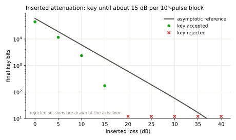

| distance (km) | loss (dB) | adversary | detected | sifted | QBER | alert | decision | final key bits | seed |
|---|---|---|---|---|---|---|---|---|---|
| 0 | 0.0 | none | 158,319 | 79,373 | 1.13 % |  | accepted | 44,396 | 11 |
| 0 | 5.0 | none | 50,061 | 25,211 | 0.91 % |  | accepted | 11,554 | 11 |
| 0 | 10.0 | none | 15,987 | 8,017 | 1.25 % |  | accepted | 2,357 | 11 |
| 0 | 15.0 | none | 5,024 | 2,556 | 0.39 % |  | accepted | 172 | 11 |
| 0 | 20.0 | none | 1,629 | 839 | 50.00 % |  | rejected (insufficient) | 0 | 11 |
| 0 | 25.0 | none | 524 | 267 | 50.00 % |  | rejected (insufficient) | 0 | 11 |
| 0 | 30.0 | none | 144 | 76 | 50.00 % |  | rejected (insufficient) | 0 | 11 |
| 0 | 35.0 | none | 49 | 23 | 50.00 % |  | rejected (insufficient) | 0 | 11 |
| 0 | 40.0 | none | 19 | 10 | 50.00 % |  | rejected (insufficient) | 0 | 11 |

## Scenario 5: ordinary noise against an adversary with the same expected error rate

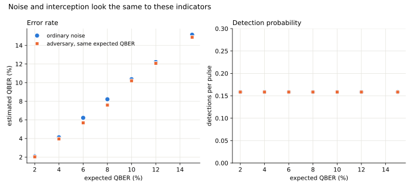

| distance (km) | loss (dB) | adversary | detected | sifted | QBER | alert | decision | final key bits | seed |
|---|---|---|---|---|---|---|---|---|---|
| 0 | 0.0 | none | 158,319 | 79,373 | 0.00 % |  | accepted | 53,702 | 11 |
| 0 | 0.0 | none | 158,319 | 79,373 | 2.09 % |  | accepted | 36,727 | 11 |
| 0 | 0.0 | IR 4.08163 % of pulses | 158,319 | 79,373 | 2.03 % |  | accepted | 36,847 | 11 |
| 0 | 0.0 | none | 158,319 | 79,373 | 4.13 % | yes | accepted | 22,648 | 11 |
| 0 | 0.0 | IR 12.2449 % of pulses | 158,319 | 79,373 | 3.96 % | yes | accepted | 23,192 | 11 |
| 0 | 0.0 | none | 158,319 | 79,373 | 6.22 % | yes | accepted | 9,707 | 11 |
| 0 | 0.0 | IR 20.4082 % of pulses | 158,319 | 79,373 | 5.68 % | yes | accepted | 11,845 | 11 |
| 0 | 0.0 | none | 158,319 | 79,373 | 8.21 % | yes | rejected (no_key) | 0 | 11 |
| 0 | 0.0 | IR 28.5714 % of pulses | 158,319 | 79,373 | 7.58 % | yes | accepted | 778 | 11 |
| 0 | 0.0 | none | 158,319 | 79,373 | 10.37 % | yes | rejected (no_key) | 0 | 11 |
| 0 | 0.0 | IR 36.7347 % of pulses | 158,319 | 79,373 | 10.19 % | yes | rejected (no_key) | 0 | 11 |
| 0 | 0.0 | none | 158,319 | 79,373 | 12.21 % | yes | rejected (qber) | 0 | 11 |
| 0 | 0.0 | IR 44.898 % of pulses | 158,319 | 79,373 | 12.07 % | yes | rejected (qber) | 0 | 11 |
| 0 | 0.0 | none | 158,319 | 79,373 | 15.14 % | yes | rejected (qber) | 0 | 11 |
| 0 | 0.0 | IR 57.1429 % of pulses | 158,319 | 79,373 | 14.87 % | yes | rejected (qber) | 0 | 11 |

Within this model, the error rate and the detection rate cannot tell ordinary noise from interception: both rise the same way. The protocol therefore treats every error as if an adversary caused it, which is what makes it safe, and the monitor reports an elevated error rate as consistent with either cause. Distinguishing them would need other evidence (for example, error-rate history, decoy-state statistics, or physical inspection).

## Scenario 6: reproducibility

Same configuration and seed twice: metrics identical **True**, keys identical **True**, run identifier identical **True**. A different seed gives a different key: **True**.

## Authentication cost and net key

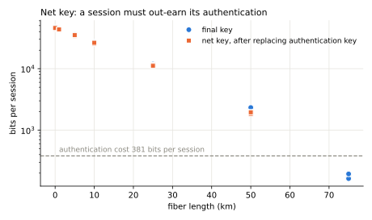

The classical channel is authenticated with Wegman–Carter tags over each site's view of the whole transcript (information-theoretically secure; forgery probability below 10⁻³⁰ per session). Each session spends 381 bits of authentication key, replaced from its own output before any key is delivered. A session that yields less than that is accepted but delivers nothing: the link is then consuming its pre-shared key rather than growing it, which in the 10⁶-pulse sessions happens near 75 km.

## Scenario 8: the source, and photon-number splitting (25 km, 10⁷ pulses)

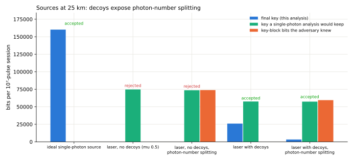

| case | decision | QBER | single-photon share (bound) | decoy gain vs honest | alert | final key | naive key | adversary knew |
|---|---|---|---|---|---|---|---|---|
| ideal single-photon source | accepted | 0.96 % | 100.0 % |  |  | 160,180 |  | 0 |
| laser, no decoys (mu 0.5) | rejected (single_photon) | 0.88 % | 0.0 % |  |  | 0 | 74,716 | 0 |
| laser, no decoys, photon-number splitting | rejected (single_photon) | 0.95 % | 0.0 % |  |  | 0 | 73,600 | 73,842 |
| laser with decoys | accepted | 0.98 % | 49.8 % | -0.3 sd |  | 25,977 | 57,560 | 0 |
| laser with decoys, photon-number splitting | accepted | 1.00 % | 20.9 % | -31.7 sd | yes | 3,289 | 57,339 | 59,468 |

An attenuated laser sends some pulses with two or more photons. A photon-number-splitting adversary keeps one photon of each, reads it after the bases are announced, and blocks single-photon pulses just enough that the detection rate looks like an honest channel's; she causes no errors. Without decoys the error rate and the gain look normal, and an analysis that treated the laser as a single-photon source would keep a key of which she knows a large share ("naive key" against "adversary knew"). The worst-case analysis without decoys (GLLP) must grant her every multi-photon pulse and finds no key at 25 km even on an honest channel. With decoy intensities she cannot tell signal from decoy pulses, the decoy gain falls far below what the signal gain implies, the operator is alerted, and the single-photon bound shrinks the key to what she cannot know.

| distance (km) | loss (dB) | adversary | detected | sifted | QBER | alert | decision | final key bits | seed |
|---|---|---|---|---|---|---|---|---|---|
| 0 | 0.0 | none | 635,451 | 305,840 | 1.02 % |  | accepted | 106,302 | 11 |
| 25 | 5.0 | none | 206,745 | 99,319 | 0.98 % |  | accepted | 25,977 | 11 |
| 50 | 10.0 | none | 65,860 | 31,720 | 0.85 % |  | accepted | 3,847 | 11 |
| 75 | 15.0 | none | 20,843 | 10,027 | 0.90 % |  | rejected (no_key) | 0 | 11 |
| 100 | 20.0 | none | 6,749 | 3,241 | 0.62 % |  | rejected (single_photon) | 0 | 11 |

## Scenario 9: an operations day

A scripted 24 hours of sessions with drift, interception, a bend, tampering, and a fiber cut, with persistent key stores and authentication pool: [`operations/README.md`](operations/README.md), written by `python -m qll.link.run operations`, and replayed on the website's operations console.

## Demonstration: external secure-communication application

An accepted session delivered 174 keys of 256 bits to both sites; a rejected session (full interception) delivered 0. 5 test messages were encrypted with AES-256-GCM at Site A and decrypted at Site B: all matched. With the store empty the application refused to send (fail closed).

## All sessions

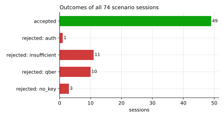

Rejection reasons: `auth`: classical message failed authentication (possible active tampering); `insufficient`: too few detections to estimate the error rate and form a key block; `qber`: estimated error rate above threshold (consistent with interception or excessive noise); `single_photon`: too few detections can be guaranteed to come from single photons (multi-photon pulses, or decoy statistics inconsistent with an honest channel); `verify`: keys still differ after reconciliation; `no_key`: no secret key remains after the finite-size and leakage deductions.
