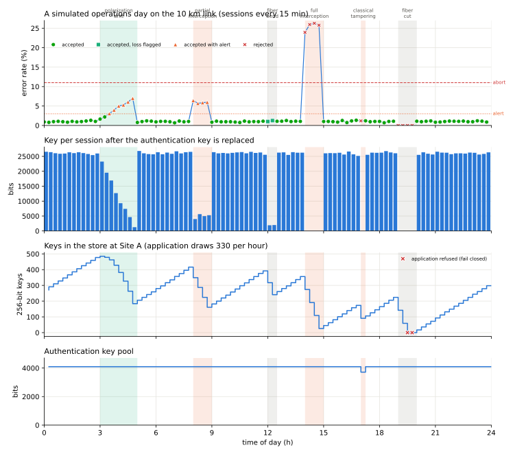

# Scenario 9: a simulated operations day

Generated by `python -m qll.link.run operations`. **A replay of a simulation under the assumptions of `../../03_assumptions.md`, not telemetry from hardware.** The same data drive the operations console on the website (`docs/link/`).

A 10 km link runs a session of 1,000,000 pulses every 15 minutes for 24 hours. The authentication pool (4,096 bits) and both sites' key stores persist all day; the store starts with 250 keys. An external application draws 330 keys of 256 bits per hour and is refused when the store is empty (fail closed). Scripted events from the concept of operations' degraded and adversarial modes change the configuration while active. A session is flagged when it is rejected, when its error rate passes the alert level, or when its detection rate falls below half of the morning baseline (loss). The whole day ran in about 25 s on one core.

## Events and how fast the monitor flagged them

| from | to | event | kind | description | flagged after |
|---|---|---|---|---|---|
| 03:00 | 05:00 | polarization drift | degradation | temperature change twists the fiber's polarization; the operator realigns at 05:00 | 30 min |
| 08:00 | 09:00 | partial interception | attack | intercept-and-resend on 20 % of pulses | 0 min |
| 12:00 | 12:30 | fiber bend | fault | a cable tray is moved; 8 dB of bend loss | 0 min |
| 14:00 | 15:00 | full interception | attack | intercept-and-resend on every pulse | 0 min |
| 17:00 | 17:15 | classical tampering | attack | a message on the classical channel is altered in transit | 0 min |
| 19:00 | 20:00 | fiber cut | fault | the fiber is cut; repaired at 20:00 | 0 min |

## Summary

| sessions | accepted | of which clean | with alert | with loss flagged | rejected | keys delivered | keys served | requests refused | lowest pool (bits) | lowest store (keys) |
|---|---|---|---|---|---|---|---|---|---|---|
| 96 | 87 | 75 | 10 | 2 | 9 | 7,862 | 7,814 | 106 | 3,715 | 0 |

What the day shows, within this model:

- Every adversarial event was flagged in the first session it touched. Partial interception raised the error rate past the alert level but not the abort threshold, so the key was shortened and kept; full interception and the altered classical message were rejected. No session's key reached the application while rejected.
- The polarization drift was flagged only once its error rate crossed the alert level; until then, the key simply shrank as the error rate rose. The error rate alone cannot say whether drift or an adversary caused it (scenario 5).
- The fiber bend left the error rate below the alert level; only the fall in detections flagged it. The fiber cut produced no detections, every session was rejected, the store ran dry, and the application was refused until the repair: the link failed closed rather than open.
- Sessions rejected before authentication (error rate or too few detections) spent no authentication key, so the pool did not drain while the link was down. The tampered session had already spent its tags when the check failed; the next accepted session topped the pool back up from its own output before delivering key.

## Operator log

| time | level | message |
|---|---|---|
| 03:00 | event | polarization drift begins: temperature change twists the fiber's polarization; the operator realigns at 05:00 |
| 03:30 | warning | error rate 3.1 % above the alert level; key shortened |
| 05:00 | event | polarization drift ends |
| 08:00 | event | partial interception begins: intercept-and-resend on 20 % of pulses |
| 08:00 | warning | error rate 6.4 % above the alert level; key shortened |
| 09:00 | event | partial interception ends |
| 12:00 | event | fiber bend begins: a cable tray is moved; 8 dB of bend loss |
| 12:00 | warning | detection rate 16 % of its baseline: loss has increased (bend, connector, or fiber) |
| 12:30 | event | fiber bend ends |
| 14:00 | event | full interception begins: intercept-and-resend on every pulse |
| 14:00 | alarm | session rejected: estimated error rate above threshold (consistent with interception or excessive noise) |
| 14:15 | alarm | session rejected: estimated error rate above threshold (consistent with interception or excessive noise) |
| 14:30 | alarm | session rejected: estimated error rate above threshold (consistent with interception or excessive noise) |
| 14:45 | alarm | session rejected: estimated error rate above threshold (consistent with interception or excessive noise) |
| 15:00 | event | full interception ends |
| 17:00 | event | classical tampering begins: a message on the classical channel is altered in transit |
| 17:00 | alarm | session rejected: classical message failed authentication (possible active tampering) |
| 17:15 | event | classical tampering ends |
| 19:00 | event | fiber cut begins: the fiber is cut; repaired at 20:00 |
| 19:00 | alarm | session rejected: too few detections to estimate the error rate and form a key block |
| 19:15 | alarm | session rejected: too few detections to estimate the error rate and form a key block |
| 19:30 | alarm | session rejected: too few detections to estimate the error rate and form a key block |
| 19:30 | alarm | key store empty: the application is refused (fail closed) |
| 19:45 | alarm | session rejected: too few detections to estimate the error rate and form a key block |
| 20:00 | event | fiber cut ends |
| 20:00 | info | key available again: the application resumes |

Per-session data: `sessions.csv`; log: `log.csv`. Every row records its run identifier and seed.
